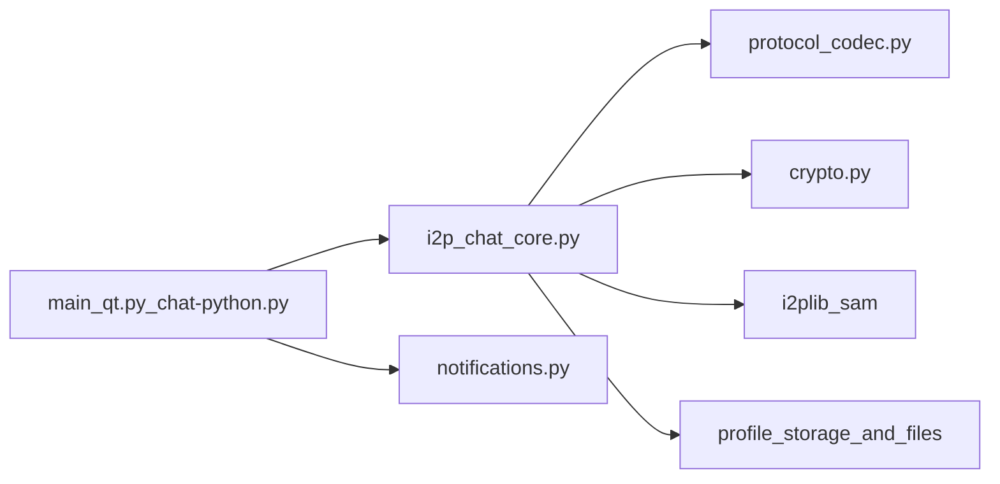

# Security Audit Report: I2PChat

Audit date: 2026-03-17  
Mode: full audit (architecture + protocol + crypto + CI/build + supply chain)  
Scope: current local repository state (`I2PChat`)

## Executive Summary

This audit focuses on architectural trust boundaries and protocol behavior under adversarial conditions, with additional review of build and CI integrity controls.

Confirmed findings:
- Critical: 0
- High: 0
- Medium: 1
- Low: 4

Overall conclusion: runtime protocol hardening is strong (signed handshake, TOFU pinning, replay/downgrade protections, context-bound MAC), while residual risk is concentrated in release authenticity and long-term supply-chain governance.

## Scope and Methodology

Reviewed components:
- Protocol and core runtime: `i2p_chat_core.py`, `protocol_codec.py`, `crypto.py`
- GUI and local boundary handling: `main_qt.py`, `notifications.py`
- Build and packaging: `build-linux.sh`, `build-macos.sh`, `build-windows.ps1`, `I2PChat.spec`
- Dependency and lock governance: `requirements.in`, `requirements.txt`, `requirements-build.txt`, `requirements-ci-audit.txt`
- CI controls: `.github/workflows/security-audit.yml`, `.github/workflows/secret-scan.yml`
- Security regression tests: `tests/test_protocol_framing_vnext.py`, `tests/test_profile_import_overwrite.py`, `tests/test_audit_remediation.py`, `tests/test_asyncio_regression.py`

Method:
- Static trust-boundary and attack-surface review
- Protocol and cryptographic control verification
- Supply-chain and release integrity review
- Regression test execution

Test verification:
- `python3 -m unittest tests/test_asyncio_regression.py tests/test_protocol_framing_vnext.py tests/test_profile_import_overwrite.py tests/test_audit_remediation.py` -> OK (46 tests)

## Architecture and Trust Boundaries

Primary boundaries:
- Network peer -> protocol parser (`ProtocolCodec.read_frame`) -> message dispatcher
- Core runtime -> local SAM router (`i2plib.dest_lookup`)
- Core/GUI -> profile storage and file paths
- GUI/runtime -> local subprocess helpers (notifications/audio)
- Build/CI -> release artifacts and published binaries

Security-significant architectural facts:
- Strict vNext framing (`MAGIC`, explicit `PROTOCOL_VERSION=4`, bounded frame length)
- Legacy parsing is explicit (`allow_legacy=False` in core codec setup)
- Profile and image operations use path confinement (`realpath` + directory checks)
- ACK tracking uses bounded state and TTL pruning (`ACK_MAX_PENDING`, `ACK_TTL_SECONDS`)

## Protocol and Cryptography Deep-Dive

Verified controls:
- Signed handshake (`INIT`/`RESP`) using Ed25519 signatures
- Peer key TOFU pinning (`_pin_or_verify_peer_signing_key`)
- PFS with ephemeral X25519 keys and DH shared secret
- Final shared secret derivation from DH + both nonces
- Context-bound HMAC (`seq`, `flags`, `msg_id`) with constant-time compare
- Anti-replay via strict sequence validation
- Anti-downgrade detection for post-handshake plaintext frames
- ACK context validation (`peer_addr`, `ack_kind`, `ack_session_epoch`)

Protocol framing facts:
- Header: `MAGIC(4) | VER(1) | TYPE(1) | FLAGS(1) | MSG_ID(8) | LEN(4)`
- Resynchronization hard limit is enforced (`resync_limit`, default 64 KiB)

## Threat Model Summary

Adversaries considered:
- Remote malicious peer on I2P
- Active MITM-like manipulator at transport boundary
- Local unprivileged attacker in hostile workstation environment
- Supply-chain attacker (dependency/build/release channel)

Mitigated classes:
- Message tampering (HMAC)
- Replay and reorder attempts (sequence checks)
- Protocol downgrade attempts (plaintext rejection after handshake)
- Handshake impersonation without trust break (signed handshake + TOFU + SAM identity checks)

Residual classes (design/operational):
- Metadata leakage from visible framing fields and pre-handshake identity exchange
- Release-channel authenticity gaps without platform-native code signing/notarization
- Long-term maintenance risk of vendored transport library updates

## Findings

## [MEDIUM] A-01: Release artifacts are checksummed/signed but not platform-trust signed

Affected:
- `build-linux.sh`, `build-macos.sh`, `build-windows.ps1`
- `.github/workflows/security-audit.yml`

Category: release authenticity / supply chain

Observation:
- Build scripts generate `SHA256SUMS` and detached `SHA256SUMS.asc` signatures.
- There is no platform-native trust chain (for example Authenticode for Windows, Apple signing/notarization for macOS, provenance attestations in release pipeline).

Impact:
- Users must rely on manual checksum/signature workflows and out-of-band key trust.
- Compromised distribution channels remain a realistic risk amplification point.

Exploitability:
- Medium. Requires release-channel compromise or user verification failure.

Recommendations:
1. Add platform-native signing/notarization for distributed binaries.
2. Add release provenance attestations in CI.
3. Publish and rotate signing policy documentation with key fingerprint pinning.

---

## [LOW] P-01: Handshake key derivation lacked explicit key separation (no HKDF) — FIXED

Affected:
- `i2p_chat_core.py` (`_compute_final_shared_key`)
- `crypto.py`

Category: cryptographic robustness

Remediation status:
- `crypto.py` implements HKDF (`hkdf_extract`/`hkdf_expand`) and dedicated derivation via `derive_handshake_subkeys(...)`.
- `i2p_chat_core.py` now derives separate session subkeys (`self.shared_key`, `self.shared_mac_key`).
- Encryption uses `k_enc` while message authentication uses `k_mac`.

Impact:
- No known practical break was identified in the previous construction, but explicit key separation is stronger cryptographic hygiene.

Exploitability:
- Low. Primarily defense-in-depth.

Outcome:
- Risk addressed as defense-in-depth hardening.

---

## [LOW] P-02: Protocol metadata remains observable — PARTIALLY MITIGATED

Affected:
- `protocol_codec.py`
- `i2p_chat_core.py` (identity preface exchange path)

Category: metadata privacy / traffic analysis

Remediation status:
- Threat-model/privacy notes were documented in `README.md`, `docs/MANUAL_EN.md`, and `docs/MANUAL_RU.md`.
- Optional encrypted payload padding profile was added; default is `balanced` (128-byte buckets).
- Runtime profile override exists via `I2PCHAT_PADDING_PROFILE` (`balanced`/`off`).

Impact:
- Header visibility still allows some traffic-shape inference (message kind/size patterns and linkage hints).

Exploitability:
- Low in protocol-integrity terms, relevant for privacy posture.

Outcome:
- Fully hiding `TYPE`/`LEN` is not feasible in current framing, but payload-length correlation is reduced.

---

## [LOW] S-01: Vendored `i2plib` required explicit security update governance — FIXED

Affected:
- `i2plib/` (vendored copy)
- `requirements.in` / `requirements.txt` (no PyPI `i2plib`)

Category: supply-chain lifecycle

Remediation status:
- Machine-readable provenance file added: `i2plib/VENDORED_UPSTREAM.json`.
- Governance policy added: `docs/VENDORED_I2PLIB_POLICY.md` (cadence, advisory sources, review workflow).
- CI policy checks validate required provenance fields in `.github/workflows/security-audit.yml`.

Impact:
- Without governance, upstream security fixes can lag in downstream adoption.

Exploitability:
- Low direct exploitability; medium operational risk over time.

Outcome:
- Governance process is formalized and machine-validated in CI.

---

## Verified Strengths

- Hash-pinned lockfiles and `--require-hashes` usage in build/audit dependency installs.
- Pinned GitHub Actions by commit SHA and least-privilege workflow permissions (`contents: read`).
- Dedicated secret scanning workflow with checksum-verified tool download (`gitleaks`).
- Protocol framing and downgrade protections are regression-tested.
- ACK state management includes TTL and bounded pending queue controls.
- GUI image/profile handling includes confinement and atomic write patterns.
- Linux helper execution uses resolved absolute paths (`shutil.which`) before subprocess launch.

## Residual Risks and Testing Gaps

Residual risks:
- Privacy metadata leakage remains a known trade-off in current framing.
- Release signing trust still depends on user verification discipline and lacks platform-native trust signing.

Recommended additional tests:
1. Negative tests for malformed handshake transcript fields and mixed-role replay attempts.
2. Protocol-level tests for padding boundary behavior (small, near-bucket, and large payload sizes).
3. CI policy tests validating platform signing/notarization requirements once implemented.

## Remediation Priority

1. P1: A-01 (platform-native release trust + provenance attestations)
2. P2: P-02 (privacy hardening beyond current header visibility limits)
3. P3: Continuous governance upkeep for S-01/S-02 controls (periodic review discipline)

## Conclusion

I2PChat currently demonstrates strong protocol integrity controls and disciplined defensive checks in runtime paths. The most meaningful remaining gap is release authenticity trust at distribution time, while recently implemented HKDF key separation and supply-chain governance controls materially reduced prior low-severity risks.
