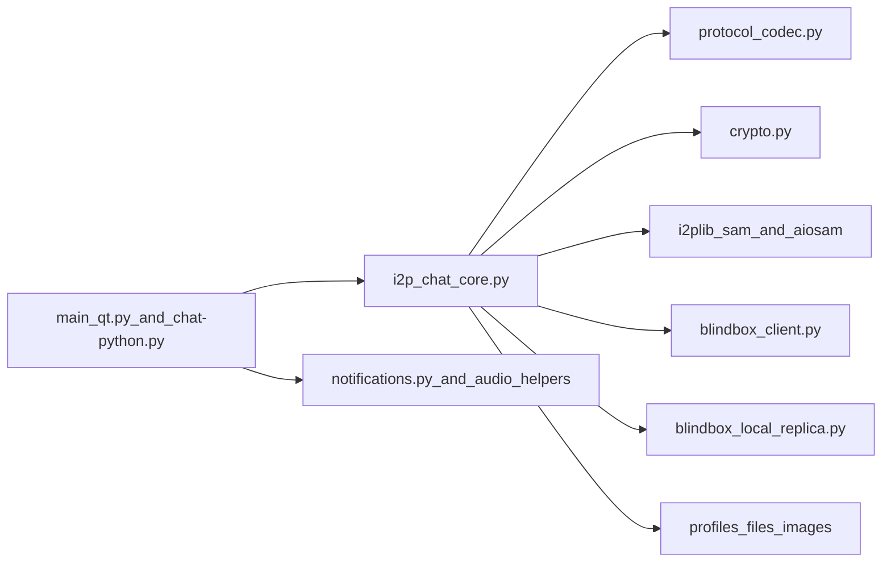

# Security Audit Report: I2PChat

Audit date: 2026-03-22  
Mode: full audit (architecture + protocol + crypto + runtime checks + CI/build + supply chain)  
Scope: current local repository state (`I2PChat`)

## Executive Summary

This audit reviewed protocol security, local trust boundaries, runtime behavior, and software supply chain controls.

Confirmed findings:
- Critical: 0
- High: 0
- Medium: 1
- Low: 3

Overall conclusion: protocol-level integrity controls are strong (signed handshake, TOFU pinning, sequence/HMAC checks, downgrade detection). During this remediation cycle, M-01/M-02/M-03 were addressed in code, and additional post-audit fixes were applied for BlindBox local-secret wrapping, locked-peer enforcement before BlindBox root exchange, and explicit CLI/TUI trust policy. The highest remaining practical risks are release and CI supply-chain assurance gaps.

## Scope and Methodology

Reviewed components:
- Protocol and runtime core: `i2p_chat_core.py`, `protocol_codec.py`, `crypto.py`
- I2P/SAM transport: `i2plib/aiosam.py`, `i2plib/sam.py`, `blindbox_client.py`, `blindbox_local_replica.py`
- GUI/local boundary handling: `main_qt.py`, `notifications.py`
- Build/release pipeline: `build-linux.sh`, `build-macos.sh`, `build-windows.ps1`, `I2PChat.spec`
- Dependency governance and CI policy: `requirements.in`, `requirements.txt`, `requirements-ci-audit.txt`, `.github/workflows/security-audit.yml`, `.github/workflows/secret-scan.yml`, `flake.nix`, `flake.lock`

Method:
- Static trust-boundary and attack-surface review
- Verification of cryptographic and protocol controls
- Runtime checks (tests and lockfile dependency audit)
- Supply-chain and release-integrity review

Runtime checks executed:
- `python3 --version` -> `Python 3.14.3`
- `python3 -m unittest tests/test_asyncio_regression.py tests/test_protocol_framing_vnext.py tests/test_profile_import_overwrite.py tests/test_audit_remediation.py` -> `FAILED (1)` due to documentation assertion (`test_metadata_padding_docs_present`)
- `python3 -m unittest tests/test_blindbox_client.py` -> `OK (5 tests)`
- `./.audit-venv/bin/pip-audit -r requirements.txt` -> `No known vulnerabilities found`
- `./.audit-venv/bin/pip-audit -r requirements.in` -> `No known vulnerabilities found`
- Post-audit targeted regression set: `python3 -m unittest tests.test_blindbox_state_wrap tests.test_asyncio_regression tests.test_blindbox_client tests.test_blindbox_core_telemetry tests.test_protocol_framing_vnext` -> `OK (47 tests, 1 skipped due to missing PyNaCl in test environment)`

Notes:
- The failing documentation test is treated as a baseline quality issue, not a direct exploitable vulnerability.

## Architecture and Trust Boundaries

Primary boundaries:
- Network peer -> frame parser (`ProtocolCodec.read_frame`) -> dispatcher
- Core runtime -> local SAM router (trust in local I2P/SAM endpoint)
- BlindBox client -> remote replicas or direct `host:port`
- Core/GUI -> local filesystem and profile data
- Build/CI -> released binaries and dependency inputs

Security-significant facts:
- Strict vNext framing and explicit protocol versioning
- Explicit anti-downgrade checks after handshake
- TOFU peer key pinning and signature-verified handshake
- Path confinement checks in key GUI file-open paths
- Hash-pinned Python lockfiles for build/audit paths

## Protocol and Cryptography Deep-Dive

Verified controls:
- Signed handshake messages (`INIT`/`RESP`) using Ed25519
- TOFU pinning via `_pin_or_verify_peer_signing_key`
- Ephemeral X25519 + shared-secret derivation
- Context-bound HMAC checks (`seq`, `flags`, `msg_id`) with constant-time compare
- Replay/reorder resistance via sequence validation
- Downgrade detection for unexpected plaintext frames post-handshake
- ACK context validation with bounded and pruned state

Protocol framing:
- Header: `MAGIC(4) | VER(1) | TYPE(1) | FLAGS(1) | MSG_ID(8) | LEN(4)`
- Resync limit enforced by codec (`resync_limit`, default 64 KiB)

## Threat Model Summary

Adversaries considered:
- Malicious remote peer on I2P
- Active manipulator at transport boundaries
- Local unprivileged process on same host
- Supply-chain attacker on dependencies/build/release path

Well-mitigated classes:
- Message tampering and replay attempts
- Basic downgrade attempts after handshake establishment
- Impersonation without trust compromise (subject to TOFU and local SAM trust assumptions)

Residual classes:
- Local trust assumptions around SAM and BlindBox local replica
- Metadata leakage in logs/UI under some paths
- Release authenticity assurances not integrated with platform-native trust chains

## Findings

## [LOW] M-01: SAM debug logging could expose sensitive SAM replies — MITIGATED

Affected:
- `i2plib/aiosam.py`
- `i2plib/sam.py`

Category: sensitive data exposure / local confidentiality

Evidence:
- Added `_redact_sam_reply(...)` to sanitize sensitive key/value pairs before debug logging.
- `parse_reply` now logs redacted output instead of raw SAM reply text.

Impact:
- Residual risk is significantly reduced; sensitive SAM fields are now redacted in this logging path.

Exploitability:
- Low after mitigation.

Recommendations:
1. Keep redaction list aligned with SAM field evolution.
2. Keep regression tests for log redaction in CI.

---

## [LOW] M-02: BlindBox local replica auth/isolation gaps — PARTIALLY MITIGATED

Affected:
- `blindbox_local_replica.py`

Category: local trust boundary / unauthorized local access

Evidence:
- Local replica now supports optional auth token for `PUT/GET`.
- Core local-auto flow now provisions and uses local auth token.
- Local replica now supports bounded entry count (`max_entries`) with `FULL` response.

Impact:
- Local abuse risk is reduced for local-auto mode and token-enabled deployments; remaining risk exists where operators keep direct/local mode without token hardening.

Exploitability:
- Low-to-medium depending on deployment hardening.

Recommendations:
1. Enable/require local token in all direct/local deployments.
2. Add per-namespace quotas and rate limiting as a next step.

---

## [LOW] M-03: BlindBox direct-TCP downgrade risk — MITIGATED BY POLICY CONTROLS

Affected:
- `i2p_chat_core.py`
- `blindbox_client.py`

Category: transport security posture / configuration risk

Evidence:
- Added strict mode gate `I2PCHAT_BLINDBOX_REQUIRE_SAM=1` to reject direct `host:port` replica configurations.
- Added explicit runtime warning when non-SAM direct transport is active.

Impact:
- Misconfiguration risk is reduced; strict mode now enforces secure transport policy when enabled.

Exploitability:
- Low with strict mode; medium if operators do not enable policy gate.

Recommendations:
1. Keep strict mode enabled by default in hardened deployments.
2. Expand operator docs around direct/local transport implications.

---

## [LOW] M-04: CI lockfile audit gap — MITIGATED

Affected:
- `.github/workflows/security-audit.yml`
- `requirements.in`
- `requirements.txt`

Category: supply-chain assurance gap

Evidence:
- CI now runs `pip-audit -r requirements.txt` as the primary gate.
- `pip-audit -r requirements.in` remains as supplemental signal.

Impact:
- Main gap is closed for lockfile-driven dependency assurance.

Exploitability:
- Low after mitigation.

Recommendations:
1. Keep lockfile-first audit mandatory in CI.
2. Add SBOM retention from lockfile in release process.

---

## [MEDIUM] M-05: Release trust does not include platform-native signing/notarization

Affected:
- `build-linux.sh`, `build-macos.sh`, `build-windows.ps1`
- Release policy checks in `.github/workflows/security-audit.yml`

Category: release authenticity / distribution trust

Evidence:
- Build scripts generate checksums and detached signatures
- No enforced platform-native trust chain (for example Authenticode or Apple notarization) in current pipeline

Impact:
- Security depends on manual checksum/signature verification and user discipline; platform trust UX is weaker for most users.

Exploitability:
- Medium. Requires release-channel compromise or verification bypass by users.

Recommendations:
1. Add platform-native signing and notarization workflows.
2. Add provenance attestations in release CI.
3. Publish versioned key policy and verification guidance.

---

## [LOW] L-01: Local path disclosure in UI/logs — MITIGATED

Affected:
- `i2p_chat_core.py`

Evidence:
- Incoming file status now emits basename (`final_name`) instead of absolute path.
- Image cache cleanup log now emits basename instead of absolute path.

Impact:
- Local privacy leakage risk is reduced in these paths.

Recommendation:
- Keep basename-only logging for user-facing/system message paths.

---

## [LOW] L-02: Windows stdout notification content leak — MITIGATED

Affected:
- `notifications.py`

Evidence:
- Fallback path now emits generic text only: `"[NOTIFY] New message received"`.

Impact:
- Message content leakage via stdout fallback is reduced.

Recommendation:
- Keep plaintext message content out of stdout fallback paths.

---

## [LOW] L-03: Secret-scan checksum source is not independently trusted

Affected:
- `.github/workflows/secret-scan.yml`

Evidence:
- `gitleaks` archive and checksums are both fetched from same release source URL

Impact:
- If release source is compromised, both artifact and checksum can be replaced together.

Recommendation:
- Verify detached signatures/provenance from independent trust root where possible.

## Verified Strengths

- Strong protocol integrity primitives and downgrade/replay safeguards.
- Hash-pinned lockfiles with `--require-hashes` in critical install paths.
- Pinned GitHub Actions commits and least-privilege workflow permissions.
- Explicit vendored dependency governance metadata (`i2plib/VENDORED_UPSTREAM.json`).
- No use of `shell=True`, `eval`, `exec`, or unsafe deserialization patterns found in core Python paths.

## Residual Risks and Testing Gaps

Residual risks:
- Security posture depends on local SAM trust and operator configuration.
- Local-host attack model remains relevant for BlindBox fallback mode.
- Release verification remains harder for non-expert users without platform-native signatures.

Recommended additional tests:
1. Add tests asserting SAM log redaction for sensitive fields.
2. Add tests for strict-SAM mode (reject direct TCP replica configs).
3. Add tests for BlindBox local replica quotas/rate limits after mitigation.
4. Extend CI checks to enforce lockfile-based vulnerability audit.

## Post-Audit Hardening Update (2026-03-23)

Additional findings reported after the main audit were reviewed and fixed in code:

- BlindBox local at-rest wrapping now derives the wrap key from `my_signing_seed` via HKDF, with local wrap-versioning and compatibility fallback for older stored state.
- Outbound `connect_to_peer(...)` now fail-closes when a profile is locked to a different `stored_peer`, and BlindBox root exchange is blocked unless the currently connected peer matches the locked peer.
- CLI/TUI no longer silently auto-pin a first-seen peer key by default; without a trust callback, explicit opt-in is now required via `I2PCHAT_TRUST_AUTO=1`.
- Regression coverage was added for wrap-key derivation, locked-peer enforcement, BlindBox root suppression on mismatch, and explicit CLI trust policy.

## Remediation Priority

1. P1: M-05 (platform-native release signing/notarization)
2. P2: further hardening for M-02 (namespace/rate-limit policies)
3. P3: additional supply-chain hardening for `L-03`

## Conclusion

I2PChat shows solid protocol hardening and generally careful defensive coding. The main remaining risks are practical operational boundaries (local process trust, logging hygiene, and release assurance), not a direct break of core cryptographic protocol logic.

## Deep Audit Addendum (2026-03-24)

This addendum captures a later full-scope deep review (code, protocol, and architecture) focused on high-risk runtime surfaces.

### Updated Findings Snapshot

- Critical: 0
- High: 0
- Medium: 4 (2 confirmed, 2 plausible)
- Low: 2

### Confirmed Findings

1. **[MEDIUM] Symlink-based profile path escape risk**
   - Affected: `i2p_chat_core.py` (`_profile_scoped_path` and profile-bound reads/writes)
   - Impact: local same-user process can redirect profile/trust/signing/blindbox paths via symlink to unexpected filesystem targets.

2. **[MEDIUM] Non-atomic fallback write for signing seed**
   - Affected: `i2p_chat_core.py` (`_ensure_local_signing_key`)
   - Impact: crash/power-loss window can corrupt `*.signing`, causing identity-signing continuity loss.

### Plausible Findings

1. **[MEDIUM] Handshake role-conflict / double-INIT race**
   - Affected: `i2p_chat_core.py` (`initiate_secure_handshake`, `_handle_handshake_message`)
   - Impact: session-establishment instability and potential DoS under simultaneous initiation.

2. **[MEDIUM] BlindBox quorum semantics accept `EXISTS` as PUT success**
   - Affected: `blindbox_client.py` (`put`)
   - Impact: byzantine replica can report logical success without durable storage.

### Low / Defense-in-Depth

1. **[LOW] BlindBox state load uses two reads of the same file**
   - Affected: `i2p_chat_core.py` (`_load_blindbox_state`)
   - Impact: possible TOCTOU consistency gap under local concurrent mutation.

2. **[LOW] Protocol downgrade diagnostic branch is string-fragile**
   - Affected: `i2p_chat_core.py` (`receive_loop`)
   - Impact: mostly observability/diagnostics quality, not core control bypass.

### Remediation Priority (Updated)

1. **P0:** enforce symlink-safe profile path policy and atomic signing-seed writes.
2. **P1:** add deterministic handshake role-conflict guard and regression tests.
3. **P1:** harden BlindBox PUT semantics (`EXISTS` handling and verification strategy).
4. **P2:** convert BlindBox state load path to single-snapshot parse and tighten downgrade diagnostics.

## Deep Audit Addendum II (2026-03-24)

This section captures a second deep pass across protocol, runtime, BlindBox, local persistence, and supply chain after the latest hardening changes.

### Updated Snapshot

- Critical: 0
- High: 0
- Medium: 2 confirmed, 3 plausible
- Low: 4

### Confirmed Findings

1. **[MEDIUM] Release authenticity still lacks platform-native trust integration**
   - Area: release/build/CI
   - Status: unresolved (manual checksum/GPG verification model remains primary)
   - Impact: weaker end-user trust UX and higher social/operational verification failure risk.

2. **[MEDIUM] CI still lacks a mandatory automated test gate**
   - Area: GitHub workflows
   - Status: mitigated in this cycle (`.github/workflows/test-gate.yml`)
   - Impact: protocol/security regressions can reach `main` without runtime validation.

### Plausible Findings

1. **[MEDIUM] BlindBox concurrent offline-send index race**
   - Area: `i2p_chat_core.py` offline send path
   - Impact: availability/quorum instability under highly concurrent local send operations (not a confidentiality/integrity break).

2. **[MEDIUM] BlindBox local state integrity is not cryptographically authenticated**
   - Area: local `blindbox.*.json`
   - Impact: local attacker with file-write capability can influence replay/consumption behavior.

3. **[MEDIUM] TOFU first-contact trust remains an inherent product-model risk**
   - Area: trust model
   - Impact: first-contact MITM risk without out-of-band fingerprint confirmation.

### Low / Defense-in-Depth

1. **[LOW] vNext resync path can be used for per-connection CPU stress up to `resync_limit`.**
2. **[LOW] `ui_prefs.json` path handling is less strict than profile-scoped key/trust/signing paths.**
3. **[LOW] gitleaks artifact + checksum are fetched from the same release trust source.**
4. **[LOW] build dependency audit gap (`requirements-build.txt`) in CI security gate.** (mitigated in this cycle)

### Verified Improvements Since Previous Round

- Inbound `BLINDBOX_ROOT`/`BLINDBOX_ROOT_ACK` now enforce locked-peer match before mutating persistent root state.
- BlindBox `SESSION CREATE` uses `i2plib.sam.session_create(...)` with centralized input validation.
- BlindBox PUT no longer trusts bare `EXISTS`: content verification is required before counting quorum success.
- Profile path handling now rejects symlink targets with real-path confinement checks.
- Signing seed fallback persistence now uses atomic writes.
- BlindBox state load now uses a single JSON snapshot (single-read consistency).
- Post-handshake malformed framing is consistently handled as protocol violation/downgrade with disconnect.
- Added mandatory CI security regression test gate for PR/main (`.github/workflows/test-gate.yml`).
- Extended dependency audit gate to include `requirements-build.txt` in `security-audit.yml`.

### Priority Backlog (Current)

1. **P1:** implement platform-native signing/notarization and release provenance attestations.
2. **P1:** serialize concurrent offline BlindBox sends (or add deterministic conflict handling).
3. **P2:** tighten local state hardening (optional signed/MACed state metadata, stricter prefs path policy).

## Deep Audit Addendum III (2026-03-24)

This addendum captures an additional deep pass after CI P0 closure (test gate + build dependency audit gate).

### Snapshot (Current)

- Critical: 0
- High: 0
- Medium: 3 confirmed, 2 plausible
- Low: 4

### Confirmed Findings (Current)

1. **[MEDIUM] Release trust still lacks platform-native signing/notarization**
   - Area: release/distribution trust
   - Status: unresolved
   - Impact: users still rely on manual checksum/GPG workflow.

2. **[MEDIUM] Python-version policy drift (CI 3.12 vs project 3.14 guidance)**
   - Area: CI/reproducibility
   - Status: unresolved
   - Impact: security/test behavior may diverge across interpreter versions.

3. **[MEDIUM] Legacy BlindBox local-wrap mode remains decryptable by weak context**
   - Area: local at-rest compatibility path
   - Status: partially mitigated (migration on load), not retroactive for old leaked backups.
   - Impact: legacy state copies may expose root material under weaker derivation assumptions.

### Plausible Findings

1. **[MEDIUM] Concurrent offline BlindBox send race on state/index mutation**
   - Area: `i2p_chat_core.py` offline send/poll state updates
   - Impact: availability/quorum instability (duplication/loss), not a direct crypto break.

2. **[MEDIUM] Local state integrity is not cryptographically authenticated**
   - Area: local state files (`blindbox.*.json`, prefs)
   - Impact: local write-capable attacker can influence replay/consumption behavior.

### Low / Defense-in-Depth

1. **[LOW] vNext resync path allows bounded per-connection CPU stress (`resync_limit`).**
2. **[LOW] `legacy_compat` config flag currently does not change codec policy (operator confusion risk).**
3. **[LOW] `ui_prefs.json` path policy is less strict than profile-scoped key/trust/signing paths.**
4. **[LOW] gitleaks artifact + checksum are fetched from the same upstream trust source.**

### Verified Progress Since Addendum II

- CI P0 is closed:
  - mandatory security regression gate exists (`.github/workflows/test-gate.yml`),
  - `requirements-build.txt` is now audited in `security-audit.yml`.
- Runtime hardening from previous rounds remains intact:
  - peer-lock checks on BlindBox root/ack paths,
  - verified `EXISTS` handling in BlindBox PUT,
  - single-snapshot BlindBox state load,
  - profile path symlink confinement and atomic signing-seed persistence.

### Priority Backlog (Updated)

1. **P1:** platform-native release signing/notarization + provenance attestations.
2. **P1:** align interpreter policy across CI/docs/lockfiles (3.12 vs 3.14).
3. **P1:** serialize concurrent offline BlindBox state mutations.
4. **P2:** optional local-state authenticity (MAC/signature) and stricter prefs path policy.
5. **P2:** clean up/activate `legacy_compat` flag semantics to avoid operator confusion.
