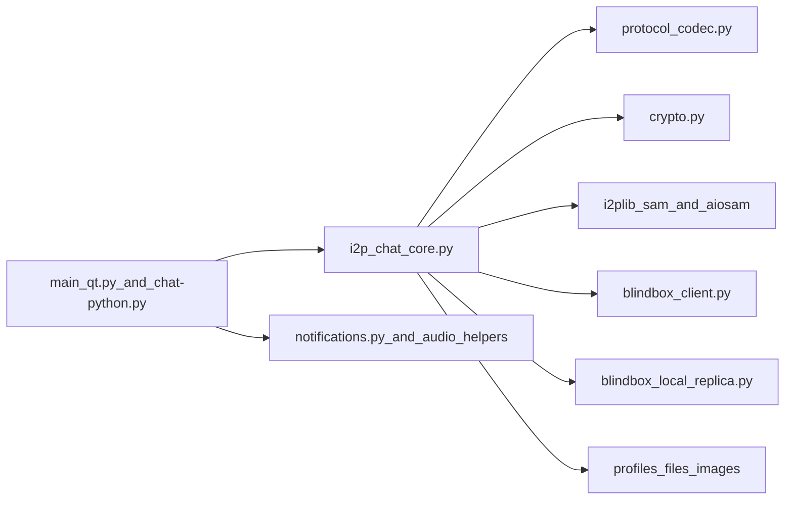

# Security Audit Report: I2PChat

Audit date: 2026-03-22  
Mode: full audit (architecture + protocol + crypto + runtime checks + CI/build + supply chain)  
Scope: current local repository state (`I2PChat`)

## Executive Summary

This audit reviewed protocol security, local trust boundaries, runtime behavior, and software supply chain controls.

Confirmed findings:
- Critical: 0
- High: 0
- Medium: 1
- Low: 3

Overall conclusion: protocol-level integrity controls are strong (signed handshake, TOFU pinning, sequence/HMAC checks, downgrade detection). During this remediation cycle, M-01/M-02/M-03 were addressed in code; the highest remaining practical risks are release and CI supply-chain assurance gaps.

## Scope and Methodology

Reviewed components:
- Protocol and runtime core: `i2p_chat_core.py`, `protocol_codec.py`, `crypto.py`
- I2P/SAM transport: `i2plib/aiosam.py`, `i2plib/sam.py`, `blindbox_client.py`, `blindbox_local_replica.py`
- GUI/local boundary handling: `main_qt.py`, `notifications.py`
- Build/release pipeline: `build-linux.sh`, `build-macos.sh`, `build-windows.ps1`, `I2PChat.spec`
- Dependency governance and CI policy: `requirements.in`, `requirements.txt`, `requirements-ci-audit.txt`, `.github/workflows/security-audit.yml`, `.github/workflows/secret-scan.yml`, `flake.nix`, `flake.lock`

Method:
- Static trust-boundary and attack-surface review
- Verification of cryptographic and protocol controls
- Runtime checks (tests and lockfile dependency audit)
- Supply-chain and release-integrity review

Runtime checks executed:
- `python3 --version` -> `Python 3.14.3`
- `python3 -m unittest tests/test_asyncio_regression.py tests/test_protocol_framing_vnext.py tests/test_profile_import_overwrite.py tests/test_audit_remediation.py` -> `FAILED (1)` due to documentation assertion (`test_metadata_padding_docs_present`)
- `python3 -m unittest tests/test_blindbox_client.py` -> `OK (5 tests)`
- `./.audit-venv/bin/pip-audit -r requirements.txt` -> `No known vulnerabilities found`
- `./.audit-venv/bin/pip-audit -r requirements.in` -> `No known vulnerabilities found`

Notes:
- The failing documentation test is treated as a baseline quality issue, not a direct exploitable vulnerability.

## Architecture and Trust Boundaries

Primary boundaries:
- Network peer -> frame parser (`ProtocolCodec.read_frame`) -> dispatcher
- Core runtime -> local SAM router (trust in local I2P/SAM endpoint)
- BlindBox client -> remote replicas or direct `host:port`
- Core/GUI -> local filesystem and profile data
- Build/CI -> released binaries and dependency inputs

Security-significant facts:
- Strict vNext framing and explicit protocol versioning
- Explicit anti-downgrade checks after handshake
- TOFU peer key pinning and signature-verified handshake
- Path confinement checks in key GUI file-open paths
- Hash-pinned Python lockfiles for build/audit paths

## Protocol and Cryptography Deep-Dive

Verified controls:
- Signed handshake messages (`INIT`/`RESP`) using Ed25519
- TOFU pinning via `_pin_or_verify_peer_signing_key`
- Ephemeral X25519 + shared-secret derivation
- Context-bound HMAC checks (`seq`, `flags`, `msg_id`) with constant-time compare
- Replay/reorder resistance via sequence validation
- Downgrade detection for unexpected plaintext frames post-handshake
- ACK context validation with bounded and pruned state

Protocol framing:
- Header: `MAGIC(4) | VER(1) | TYPE(1) | FLAGS(1) | MSG_ID(8) | LEN(4)`
- Resync limit enforced by codec (`resync_limit`, default 64 KiB)

## Threat Model Summary

Adversaries considered:
- Malicious remote peer on I2P
- Active manipulator at transport boundaries
- Local unprivileged process on same host
- Supply-chain attacker on dependencies/build/release path

Well-mitigated classes:
- Message tampering and replay attempts
- Basic downgrade attempts after handshake establishment
- Impersonation without trust compromise (subject to TOFU and local SAM trust assumptions)

Residual classes:
- Local trust assumptions around SAM and BlindBox local replica
- Metadata leakage in logs/UI under some paths
- Release authenticity assurances not integrated with platform-native trust chains

## Findings

## [LOW] M-01: SAM debug logging could expose sensitive SAM replies — MITIGATED

Affected:
- `i2plib/aiosam.py`
- `i2plib/sam.py`

Category: sensitive data exposure / local confidentiality

Evidence:
- Added `_redact_sam_reply(...)` to sanitize sensitive key/value pairs before debug logging.
- `parse_reply` now logs redacted output instead of raw SAM reply text.

Impact:
- Residual risk is significantly reduced; sensitive SAM fields are now redacted in this logging path.

Exploitability:
- Low after mitigation.

Recommendations:
1. Keep redaction list aligned with SAM field evolution.
2. Keep regression tests for log redaction in CI.

---

## [LOW] M-02: BlindBox local replica auth/isolation gaps — PARTIALLY MITIGATED

Affected:
- `blindbox_local_replica.py`

Category: local trust boundary / unauthorized local access

Evidence:
- Local replica now supports optional auth token for `PUT/GET`.
- Core local-auto flow now provisions and uses local auth token.
- Local replica now supports bounded entry count (`max_entries`) with `FULL` response.

Impact:
- Local abuse risk is reduced for local-auto mode and token-enabled deployments; remaining risk exists where operators keep direct/local mode without token hardening.

Exploitability:
- Low-to-medium depending on deployment hardening.

Recommendations:
1. Enable/require local token in all direct/local deployments.
2. Add per-namespace quotas and rate limiting as a next step.

---

## [LOW] M-03: BlindBox direct-TCP downgrade risk — MITIGATED BY POLICY CONTROLS

Affected:
- `i2p_chat_core.py`
- `blindbox_client.py`

Category: transport security posture / configuration risk

Evidence:
- Added strict mode gate `I2PCHAT_BLINDBOX_REQUIRE_SAM=1` to reject direct `host:port` replica configurations.
- Added explicit runtime warning when non-SAM direct transport is active.

Impact:
- Misconfiguration risk is reduced; strict mode now enforces secure transport policy when enabled.

Exploitability:
- Low with strict mode; medium if operators do not enable policy gate.

Recommendations:
1. Keep strict mode enabled by default in hardened deployments.
2. Expand operator docs around direct/local transport implications.

---

## [LOW] M-04: CI lockfile audit gap — MITIGATED

Affected:
- `.github/workflows/security-audit.yml`
- `requirements.in`
- `requirements.txt`

Category: supply-chain assurance gap

Evidence:
- CI now runs `pip-audit -r requirements.txt` as the primary gate.
- `pip-audit -r requirements.in` remains as supplemental signal.

Impact:
- Main gap is closed for lockfile-driven dependency assurance.

Exploitability:
- Low after mitigation.

Recommendations:
1. Keep lockfile-first audit mandatory in CI.
2. Add SBOM retention from lockfile in release process.

---

## [MEDIUM] M-05: Release trust does not include platform-native signing/notarization

Affected:
- `build-linux.sh`, `build-macos.sh`, `build-windows.ps1`
- Release policy checks in `.github/workflows/security-audit.yml`

Category: release authenticity / distribution trust

Evidence:
- Build scripts generate checksums and detached signatures
- No enforced platform-native trust chain (for example Authenticode or Apple notarization) in current pipeline

Impact:
- Security depends on manual checksum/signature verification and user discipline; platform trust UX is weaker for most users.

Exploitability:
- Medium. Requires release-channel compromise or verification bypass by users.

Recommendations:
1. Add platform-native signing and notarization workflows.
2. Add provenance attestations in release CI.
3. Publish versioned key policy and verification guidance.

---

## [LOW] L-01: Local path disclosure in UI/logs — MITIGATED

Affected:
- `i2p_chat_core.py`

Evidence:
- Incoming file status now emits basename (`final_name`) instead of absolute path.
- Image cache cleanup log now emits basename instead of absolute path.

Impact:
- Local privacy leakage risk is reduced in these paths.

Recommendation:
- Keep basename-only logging for user-facing/system message paths.

---

## [LOW] L-02: Windows stdout notification content leak — MITIGATED

Affected:
- `notifications.py`

Evidence:
- Fallback path now emits generic text only: `"[NOTIFY] New message received"`.

Impact:
- Message content leakage via stdout fallback is reduced.

Recommendation:
- Keep plaintext message content out of stdout fallback paths.

---

## [LOW] L-03: Secret-scan checksum source is not independently trusted

Affected:
- `.github/workflows/secret-scan.yml`

Evidence:
- `gitleaks` archive and checksums are both fetched from same release source URL

Impact:
- If release source is compromised, both artifact and checksum can be replaced together.

Recommendation:
- Verify detached signatures/provenance from independent trust root where possible.

## Verified Strengths

- Strong protocol integrity primitives and downgrade/replay safeguards.
- Hash-pinned lockfiles with `--require-hashes` in critical install paths.
- Pinned GitHub Actions commits and least-privilege workflow permissions.
- Explicit vendored dependency governance metadata (`i2plib/VENDORED_UPSTREAM.json`).
- No use of `shell=True`, `eval`, `exec`, or unsafe deserialization patterns found in core Python paths.

## Residual Risks and Testing Gaps

Residual risks:
- Security posture depends on local SAM trust and operator configuration.
- Local-host attack model remains relevant for BlindBox fallback mode.
- Release verification remains harder for non-expert users without platform-native signatures.

Recommended additional tests:
1. Add tests asserting SAM log redaction for sensitive fields.
2. Add tests for strict-SAM mode (reject direct TCP replica configs).
3. Add tests for BlindBox local replica quotas/rate limits after mitigation.
4. Extend CI checks to enforce lockfile-based vulnerability audit.

## Remediation Priority

1. P1: M-05 (platform-native release signing/notarization)
2. P2: further hardening for M-02 (namespace/rate-limit policies)
3. P3: additional supply-chain hardening for `L-03`

## Conclusion

I2PChat shows solid protocol hardening and generally careful defensive coding. The main remaining risks are practical operational boundaries (local process trust, logging hygiene, and release assurance), not a direct break of core cryptographic protocol logic.
