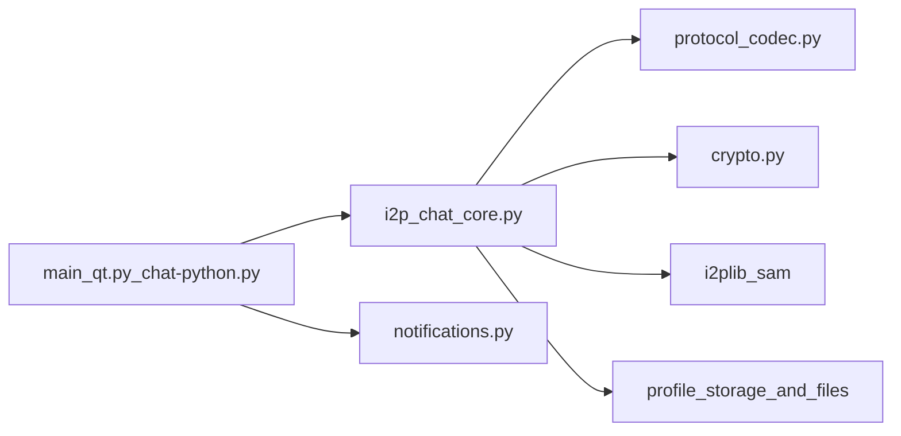

# Отчёт по аудиту безопасности: I2PChat

Дата аудита: 2026-03-17  
Режим: полный аудит (архитектура + протокол + криптография + CI/build + supply chain)  
Область: текущее локальное состояние репозитория (`I2PChat`)

## Executive Summary

Этот аудит сфокусирован на архитектурных trust boundaries и поведении протокола в атакующих сценариях, с дополнительной проверкой целостности сборки и CI.

Подтверждённые находки:
- Critical: 0
- High: 0
- Medium: 1
- Low: 4

Общий вывод: runtime-уровень протокола хорошо усилен (signed handshake, TOFU pinning, replay/downgrade защиты, context-bound MAC), а остаточный риск смещён в область аутентичности релизов и долгосрочного governance цепочки поставки.

## Scope и методология

Проверенные компоненты:
- Протокол и core runtime: `i2p_chat_core.py`, `protocol_codec.py`, `crypto.py`
- GUI и локальные границы: `main_qt.py`, `notifications.py`
- Сборка и упаковка: `build-linux.sh`, `build-macos.sh`, `build-windows.ps1`, `I2PChat.spec`
- Управление зависимостями и lock-файлами: `requirements.in`, `requirements.txt`, `requirements-build.txt`, `requirements-ci-audit.txt`
- CI-контроли: `.github/workflows/security-audit.yml`, `.github/workflows/secret-scan.yml`
- Security-регрессии: `tests/test_protocol_framing_vnext.py`, `tests/test_profile_import_overwrite.py`, `tests/test_audit_remediation.py`, `tests/test_asyncio_regression.py`

Метод:
- Статический обзор trust boundaries и attack surface
- Верификация протокольных и криптографических контролей
- Анализ supply chain и release integrity
- Запуск регрессионных тестов

Проверка тестами:
- `python3 -m unittest tests/test_asyncio_regression.py tests/test_protocol_framing_vnext.py tests/test_profile_import_overwrite.py tests/test_audit_remediation.py` -> OK (46 tests)

## Архитектура и границы доверия

Основные границы:
- Сетевой peer -> парсер протокола (`ProtocolCodec.read_frame`) -> диспетчер сообщений
- Core runtime -> локальный SAM router (`i2plib.dest_lookup`)
- Core/GUI -> профильное хранилище и файловые пути
- GUI/runtime -> локальные subprocess helper-команды (notification/audio)
- Build/CI -> релизные артефакты и публикуемые бинарники

Критичные для безопасности архитектурные факты:
- Строгий vNext framing (`MAGIC`, явный `PROTOCOL_VERSION=4`, ограничение длины кадра)
- Legacy-парсинг включается только явно (`allow_legacy=False` в настройке codec)
- Операции с профилями/изображениями используют path confinement (`realpath` + проверки директории)
- ACK-учёт имеет bounded state и TTL pruning (`ACK_MAX_PENDING`, `ACK_TTL_SECONDS`)

## Углублённая оценка протокола и криптографии

Подтверждённые контроли:
- Signed handshake (`INIT`/`RESP`) на Ed25519
- TOFU pinning ключа peer (`_pin_or_verify_peer_signing_key`)
- PFS через эфемерные X25519 ключи и DH shared secret
- Финальный shared secret выводится из DH + двух nonce
- Context-bound HMAC (`seq`, `flags`, `msg_id`) и constant-time compare
- Anti-replay через строгую валидацию sequence
- Anti-downgrade обнаружение plaintext кадра после handshake
- ACK context validation (`peer_addr`, `ack_kind`, `ack_session_epoch`)

Факты по framing:
- Заголовок: `MAGIC(4) | VER(1) | TYPE(1) | FLAGS(1) | MSG_ID(8) | LEN(4)`
- Жёсткий лимит resync (`resync_limit`, по умолчанию 64 KiB)

## Краткая модель угроз

Рассмотренные нарушители:
- Удалённый злонамеренный peer в I2P
- Активный манипулятор на транспортной границе (MITM-like)
- Локальный непривилегированный атакующий в hostile workstation environment
- Supply-chain атакующий (dependency/build/release channel)

Классы угроз, которые снижены:
- Подмена/порча сообщений (HMAC)
- Replay и reorder попытки (проверка sequence)
- Protocol downgrade попытки (запрет plaintext после handshake)
- Handshake impersonation без компрометации доверия (signed handshake + TOFU + SAM identity checks)

Остаточные классы (design/operational):
- Утечка метаданных из видимых полей framing и pre-handshake identity exchange
- Пробелы аутентичности release-channel без platform-native signing/notarization
- Долгосрочный риск сопровождения vendored transport-библиотеки

## Findings

## [MEDIUM] A-01: Релизные артефакты имеют checksums/signature, но без platform-trust подписи

Затронуто:
- `build-linux.sh`, `build-macos.sh`, `build-windows.ps1`
- `.github/workflows/security-audit.yml`

Категория: release authenticity / supply chain

Наблюдение:
- Build-скрипты формируют `SHA256SUMS` и detached подпись `SHA256SUMS.asc`.
- Отсутствует platform-native trust chain (например, Authenticode для Windows, Apple signing/notarization для macOS, provenance attestations в release pipeline).

Влияние:
- Пользователь вынужден опираться на ручной checksum/signature workflow и внешнее доверие к ключу.
- При компрометации канала дистрибуции риск заметно возрастает.

Эксплуатируемость:
- Medium. Требуется компрометация канала релиза или ошибка верификации у пользователя.

Рекомендации:
1. Добавить platform-native signing/notarization для распространяемых бинарников.
2. Добавить release provenance attestations в CI.
3. Публиковать и поддерживать signing policy с pinning fingerprint ключа.

---

## [LOW] P-01: Вывод ключа handshake без явного key separation (без HKDF) — ИСПРАВЛЕНО

Затронуто:
- `i2p_chat_core.py` (`_compute_final_shared_key`)
- `crypto.py`

Категория: cryptographic robustness

Статус remediation:
- В `crypto.py` добавлен HKDF (`hkdf_extract`/`hkdf_expand`) и деривация subkeys через `derive_handshake_subkeys(...)`.
- В `i2p_chat_core.py` handshake теперь формирует отдельные ключи `k_enc` и `k_mac` (`shared_key` + `shared_mac_key`).
- Шифрование использует `k_enc`, а MAC-проверка — `k_mac`.

Влияние:
- Практического взлома прошлой схемы не выявлено, однако явное разделение ключей через KDF даёт более строгую криптографическую гигиену.

Эксплуатируемость:
- Low. В первую очередь defense-in-depth.

Итог:
- Риск закрыт как defense-in-depth hardening.

---

## [LOW] P-02: Метаданные протокола остаются наблюдаемыми — ЧАСТИЧНО СНИЖЕНО

Затронуто:
- `protocol_codec.py`
- `i2p_chat_core.py` (path обмена identity preface)

Категория: metadata privacy / traffic analysis

Статус remediation:
- Документация threat-model обновлена в `README.md`, `docs/MANUAL_RU.md`, `docs/MANUAL_EN.md`.
- Введён опциональный профиль padding для encrypted payload; по умолчанию включён `balanced` (выравнивание по 128 байт).
- Профиль может быть переключён через `I2PCHAT_PADDING_PROFILE` (`balanced`/`off`).

Влияние:
- Видимость заголовка по-прежнему позволяет выводы о паттернах трафика (тип/длина) и косвенной корреляции.

Эксплуатируемость:
- Low с точки зрения целостности протокола, но важно для privacy posture.

Итог:
- Полностью убрать наблюдаемость `TYPE/LEN` нельзя в текущем framing, но корреляция по длине снижена.

---

## [LOW] S-01: Vendored `i2plib` требует формализованного процесса security-обновлений — ИСПРАВЛЕНО

Затронуто:
- `i2plib/` (vendored copy)
- `requirements.in` / `requirements.txt` (без PyPI `i2plib`)

Категория: supply-chain lifecycle

Статус remediation:
- Добавлен machine-readable provenance файл `i2plib/VENDORED_UPSTREAM.json`.
- Добавлена политика сопровождения `docs/VENDORED_I2PLIB_POLICY.md` (cadence, advisory sources, review workflow).
- В CI (`.github/workflows/security-audit.yml`) добавлена проверка обязательных provenance-полей.

Влияние:
- Без формальной политики синхронизации возможна задержка внедрения upstream security-fixes.

Эксплуатируемость:
- Низкая прямая эксплуатируемость; средний операционный риск в долгом горизонте.

Итог:
- Governance-процесс формализован и машинно проверяется в CI.

---

## Подтверждённые сильные стороны

- Hash-pinned lockfiles и использование `--require-hashes` для build/audit зависимостей.
- GitHub Actions закреплены по commit SHA; workflows работают с least-privilege (`contents: read`).
- Есть отдельный secret scanning workflow с checksum-верификацией скачиваемого инструмента (`gitleaks`).
- Framing протокола и downgrade-защиты покрыты regression-тестами.
- ACK-state management использует TTL и bounded pending queue.
- В GUI для изображений/профилей применены confinement и атомарные паттерны записи.
- Linux helper-команды запускаются через absolute paths (`shutil.which`) перед subprocess.

## Остаточные риски и пробелы тестирования

Остаточные риски:
- Утечка privacy-метаданных остаётся осознанным trade-off текущего framing.
- Доверие к релизной подписи по-прежнему зависит от дисциплины верификации пользователя и не усилено platform-native trust signing.

Рекомендуемые дополнительные тесты:
1. Негативные тесты для malformed handshake transcript и mixed-role replay сценариев.
2. Протокольные тесты граничных случаев padding (малые, около границы bucket и большие payload-и).
3. CI policy-тесты на обязательность platform signing/notarization после внедрения.

## Приоритет remediation

1. P1: A-01 (platform-native release trust + provenance attestations)
2. P2: P-02 (дальнейшее privacy-усиление в рамках ограничений текущего header framing)
3. P3: Непрерывная дисциплина сопровождения контролей S-01/S-02 (periodic governance reviews)

## Заключение

Текущее состояние I2PChat показывает сильные контроли целостности протокола и дисциплинированные defensive checks в runtime-путях. Наиболее существенный оставшийся пробел — аутентичность релизов на этапе дистрибуции; при этом внедрённые HKDF key separation и governance-контроли цепочки поставки заметно снизили часть прежних низкоуровневых рисков.
