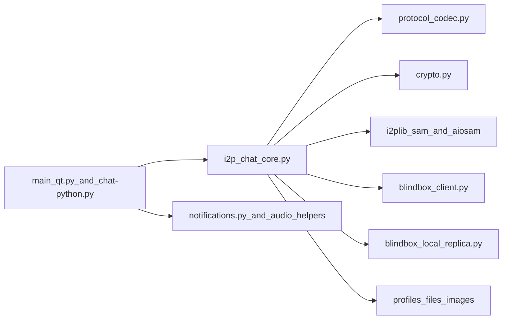

# Отчёт по аудиту безопасности: I2PChat

Дата аудита: 2026-03-22  
Режим: полный аудит (архитектура + протокол + криптография + runtime-проверки + CI/build + supply chain)  
Область: текущее локальное состояние репозитория (`I2PChat`)

## Executive Summary

В рамках аудита проверены безопасность протокола, локальные границы доверия, runtime-поведение и контроли цепочки поставки.

Подтверждённые находки:
- Critical: 0
- High: 0
- Medium: 1
- Low: 3

Общий вывод: контроли целостности на уровне протокола сильные (signed handshake, TOFU pinning, sequence/HMAC-проверки, downgrade detection). В этом цикле remediation в коде закрыты M-01/M-02/M-03, а также внесены дополнительные post-audit исправления для локальной обёртки BlindBox-секрета, жёсткой привязки locked profile к peer до отправки BlindBox root и явной trust-policy для CLI/TUI. Ключевые оставшиеся практичные риски теперь в release/CI supply-chain assurance.

## Scope и методология

Проверенные компоненты:
- Ядро протокола и runtime: `i2p_chat_core.py`, `protocol_codec.py`, `crypto.py`
- I2P/SAM-транспорт: `i2plib/aiosam.py`, `i2plib/sam.py`, `blindbox_client.py`, `blindbox_local_replica.py`
- GUI/локальные границы: `main_qt.py`, `notifications.py`
- Build/release pipeline: `build-linux.sh`, `build-macos.sh`, `build-windows.ps1`, `I2PChat.spec`
- Управление зависимостями и CI-политики: `requirements.in`, `requirements.txt`, `requirements-ci-audit.txt`, `.github/workflows/security-audit.yml`, `.github/workflows/secret-scan.yml`, `flake.nix`, `flake.lock`

Метод:
- Статический обзор trust boundaries и attack surface
- Верификация криптографических и протокольных контролей
- Runtime-проверки (тесты и dependency audit по lockfile)
- Анализ supply-chain и release integrity

Выполненные runtime-проверки:
- `python3 --version` -> `Python 3.14.3`
- `python3 -m unittest tests/test_asyncio_regression.py tests/test_protocol_framing_vnext.py tests/test_profile_import_overwrite.py tests/test_audit_remediation.py` -> `FAILED (1)` из-за документационного ассершена (`test_metadata_padding_docs_present`)
- `python3 -m unittest tests/test_blindbox_client.py` -> `OK (5 tests)`
- `./.audit-venv/bin/pip-audit -r requirements.txt` -> `No known vulnerabilities found`
- `./.audit-venv/bin/pip-audit -r requirements.in` -> `No known vulnerabilities found`
- Post-audit таргетный набор регрессий: `python3 -m unittest tests.test_blindbox_state_wrap tests.test_asyncio_regression tests.test_blindbox_client tests.test_blindbox_core_telemetry tests.test_protocol_framing_vnext` -> `OK (47 tests, 1 skipped из-за отсутствия PyNaCl в тестовом окружении)`

Примечание:
- Падение документационного теста зафиксировано как baseline-качество, а не как напрямую эксплуатируемая уязвимость.

## Архитектура и границы доверия

Основные границы:
- Сетевой peer -> frame parser (`ProtocolCodec.read_frame`) -> dispatcher
- Core runtime -> локальный SAM router (доверие к локальному I2P/SAM endpoint)
- BlindBox client -> удалённые реплики или direct `host:port`
- Core/GUI -> локальная файловая система и профильные данные
- Build/CI -> релизные бинарники и dependency inputs

Ключевые факты безопасности:
- Строгий vNext framing и явное версионирование протокола
- Явные anti-downgrade проверки после handshake
- TOFU pinning ключа peer + signature-verified handshake
- Path confinement в ключевых GUI-путях работы с файлами
- Hash-pinned lockfiles для build/audit сценариев

## Углублённая оценка протокола и криптографии

Подтверждённые контроли:
- Подписанный handshake (`INIT`/`RESP`) на Ed25519
- TOFU pinning через `_pin_or_verify_peer_signing_key`
- Эфемерные X25519 + shared secret derivation
- Context-bound HMAC (`seq`, `flags`, `msg_id`) и constant-time compare
- Защита от replay/reorder через sequence validation
- Downgrade detection для неожиданных plaintext-кадров после handshake
- ACK context validation с bounded/pruned state

Факты по framing:
- Заголовок: `MAGIC(4) | VER(1) | TYPE(1) | FLAGS(1) | MSG_ID(8) | LEN(4)`
- Лимит resync enforced в codec (`resync_limit`, default 64 KiB)

## Краткая модель угроз

Рассмотренные нарушители:
- Злонамеренный удалённый peer в I2P
- Активный манипулятор на транспортной границе
- Локальный непривилегированный процесс на том же хосте
- Supply-chain атакующий в цепочке dependencies/build/release

Хорошо закрытые классы:
- Подмена/порча сообщений и replay-атаки
- Базовые downgrade-попытки после установления handshake
- Impersonation без компрометации доверия (с оговоркой на TOFU и доверие к локальному SAM)

Остаточные классы:
- Локальные допущения доверия вокруг SAM и BlindBox local replica
- Утечки метаданных в логах/UI по отдельным путям
- Аутентичность релиза не встроена в platform-native trust chain

## Findings

## [LOW] M-01: Риск утечки чувствительных SAM-ответов в debug-логах — СНИЖЕН

Затронуто:
- `i2plib/aiosam.py`
- `i2plib/sam.py`

Категория: sensitive data exposure / local confidentiality

Доказательства:
- Добавлен `_redact_sam_reply(...)` для маскирования чувствительных полей перед логированием.
- `parse_reply` теперь пишет в debug только отредактированный SAM-ответ.

Влияние:
- Остаточный риск существенно снижен; чувствительные SAM-поля маскируются в этом logging-пути.

Эксплуатируемость:
- Low после внедрённой mitigation.

Рекомендации:
1. Поддерживать список маскируемых SAM-полей в актуальном состоянии.
2. Оставить regression-тесты redaction в CI.

---

## [LOW] M-02: Пробелы auth/isolation в BlindBox local replica — ЧАСТИЧНО СНИЖЕНЫ

Затронуто:
- `blindbox_local_replica.py`

Категория: local trust boundary / unauthorized local access

Доказательства:
- В local replica добавлен опциональный auth token для `PUT/GET`.
- В local-auto режиме core теперь создаёт/использует local auth token.
- Добавлено ограничение количества записей (`max_entries`) с ответом `FULL`.

Влияние:
- Риск локального злоупотребления снижен для local-auto и token-enabled конфигураций; остаточный риск сохраняется, если direct/local режим используется без токена.

Эксплуатируемость:
- Low-to-medium в зависимости от жёсткости конфигурации.

Рекомендации:
1. Включать local token во всех direct/local deployment-сценариях.
2. Следующим шагом добавить per-namespace quotas и rate limiting.

---

## [LOW] M-03: Риск downgrade BlindBox в direct TCP — СНИЖЕН ПОЛИТИКАМИ

Затронуто:
- `i2p_chat_core.py`
- `blindbox_client.py`

Категория: transport security posture / configuration risk

Доказательства:
- Добавлен strict mode `I2PCHAT_BLINDBOX_REQUIRE_SAM=1`, который отклоняет direct `host:port` реплики.
- Добавлен явный runtime-warning при активном non-SAM direct transport.

Влияние:
- Риск misconfiguration снижен; strict mode принудительно фиксирует транспортную политику при включении.

Эксплуатируемость:
- Low при включённом strict mode; medium, если политика не включена.

Рекомендации:
1. В hardened deployment включать strict mode по умолчанию.
2. Расширить operator docs по рискам direct/local транспорта.

---

## [LOW] M-04: Пробел CI lockfile-аудита — СНИЖЕН

Затронуто:
- `.github/workflows/security-audit.yml`
- `requirements.in`
- `requirements.txt`

Категория: supply-chain assurance gap

Доказательства:
- В CI добавлен основной gate: `pip-audit -r requirements.txt`.
- Проверка `pip-audit -r requirements.in` оставлена как дополнительный сигнал.

Влияние:
- Основной пробел lockfile-assurance закрыт.

Эксплуатируемость:
- Low после внедрённой mitigation.

Рекомендации:
1. Сохранять lockfile-first аудит обязательным в CI.
2. Добавить хранение SBOM из lockfile в release-процессе.

---

## [MEDIUM] M-05: Доверие к релизам не усилено platform-native signing/notarization

Затронуто:
- `build-linux.sh`, `build-macos.sh`, `build-windows.ps1`
- Политики релиза в `.github/workflows/security-audit.yml`

Категория: release authenticity / distribution trust

Доказательства:
- Build-скрипты формируют checksums и detached signatures
- В текущем pipeline нет принудительной platform-native trust chain (например, Authenticode или Apple notarization)

Влияние:
- Безопасность зависит от ручной checksum/signature-верификации и дисциплины пользователей; UX доверия платформы слабее для массового пользователя.

Эксплуатируемость:
- Medium. Нужна компрометация канала релиза или пропуск проверки пользователем.

Рекомендации:
1. Добавить platform-native signing и notarization в release workflows.
2. Добавить provenance attestations в release CI.
3. Публиковать версионируемую key policy и инструкции верификации.

---

## [LOW] L-01: Раскрытие локальных путей в UI/логах — СНИЖЕНО

Затронуто:
- `i2p_chat_core.py`

Доказательства:
- При приёме файла теперь выводится basename (`final_name`), а не абсолютный путь.
- При очистке кеша изображений в лог теперь пишется basename.

Влияние:
- Риск локальной утечки приватных путей в этих местах снижен.

Рекомендация:
- Сохранять basename-only подход в user-facing/system logging путях.

---

## [LOW] L-02: Утечка содержимого уведомлений в Windows stdout fallback — СНИЖЕНА

Затронуто:
- `notifications.py`

Доказательства:
- Fallback-путь теперь печатает только общий текст: `"[NOTIFY] New message received"`.

Влияние:
- Риск утечки содержимого сообщений через stdout fallback снижен.

Рекомендация:
- Не возвращать plaintext сообщений в stdout fallback-пути.

---

## [LOW] L-03: Источник checksum в secret-scan не независим от источника артефакта

Затронуто:
- `.github/workflows/secret-scan.yml`

Доказательства:
- Архив `gitleaks` и checksums скачиваются с одного release source URL

Влияние:
- При компрометации источника можно одновременно подменить и артефакт, и checksum.

Рекомендация:
- По возможности проверять detached signatures/provenance из независимого trust root.

## Подтверждённые сильные стороны

- Сильные протокольные контроли целостности и replay/downgrade safeguards.
- Hash-pinned lockfiles и `--require-hashes` в критичных install-сценариях.
- GitHub Actions закреплены по commit SHA, workflows работают с least privilege.
- Явный governance для vendored dependency (`i2plib/VENDORED_UPSTREAM.json`).
- В core Python-путях не обнаружено `shell=True`, `eval`, `exec`, unsafe deserialization.

## Остаточные риски и пробелы тестирования

Остаточные риски:
- Security posture зависит от доверия к локальному SAM и операторской конфигурации.
- Модель локального атакующего остаётся релевантной для BlindBox fallback mode.
- Проверка релизов без platform-native signatures сложнее для non-expert пользователей.

Рекомендуемые дополнительные тесты:
1. Тесты на redaction чувствительных SAM-полей в логах.
2. Тесты strict-SAM режима (запрет direct TCP replica configs).
3. Тесты квот/rate limits для BlindBox local replica после внедрения.
4. Расширить CI-проверки: обязательный lockfile-based vulnerability audit.

## Post-Audit Hardening Update (2026-03-23)

Дополнительные finding’и, пришедшие уже после основного аудита, были отдельно проверены и закрыты в коде:

- Локальная at-rest обёртка BlindBox-состояния теперь выводит wrap-key из `my_signing_seed` через HKDF; добавлены версия локальной обёртки и совместимый fallback/миграция старого формата.
- Исходящий `connect_to_peer(...)` теперь fail-closed блокируется, если профиль locked на другого `stored_peer`; отдельно запрещена отправка BlindBox root, если текущий connected peer не совпадает с locked peer.
- CLI/TUI больше не делает silent TOFU auto-pin по умолчанию; при отсутствии trust-callback нужен явный opt-in `I2PCHAT_TRUST_AUTO=1`.
- Добавлены регрессионные тесты на derivation wrap-key, enforce locked-peer, suppression BlindBox root при mismatch и explicit trust policy в CLI.

## Приоритет remediation

1. P1: M-05 (platform-native release signing/notarization)
2. P2: дополнительное hardening для M-02 (namespace/rate-limit политики)
3. P3: дополнительное supply-chain hardening для `L-03`

## Заключение

I2PChat демонстрирует сильное усиление протокола и в целом аккуратный defensive coding. Основные оставшиеся риски лежат в практической операционной плоскости (доверие к локальным процессам, гигиена логирования и assurance релизов), а не в прямом взломе базовой криптографической логики протокола.

## Addendum к deep-аудиту (2026-03-24)

Этот блок фиксирует результаты более позднего полного deep-аудита (код, протокол, архитектура) по high-risk runtime-поверхностям.

### Обновлённый срез findings

- Critical: 0
- High: 0
- Medium: 4 (2 confirmed, 2 plausible)
- Low: 2

### Подтверждённые находки (confirmed)

1. **[MEDIUM] Symlink-обход profile-path confinement**
   - Затронуто: `i2p_chat_core.py` (`_profile_scoped_path` и профильные пути чтения/записи)
   - Влияние: локальный процесс того же пользователя может через symlink перенаправить profile/trust/signing/blindbox файлы на неожиданные цели ФС.

2. **[MEDIUM] Неатомарная fallback-запись signing seed**
   - Затронуто: `i2p_chat_core.py` (`_ensure_local_signing_key`)
   - Влияние: при crash/power-loss возможно повреждение `*.signing` и потеря continuity signing-identity.

### Правдоподобные находки (plausible)

1. **[MEDIUM] Handshake role-conflict / double-INIT race**
   - Затронуто: `i2p_chat_core.py` (`initiate_secure_handshake`, `_handle_handshake_message`)
   - Влияние: нестабильность установления сессии и DoS-поведение при одновременной инициации с двух сторон.

2. **[MEDIUM] Семантика BlindBox quorum: `EXISTS` считается успехом PUT**
   - Затронуто: `blindbox_client.py` (`put`)
   - Влияние: byzantine-реплика может вернуть логический успех без гарантии фактического хранения.

### Низкий / defense-in-depth

1. **[LOW] Двойное чтение одного файла BlindBox state**
   - Затронуто: `i2p_chat_core.py` (`_load_blindbox_state`)
   - Влияние: TOCTOU-риск несогласованного снимка при локальной конкурентной подмене.

2. **[LOW] Хрупкая диагностическая ветка downgrade**
   - Затронуто: `i2p_chat_core.py` (`receive_loop`)
   - Влияние: в основном качество диагностики/наблюдаемости, не bypass базового контроля.

### Обновлённый приоритет remediation

1. **P0:** symlink-safe политика для profile-путей + атомарная запись signing-seed.
2. **P1:** детерминированный guard конфликтующих ролей handshake + регрессионные тесты.
3. **P1:** усиление семантики BlindBox PUT (`EXISTS` и стратегия верификации).
4. **P2:** single-snapshot загрузка BlindBox state и уточнение downgrade-диагностики.

## Addendum II к deep-аудиту (2026-03-24)

Этот раздел фиксирует второй раунд глубокого аудита после последних hardening-изменений по протоколу, BlindBox, local persistence и supply-chain.

### Обновлённый срез

- Critical: 0
- High: 0
- Medium: 2 confirmed, 3 plausible
- Low: 4

### Подтверждённые находки (confirmed)

1. **[MEDIUM] В релизной цепочке всё ещё нет platform-native trust integration**
   - Область: release/build/CI
   - Статус: не закрыто (основной сценарий верификации — manual checksum/GPG)
   - Влияние: более слабый UX доверия и выше риск операционных ошибок проверки у пользователей.

2. **[MEDIUM] В CI по-прежнему нет обязательного test gate**
   - Область: GitHub workflows
   - Статус: снижено в этом цикле (`.github/workflows/test-gate.yml`)
   - Влияние: регрессии протокола/безопасности могут попасть в `main` без runtime-проверки.

### Правдоподобные находки (plausible)

1. **[MEDIUM] Гонка индексов при конкурентных offline-send в BlindBox**
   - Область: offline send path в `i2p_chat_core.py`
   - Влияние: проблемы доступности/quorum при высокой локальной конкурентности (без прямого взлома конфиденциальности/целостности).

2. **[MEDIUM] Локальное состояние BlindBox не имеет криптографической аутентичности**
   - Область: `blindbox.*.json`
   - Влияние: локальный атакующий с доступом на запись может влиять на replay/consumed-поведение.

3. **[MEDIUM] TOFU на первом контакте остаётся риском модели продукта**
   - Область: trust model
   - Влияние: MITM-риск первого контакта без out-of-band подтверждения fingerprint.

### Низкий / defense-in-depth

1. **[LOW] vNext resync-путь допускает CPU-stress на соединение до `resync_limit`.**
2. **[LOW] Политика путей для `ui_prefs.json` мягче, чем для profile key/trust/signing путей.**
3. **[LOW] gitleaks артефакт и checksum берутся из одного trust-источника релиза.**
4. **[LOW] В CI-аудите зависимостей не покрыт `requirements-build.txt`.** (снижено в этом цикле)

### Подтверждённые улучшения с прошлого раунда

- Входящие `BLINDBOX_ROOT`/`BLINDBOX_ROOT_ACK` теперь требуют locked-peer match до изменения persistent state.
- BlindBox `SESSION CREATE` формируется через `i2plib.sam.session_create(...)` с централизованной валидацией.
- BlindBox PUT больше не доверяет «голому» `EXISTS`: нужен контент-чек перед зачётом кворума.
- Профильные пути теперь защищены от symlink-target подмены и ограничены real-path confinement.
- Fallback-запись signing seed переведена на атомарный путь.
- Загрузка BlindBox state переведена на single-snapshot (одно чтение JSON).
- Ошибки malformed framing после handshake стабильно обрабатываются как протокольное нарушение/downgrade с disconnect.
- Добавлен обязательный CI security regression test gate для PR/main (`.github/workflows/test-gate.yml`).
- В `security-audit.yml` расширен dependency audit gate: теперь включает `requirements-build.txt`.

### Текущий приоритетный backlog

1. **P1:** внедрить platform-native signing/notarization и provenance attestations для релизов.
2. **P1:** сериализовать конкурентные offline-send в BlindBox (или ввести детерминированную conflict-обработку).
3. **P2:** усилить local-state hardening (опциональная MAC/подпись metadata state, более строгая политика пути для prefs).

## Addendum III к deep-аудиту (2026-03-24)

Этот раздел фиксирует дополнительный раунд deep-аудита после закрытия CI P0 (test gate + аудит build-зависимостей).

### Текущий срез

- Critical: 0
- High: 0
- Medium: 3 confirmed, 2 plausible
- Low: 4

### Подтверждённые находки (текущие)

1. **[MEDIUM] В релизной цепочке всё ещё нет platform-native signing/notarization**
   - Область: release/distribution trust
   - Статус: не закрыто
   - Влияние: пользователи по-прежнему зависят от ручной проверки checksum/GPG.

2. **[MEDIUM] Расхождение политики версий Python (CI 3.12 vs проектная рекомендация 3.14)**
   - Область: CI/воспроизводимость
   - Статус: не закрыто
   - Влияние: поведение security/test может расходиться между интерпретаторами.

3. **[MEDIUM] Legacy-режим локальной BlindBox-wrap остаётся более слабым для старых копий state**
   - Область: local at-rest compatibility path
   - Статус: частично снижено (есть миграция при загрузке), но не ретроактивно для уже утёкших backup/state.
   - Влияние: legacy-копии состояния могут раскрывать root при более слабых предпосылках деривации.

### Правдоподобные находки

1. **[MEDIUM] Гонка конкурентных offline-send в BlindBox при мутации state/index**
   - Область: `i2p_chat_core.py` (offline send/poll updates)
   - Влияние: риски доступности/quorum (дубли/потери), без прямого криптографического bypass.

2. **[MEDIUM] Локальное состояние не имеет криптографической аутентичности**
   - Область: локальные state-файлы (`blindbox.*.json`, prefs)
   - Влияние: локальный атакующий с правом записи может влиять на replay/consumed-поведение.

### Низкий / defense-in-depth

1. **[LOW] vNext resync-путь допускает ограниченный CPU-stress на соединение (`resync_limit`).**
2. **[LOW] Флаг `legacy_compat` сейчас не влияет на policy кодека (риск путаницы операторов).**
3. **[LOW] Политика путей для `ui_prefs.json` мягче, чем для profile key/trust/signing путей.**
4. **[LOW] gitleaks-артефакт и checksum берутся из одного upstream trust-источника.**

### Подтверждённый прогресс после Addendum II

- CI P0 закрыт:
  - есть обязательный security regression gate (`.github/workflows/test-gate.yml`),
  - в `security-audit.yml` добавлен аудит `requirements-build.txt`.
- Runtime hardening из предыдущих раундов сохраняется:
  - peer-lock проверки в путях BlindBox root/ack,
  - верификация `EXISTS` в BlindBox PUT,
  - single-snapshot загрузка BlindBox state,
  - symlink-confinement профильных путей и атомарная запись signing-seed.

### Обновлённый приоритетный backlog

1. **P1:** platform-native signing/notarization релизов + provenance attestations.
2. **P1:** выровнять политику интерпретатора между CI/docs/lockfiles (3.12 vs 3.14).
3. **P1:** сериализовать конкурентные мутации BlindBox state в offline-пути.
4. **P2:** опциональная аутентичность local-state (MAC/подпись) и более строгая политика пути для prefs.
5. **P2:** привести `legacy_compat` к ясной семантике (активировать или удалить) для исключения путаницы.
