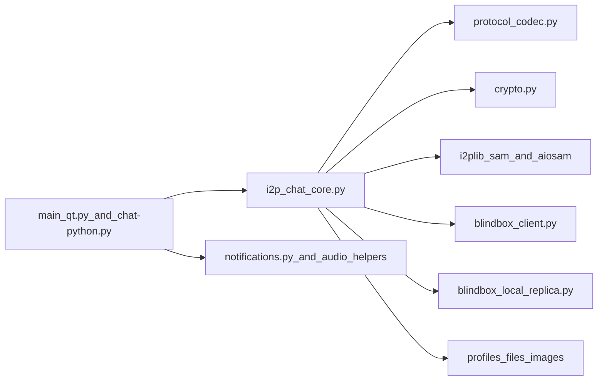

# Отчёт по аудиту безопасности: I2PChat

Дата аудита: 2026-03-22  
Режим: полный аудит (архитектура + протокол + криптография + runtime-проверки + CI/build + supply chain)  
Область: текущее локальное состояние репозитория (`I2PChat`)

## Executive Summary

В рамках аудита проверены безопасность протокола, локальные границы доверия, runtime-поведение и контроли цепочки поставки.

Подтверждённые находки:
- Critical: 0
- High: 0
- Medium: 1
- Low: 3

Общий вывод: контроли целостности на уровне протокола сильные (signed handshake, TOFU pinning, sequence/HMAC-проверки, downgrade detection). В этом цикле remediation в коде закрыты M-01/M-02/M-03; ключевые оставшиеся практичные риски теперь в release/CI supply-chain assurance.

## Scope и методология

Проверенные компоненты:
- Ядро протокола и runtime: `i2p_chat_core.py`, `protocol_codec.py`, `crypto.py`
- I2P/SAM-транспорт: `i2plib/aiosam.py`, `i2plib/sam.py`, `blindbox_client.py`, `blindbox_local_replica.py`
- GUI/локальные границы: `main_qt.py`, `notifications.py`
- Build/release pipeline: `build-linux.sh`, `build-macos.sh`, `build-windows.ps1`, `I2PChat.spec`
- Управление зависимостями и CI-политики: `requirements.in`, `requirements.txt`, `requirements-ci-audit.txt`, `.github/workflows/security-audit.yml`, `.github/workflows/secret-scan.yml`, `flake.nix`, `flake.lock`

Метод:
- Статический обзор trust boundaries и attack surface
- Верификация криптографических и протокольных контролей
- Runtime-проверки (тесты и dependency audit по lockfile)
- Анализ supply-chain и release integrity

Выполненные runtime-проверки:
- `python3 --version` -> `Python 3.14.3`
- `python3 -m unittest tests/test_asyncio_regression.py tests/test_protocol_framing_vnext.py tests/test_profile_import_overwrite.py tests/test_audit_remediation.py` -> `FAILED (1)` из-за документационного ассершена (`test_metadata_padding_docs_present`)
- `python3 -m unittest tests/test_blindbox_client.py` -> `OK (5 tests)`
- `./.audit-venv/bin/pip-audit -r requirements.txt` -> `No known vulnerabilities found`
- `./.audit-venv/bin/pip-audit -r requirements.in` -> `No known vulnerabilities found`

Примечание:
- Падение документационного теста зафиксировано как baseline-качество, а не как напрямую эксплуатируемая уязвимость.

## Архитектура и границы доверия

Основные границы:
- Сетевой peer -> frame parser (`ProtocolCodec.read_frame`) -> dispatcher
- Core runtime -> локальный SAM router (доверие к локальному I2P/SAM endpoint)
- BlindBox client -> удалённые реплики или direct `host:port`
- Core/GUI -> локальная файловая система и профильные данные
- Build/CI -> релизные бинарники и dependency inputs

Ключевые факты безопасности:
- Строгий vNext framing и явное версионирование протокола
- Явные anti-downgrade проверки после handshake
- TOFU pinning ключа peer + signature-verified handshake
- Path confinement в ключевых GUI-путях работы с файлами
- Hash-pinned lockfiles для build/audit сценариев

## Углублённая оценка протокола и криптографии

Подтверждённые контроли:
- Подписанный handshake (`INIT`/`RESP`) на Ed25519
- TOFU pinning через `_pin_or_verify_peer_signing_key`
- Эфемерные X25519 + shared secret derivation
- Context-bound HMAC (`seq`, `flags`, `msg_id`) и constant-time compare
- Защита от replay/reorder через sequence validation
- Downgrade detection для неожиданных plaintext-кадров после handshake
- ACK context validation с bounded/pruned state

Факты по framing:
- Заголовок: `MAGIC(4) | VER(1) | TYPE(1) | FLAGS(1) | MSG_ID(8) | LEN(4)`
- Лимит resync enforced в codec (`resync_limit`, default 64 KiB)

## Краткая модель угроз

Рассмотренные нарушители:
- Злонамеренный удалённый peer в I2P
- Активный манипулятор на транспортной границе
- Локальный непривилегированный процесс на том же хосте
- Supply-chain атакующий в цепочке dependencies/build/release

Хорошо закрытые классы:
- Подмена/порча сообщений и replay-атаки
- Базовые downgrade-попытки после установления handshake
- Impersonation без компрометации доверия (с оговоркой на TOFU и доверие к локальному SAM)

Остаточные классы:
- Локальные допущения доверия вокруг SAM и BlindBox local replica
- Утечки метаданных в логах/UI по отдельным путям
- Аутентичность релиза не встроена в platform-native trust chain

## Findings

## [LOW] M-01: Риск утечки чувствительных SAM-ответов в debug-логах — СНИЖЕН

Затронуто:
- `i2plib/aiosam.py`
- `i2plib/sam.py`

Категория: sensitive data exposure / local confidentiality

Доказательства:
- Добавлен `_redact_sam_reply(...)` для маскирования чувствительных полей перед логированием.
- `parse_reply` теперь пишет в debug только отредактированный SAM-ответ.

Влияние:
- Остаточный риск существенно снижен; чувствительные SAM-поля маскируются в этом logging-пути.

Эксплуатируемость:
- Low после внедрённой mitigation.

Рекомендации:
1. Поддерживать список маскируемых SAM-полей в актуальном состоянии.
2. Оставить regression-тесты redaction в CI.

---

## [LOW] M-02: Пробелы auth/isolation в BlindBox local replica — ЧАСТИЧНО СНИЖЕНЫ

Затронуто:
- `blindbox_local_replica.py`

Категория: local trust boundary / unauthorized local access

Доказательства:
- В local replica добавлен опциональный auth token для `PUT/GET`.
- В local-auto режиме core теперь создаёт/использует local auth token.
- Добавлено ограничение количества записей (`max_entries`) с ответом `FULL`.

Влияние:
- Риск локального злоупотребления снижен для local-auto и token-enabled конфигураций; остаточный риск сохраняется, если direct/local режим используется без токена.

Эксплуатируемость:
- Low-to-medium в зависимости от жёсткости конфигурации.

Рекомендации:
1. Включать local token во всех direct/local deployment-сценариях.
2. Следующим шагом добавить per-namespace quotas и rate limiting.

---

## [LOW] M-03: Риск downgrade BlindBox в direct TCP — СНИЖЕН ПОЛИТИКАМИ

Затронуто:
- `i2p_chat_core.py`
- `blindbox_client.py`

Категория: transport security posture / configuration risk

Доказательства:
- Добавлен strict mode `I2PCHAT_BLINDBOX_REQUIRE_SAM=1`, который отклоняет direct `host:port` реплики.
- Добавлен явный runtime-warning при активном non-SAM direct transport.

Влияние:
- Риск misconfiguration снижен; strict mode принудительно фиксирует транспортную политику при включении.

Эксплуатируемость:
- Low при включённом strict mode; medium, если политика не включена.

Рекомендации:
1. В hardened deployment включать strict mode по умолчанию.
2. Расширить operator docs по рискам direct/local транспорта.

---

## [LOW] M-04: Пробел CI lockfile-аудита — СНИЖЕН

Затронуто:
- `.github/workflows/security-audit.yml`
- `requirements.in`
- `requirements.txt`

Категория: supply-chain assurance gap

Доказательства:
- В CI добавлен основной gate: `pip-audit -r requirements.txt`.
- Проверка `pip-audit -r requirements.in` оставлена как дополнительный сигнал.

Влияние:
- Основной пробел lockfile-assurance закрыт.

Эксплуатируемость:
- Low после внедрённой mitigation.

Рекомендации:
1. Сохранять lockfile-first аудит обязательным в CI.
2. Добавить хранение SBOM из lockfile в release-процессе.

---

## [MEDIUM] M-05: Доверие к релизам не усилено platform-native signing/notarization

Затронуто:
- `build-linux.sh`, `build-macos.sh`, `build-windows.ps1`
- Политики релиза в `.github/workflows/security-audit.yml`

Категория: release authenticity / distribution trust

Доказательства:
- Build-скрипты формируют checksums и detached signatures
- В текущем pipeline нет принудительной platform-native trust chain (например, Authenticode или Apple notarization)

Влияние:
- Безопасность зависит от ручной checksum/signature-верификации и дисциплины пользователей; UX доверия платформы слабее для массового пользователя.

Эксплуатируемость:
- Medium. Нужна компрометация канала релиза или пропуск проверки пользователем.

Рекомендации:
1. Добавить platform-native signing и notarization в release workflows.
2. Добавить provenance attestations в release CI.
3. Публиковать версионируемую key policy и инструкции верификации.

---

## [LOW] L-01: Раскрытие локальных путей в UI/логах — СНИЖЕНО

Затронуто:
- `i2p_chat_core.py`

Доказательства:
- При приёме файла теперь выводится basename (`final_name`), а не абсолютный путь.
- При очистке кеша изображений в лог теперь пишется basename.

Влияние:
- Риск локальной утечки приватных путей в этих местах снижен.

Рекомендация:
- Сохранять basename-only подход в user-facing/system logging путях.

---

## [LOW] L-02: Утечка содержимого уведомлений в Windows stdout fallback — СНИЖЕНА

Затронуто:
- `notifications.py`

Доказательства:
- Fallback-путь теперь печатает только общий текст: `"[NOTIFY] New message received"`.

Влияние:
- Риск утечки содержимого сообщений через stdout fallback снижен.

Рекомендация:
- Не возвращать plaintext сообщений в stdout fallback-пути.

---

## [LOW] L-03: Источник checksum в secret-scan не независим от источника артефакта

Затронуто:
- `.github/workflows/secret-scan.yml`

Доказательства:
- Архив `gitleaks` и checksums скачиваются с одного release source URL

Влияние:
- При компрометации источника можно одновременно подменить и артефакт, и checksum.

Рекомендация:
- По возможности проверять detached signatures/provenance из независимого trust root.

## Подтверждённые сильные стороны

- Сильные протокольные контроли целостности и replay/downgrade safeguards.
- Hash-pinned lockfiles и `--require-hashes` в критичных install-сценариях.
- GitHub Actions закреплены по commit SHA, workflows работают с least privilege.
- Явный governance для vendored dependency (`i2plib/VENDORED_UPSTREAM.json`).
- В core Python-путях не обнаружено `shell=True`, `eval`, `exec`, unsafe deserialization.

## Остаточные риски и пробелы тестирования

Остаточные риски:
- Security posture зависит от доверия к локальному SAM и операторской конфигурации.
- Модель локального атакующего остаётся релевантной для BlindBox fallback mode.
- Проверка релизов без platform-native signatures сложнее для non-expert пользователей.

Рекомендуемые дополнительные тесты:
1. Тесты на redaction чувствительных SAM-полей в логах.
2. Тесты strict-SAM режима (запрет direct TCP replica configs).
3. Тесты квот/rate limits для BlindBox local replica после внедрения.
4. Расширить CI-проверки: обязательный lockfile-based vulnerability audit.

## Приоритет remediation

1. P1: M-05 (platform-native release signing/notarization)
2. P2: дополнительное hardening для M-02 (namespace/rate-limit политики)
3. P3: дополнительное supply-chain hardening для `L-03`

## Заключение

I2PChat демонстрирует сильное усиление протокола и в целом аккуратный defensive coding. Основные оставшиеся риски лежат в практической операционной плоскости (доверие к локальным процессам, гигиена логирования и assurance релизов), а не в прямом взломе базовой криптографической логики протокола.
