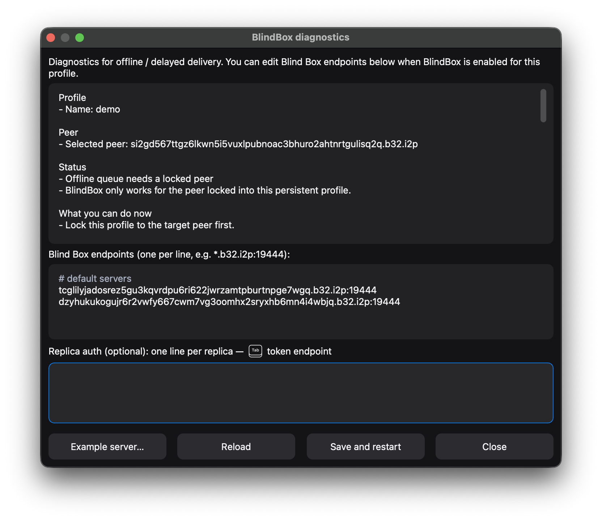
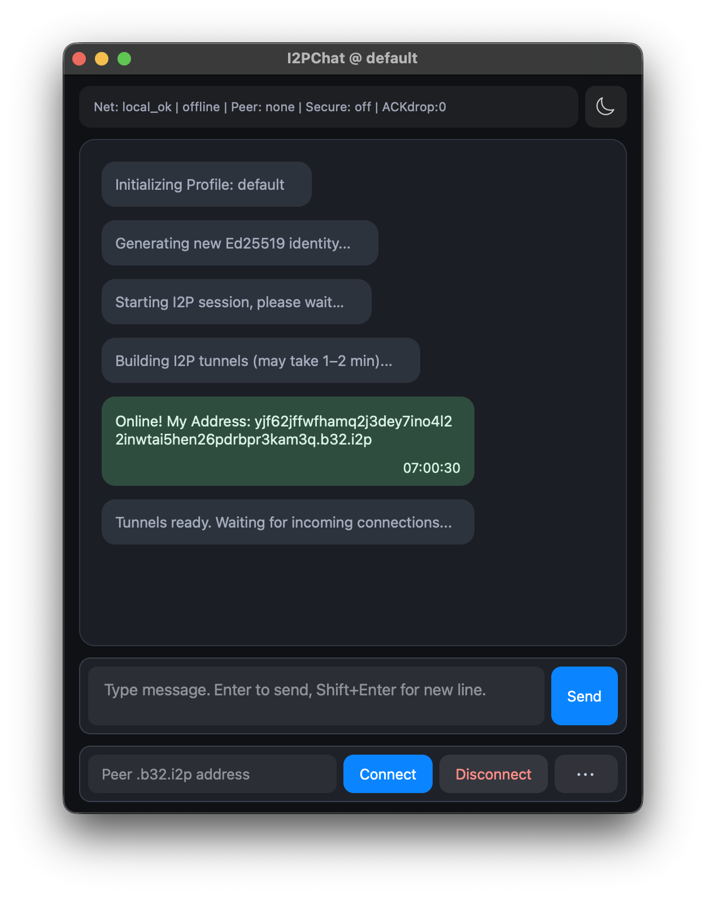

<p align="center">
  
</p>

<h1 align="center">I2PChat</h1>

<p align="center">
  <a href="https://github.com/MetanoicArmor/I2PChat/releases/latest"></a>
  <a href="LICENSE"></a>
  <a href="requirements.txt"></a>
  <a href="https://i2pd.website"></a>
</p>

<p align="center">
  <b>Experimental peer‑to‑peer chat client for the <a href="https://i2pd.website">I2P</a> anonymity network.</b><br>
  Cross‑platform GUI (PyQt6) on top of a shared asynchronous core.
</p>

---

### Language / Язык

[](docs/MANUAL_EN.md)
[](docs/MANUAL_RU.md)

---

### 📑 Table of contents

- [✨ Features](#-features)
- [📸 Screenshots](#-screenshots)
- [📦 Prebuilt binaries](#-prebuilt-binaries)
- [🛠 Running from source](#-running-from-source)
- [🔧 Cross‑platform builds](#-crossplatform-builds)
- [📄 License](#-license)
- [☕ Buy me a coffee](#-buy-me-a-coffee)

### ✨ Features

- **End‑to‑end communication over I2P SAM** (via `i2plib`)
- **E2E encryption** — handshake, key signing and verification
- **TOFU** — peer key pinning on first contact
- **Lock to peer** — bind a profile to a single peer
- **PyQt6 GUI** with light and dark themes (macOS-style, consistent and predictable on all platforms)
- **File transfer** and **image sending** (Send picture) between peers
- **Profiles (.dat)** — multiple profiles, load and import
- **System notifications** — tray toasts for new messages
- **Sound notifications** for incoming messages
- Cross‑platform build scripts (Linux, macOS, Windows)

#### 📖 Manuals

- **English manual**: [**docs/MANUAL_EN.md**](docs/MANUAL_EN.md)
- **Русский мануал**: [**docs/MANUAL_RU.md**](docs/MANUAL_RU.md)

### 📸 Screenshots

<p align="center">
  
  
</p>

<p align="center">
  <br>
  
</p>

### 📦 Prebuilt binaries

**[Latest release](https://github.com/MetanoicArmor/I2PChat/releases/latest)** — prebuilt binaries for Windows, macOS, and Linux.

Currently available:

- **Windows (x64) GUI**
  - Archive: `I2PChat-windows-x64.zip`
  - Inside: `I2PChat\I2PChat.exe`
  - Built with **Python 3.14** and PyInstaller, includes the Python runtime and all dependencies.
  - **Python is *not* required on the target system** – just unpack the zip and run `I2PChat.exe`.

Other platforms are available — see the table below or check [Releases](https://github.com/MetanoicArmor/I2PChat/releases/latest).

### 🛠 Running from source

Requirements:

- Python **3.14+** (recommended; this is what the bundled `i2plib` copy and current builds are tested with)
- [i2pd](https://i2pd.website) router with **SAM** enabled (default port `7656`)

Create and activate a virtual environment, then install dependencies:

```bash
python3.14 -m venv .venv
source .venv/bin/activate  # on Windows: .venv\Scripts\Activate.ps1
pip install -r requirements.txt
```

Run the application:

```bash
python main_qt.py
```

### 🔧 Cross‑platform builds

The project is intentionally **cross‑platform** and ships with helper scripts for the main targets.  
Everywhere, the recommended/runtime version is **Python 3.14+** (the repo includes an updated copy of `i2plib` compatible with modern asyncio).

#### 🐧 Linux (GUI AppImage)

```bash
./build-linux.sh
```

This script:

- Uses `python3.14` (or default `python3`) and `.venv314`.
- Builds a self‑contained GUI binary via PyInstaller.
- Packs it into `I2PChat.AppImage` using `appimagetool`.
- Creates release archive `I2PChat-linux-<arch>-v<version>.zip` (contains `I2PChat.AppImage`).

#### 🍎 macOS (GUI .app bundle)

```bash
./build-macos.sh
```

- Uses Python 3.14+ (from PATH or Homebrew).
- Builds `dist/I2PChat.app` via PyInstaller.

### 🪟 Windows build (GUI)

For reproducible Windows builds there is a PowerShell script:

```powershell
powershell -ExecutionPolicy Bypass -File .\build-windows.ps1
```

It will:

1. Create a fresh virtual environment `.venv314` using **Python 3.14** via `py -3.14 -m venv`.
2. Install all dependencies from `requirements.txt` plus `pyinstaller`.
3. Build a GUI‑only PyQt6 binary:
   - Output folder: `dist\I2PChat\`
   - Main executable: `dist\I2PChat\I2PChat.exe`

The resulting `I2PChat.exe` is self‑contained and can be distributed to machines without Python installed.

#### ❄️ NixOS

```bash
# Run directly
nix run github:MetanoicArmor/I2PChat

# Development shell
nix develop github:MetanoicArmor/I2PChat
```

### 📄 License

See `LICENSE` for full license text.  
Please also respect the original `termchat-i2p-python` licensing and attribution to **Stanley (I2P community)**.

### ☕ Buy me a coffee

If you like this project and want to support development, you can send a small donation in Bitcoin:

- **BTC address**: `bc1q3sq35ym2a90ndpqe35ujuzktjrjnr9mz55j8hd`

<p align="center">
  
</p>

---

## 🚀 Quick Start

### 📥 Prebuilt Downloads

**[Download latest release](https://github.com/MetanoicArmor/I2PChat/releases/latest)** — no Python installation required; everything is bundled and ready to run.

| Platform | Download | Launch |
|----------|----------|--------|
| **Windows** | [I2PChat-windows-x64-v0.5.0.zip](https://github.com/MetanoicArmor/I2PChat/releases/latest/download/I2PChat-windows-x64-v0.5.0.zip) | Unzip → run `I2PChat.exe` |
| **macOS** | [I2PChat-macOS-arm64-v0.5.0.zip](https://github.com/MetanoicArmor/I2PChat/releases/latest/download/I2PChat-macOS-arm64-v0.5.0.zip) | Unzip → open `I2PChat.app` |
| **Linux** | [I2PChat-linux-x86_64-v0.5.0.zip](https://github.com/MetanoicArmor/I2PChat/releases/latest/download/I2PChat-linux-x86_64-v0.5.0.zip) | Unzip → `chmod +x I2PChat.AppImage` → run |

> **Requirement:** [i2pd](https://i2pd.website) router must be running with SAM API enabled (default port 7656).

### ℹ️ About

I2PChat is a cross‑platform chat client for the [I2P](https://i2pd.website) anonymity network, using the SAM interface.  
PyQt6 GUI with light and dark themes.

Originally derived from [`termchat-i2p-python`](http://git.community.i2p/stan/termchat-i2p-python) by Stanley (I2P community), substantially rewritten.

### ✨ Features

- Messaging over I2P SAM (via `i2plib`)
- Cross‑platform GUI (Windows, macOS, Linux)
- File transfer between peers

---

<details>
<summary>📜 <i>Sur le secret</i> — Pierre Janet</summary>

<br>

> *Chez l'homme naïf la croyance est liée à son expression. Avoir une croyance, c'est l'exprimer, l'affirmer; beaucoup de personnes disent: «Si je ne peux pas parler tout haut, je ne peux pas penser. Si je ne parle pas de ce en quoi je crois, je ne peux pas y croire. Et, au contraire, quand je crois quelque chose, il faut que je l'affirme; quand je pense quelque chose, il faut que je le dise.» Si l'on empêche ces personnes de parler, elles penseront à autre chose. Le secret n'est donc pas une fonction psychologique primitive, c'est un phénomène tardif. Il apparaît à l'époque de la réflexion.*
>
> *Il vaut mieux ne pas communiquer ses projets: en les racontant on se met immédiatement dans une position défavorable. Même si l'idée n'est pas prise, elle sera critiquée d'avance. Il ne faut pas montrer les brouillons. Que se passera-t-il si vous commencez à exprimer toutes vos rêveries, toutes ces pensées «pour vous-même» qui vous soutiennent? Les autres se moqueront de vous, diront que c'est ridicule, absurde, et détruiront vos rêves. «Peu importe», direz-vous, «puisque je sais bien moi-même que ce ne sont que des rêves». Mais en détruisant vos rêves, ils emporteront aussi votre courage et l'enthousiasme que vous y puisiez.*
>
> *Il vient une époque où il n'est plus toujours bon d'exprimer au dehors les phénomènes psychologiques, de les rendre publics. Dans la société, dans le groupe auquel nous appartenons, il faut savoir garder certaines choses secrètes et en dire d'autres; avoir quelque chose pour soi et quelque chose pour les autres. C'est une opération difficile qui se rapproche de l'évaluation, car pour produire une impression favorable il vaut mieux ne pas tout dire. Tout le monde devrait savoir faire cela. Mais c'est difficile et les timides y réussissent mal; aussi l'une de leurs difficultés dans la société est-elle un trouble de la fonction du secret.*
>
> *Il existe toute une catégorie de personnes — les primitifs, les enfants, les malades — chez qui la fonction du secret n'existe pas; ils ne savent pas ce que c'est. Le petit enfant n'a pas de secret. Le malade en état de désagrégation mentale parle tout haut et dit toutes sortes de sottises: il ne comprend absolument pas qu'il y ait des choses qu'il faut garder secrètes.*

</details>

---

<p align="center">
  Created with ❤️ by <b>Vade</b> for the privacy and anonymity community
  <br><br>
  © 2026 Vade
</p>
