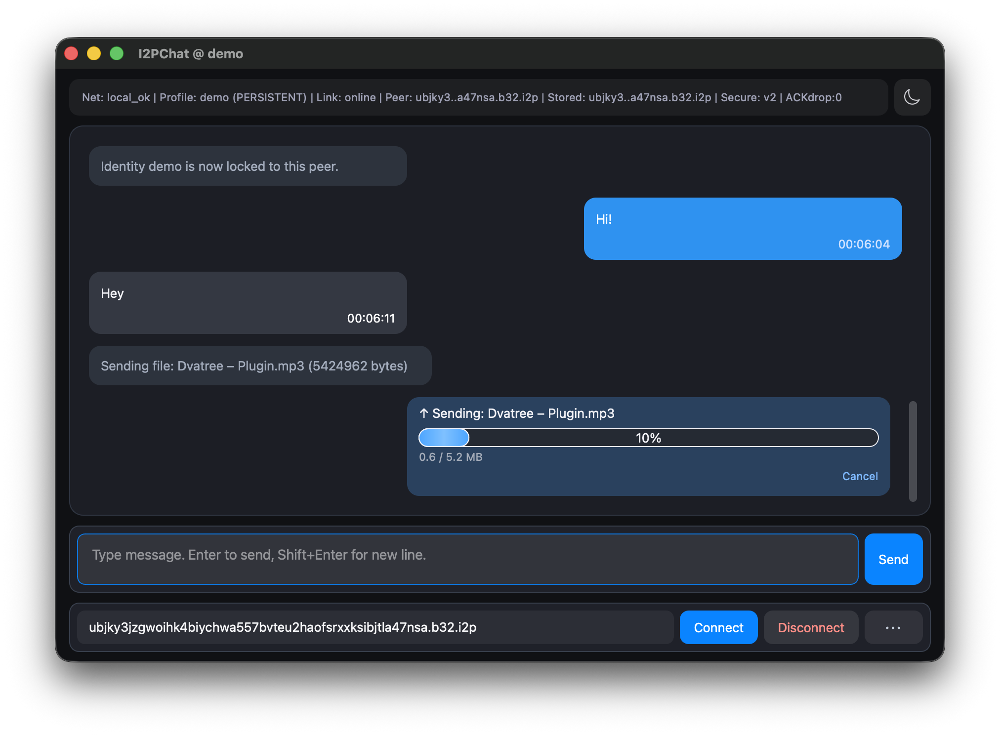

<p align="center">
  
</p>

<h1 align="center">I2PChat</h1>

<p align="center">
  <a href="https://github.com/MetanoicArmor/I2PChat/releases/latest"></a>
  <a href="LICENSE"></a>
  <a href="requirements.txt"></a>
  <a href="https://i2pd.website"></a>
</p>

<p align="center">
  <b>Experimental peer‑to‑peer chat client for the <a href="https://i2pd.website">I2P</a> anonymity network.</b><br>
  Cross‑platform GUI (PyQt6) on top of a shared asynchronous core.
</p>

---

### Language / Язык

[](docs/MANUAL_EN.md)
[](docs/MANUAL_RU.md)
[](ROADMAP.md)
[](docs/ROADMAP_RU.md)
[](ISSUE_BACKLOG.md)
[](docs/ISSUE_BACKLOG_RU.md)
[](docs/GITHUB_BACKLOG_SYNC.md)

Backlog sync helper: `GITHUB_TOKEN=... ./scripts/sync_backlog.sh`

---

### 📑 Table of contents

- [✨ Features](#-features)
- [🔌 Protocol overview](#-protocol-overview)
- [📬 BlindBox in short](#-blindbox-in-short)
- [📸 Screenshots](#-screenshots)
- [📦 Prebuilt binaries](#-prebuilt-binaries)
- [🛠 Running from source](#-running-from-source)
- [🔧 Cross‑platform builds](#-crossplatform-builds)
- [📄 License](#-license)
- [☕ Buy me a coffee](#-buy-me-a-coffee)

### ✨ Features

- **End‑to‑end communication over I2P SAM** (via `i2plib`)
- **E2E encryption** — handshake, key signing and verification
- **TOFU** — peer key pinning on first contact
- **Lock to peer** — bind a profile to a single peer
- **PyQt6 GUI** with light and dark themes (macOS-style, consistent and predictable on all platforms)
- **File transfer** and **image sending** (Send picture: PNG, JPEG, WebP) between peers
- **Profiles (.dat)** — multiple profiles, load and import
- **System notifications** — tray toasts for new messages
- **Sound notifications** for incoming messages
- **BlindBox (default-on for named profiles)** — offline message delivery
- **Optional encrypted chat history** — per-peer local history (toggle **Chat history: ON/OFF** in the **⋯** menu); encrypted at rest with keys derived from your profile identity (see **§4.11** in [MANUAL_EN](docs/MANUAL_EN.md) / [MANUAL_RU](docs/MANUAL_RU.md))
- Cross‑platform build scripts (Linux, macOS, Windows)

#### 📖 Manuals

- **English manual**: [**docs/MANUAL_EN.md**](docs/MANUAL_EN.md)
- **Русский мануал**: [**docs/MANUAL_RU.md**](docs/MANUAL_RU.md)
- BlindBox design notes: [**RELEASE_0.6.0.md**](docs/releases/RELEASE_0.6.0.md)

### 🔌 Protocol overview

Traffic is a **byte stream** over **I2P SAM** (one TCP session to the router). Application data is split into **vNext binary frames**:

```
┌─────────── vNext frame ────────────────────────────────────────┐
│ MAGIC (4) │ VER (1) │ TYPE (1) │ FLAGS (1) │ MSG_ID (8) │ LEN (4) │ PAYLOAD (LEN bytes) │
└──────────────────────────────────────────────────────────────────┘
```

- **Handshake** uses **plain** frame bodies (UTF‑8 text: identities, `INIT` / replies, signatures).
- After the secure handshake, payloads are **encrypted** (`FLAGS` marks it): each body is **sequence (8 B) + ciphertext + MAC** (NaCl SecretBox + HMAC over metadata).
- **Message IDs** and **sequence numbers** tie frames to ordering and replay protection; see also [padding](#protocol-metadata-and-padding-profile) below.

### 📬 BlindBox

BlindBox is your “send now, deliver later” mode for text messages.

Why users like it:

- You can message people even when they are temporarily offline.
- Delivery happens automatically when they come back online.
- The chat stays clean and readable: only real messages, no technical noise.
- Works naturally with normal live chat — no extra routine in daily use.

Simple flow:

1. If the peer is online, the message is delivered live.
2. If the peer is offline, the app keeps it in the offline queue.
3. When the peer returns, the message appears automatically.

Practical notes:

- For named profiles BlindBox is enabled by default.
- For `default` (transient) profile BlindBox is off.
- Disable explicitly with `I2PCHAT_BLINDBOX_ENABLED=0`.
- Deployments can set Blind Box endpoints via env (`I2PCHAT_BLINDBOX_REPLICAS`, `I2PCHAT_BLINDBOX_DEFAULT_REPLICAS`, or `I2PCHAT_BLINDBOX_DEFAULT_REPLICAS_FILE`). Built-in release defaults and further options → manuals / release notes above.

### 📸 Screenshots

<p align="center">
  <br>
  
</p>

### 📦 Prebuilt binaries

**[Latest release](https://github.com/MetanoicArmor/I2PChat/releases/latest)** — prebuilt binaries for Windows, macOS, and Linux.

Currently available:

- **Windows (x64) GUI**
  - Archive: `I2PChat-windows-x64.zip`
  - Inside: `I2PChat\I2PChat.exe`
  - Built with **Python 3.14** and PyInstaller, includes the Python runtime and all dependencies.
  - **Python is *not* required on the target system** – just unpack the zip and run `I2PChat.exe`.

Other platforms are available — see the table below or check [Releases](https://github.com/MetanoicArmor/I2PChat/releases/latest).

### 🛠 Running from source

Requirements:

- Python **3.14+** (recommended; this is what the vendored local `i2plib` copy and current builds are tested with)
- [i2pd](https://i2pd.website) router with **SAM** enabled (default port `7656`)

Create and activate a virtual environment, then install dependencies:

```bash
python3.14 -m venv .venv
source .venv/bin/activate  # on Windows: .venv\Scripts\Activate.ps1
pip install -r requirements.txt
```

If `.venv/bin/pip` fails with **bad interpreter** / a path to another project, another virtualenv was probably first on `PATH`. Run `deactivate` (repeat until none is active), then recreate `.venv`. On **macOS + Homebrew** you can pin the interpreter without using a fixed `/opt/homebrew` path:

```bash
rm -rf .venv
"$(brew --prefix python@3.14)/bin/python3.14" -m venv .venv
```

Run the application:

```bash
python main_qt.py
```

### 🔧 Cross‑platform builds

The project is intentionally **cross‑platform** and ships with helper scripts for the main targets.  
Everywhere, the recommended/runtime version is **Python 3.14+** (the repo includes a vendored local `i2plib` copy compatible with modern asyncio; PyPI `i2plib` is not used).

#### 🐧 Linux (GUI AppImage)

```bash
./build-linux.sh
```

This script:

- Uses `python3.14` (or default `python3`) and `.venv314`.
- Builds a self‑contained GUI binary via PyInstaller.
- Packs it into `I2PChat.AppImage` using `appimagetool`.
- Creates release archive `I2PChat-linux-<arch>-v<version>.zip` (contains `I2PChat.AppImage`).

#### 🍎 macOS (GUI .app bundle)

```bash
./build-macos.sh
```

- Uses Python 3.14+ (from PATH or Homebrew).
- Builds `dist/I2PChat.app` via PyInstaller.

### 🪟 Windows build (GUI)

For reproducible Windows builds there is a PowerShell script:

```powershell
powershell -ExecutionPolicy Bypass -File .\build-windows.ps1
```

For a safer one-off session, prefer:

```powershell
powershell -NoProfile -Command "Set-ExecutionPolicy -Scope Process RemoteSigned; .\build-windows.ps1"
```

This limits policy relaxation to the current process and does not change machine/user policy permanently.

It will:

1. Create a fresh virtual environment `.venv314` using **Python 3.14** via `py -3.14 -m venv`.
2. Install all dependencies from `requirements.txt` and `requirements-build.txt` (both hash-locked).
3. Build a GUI‑only PyQt6 binary:
   - Output folder: `dist\I2PChat\`
   - Main executable: `dist\I2PChat\I2PChat.exe`

The resulting `I2PChat.exe` is self‑contained and can be distributed to machines without Python installed.

### Verify release artifacts

Release build scripts generate:

- `SHA256SUMS` file for produced release archive(s);
- detached armored GPG signature `SHA256SUMS.asc` (best-effort by default).

These files are **not** tracked in git (they differ per OS/build); upload them **with the release assets** on GitHub.

Build-time controls:

- `I2PCHAT_SKIP_GPG_SIGN=1` — always skip detached signature creation;
- `I2PCHAT_REQUIRE_GPG=1` — fail build if GPG signing is unavailable or fails;
- `I2PCHAT_GPG_KEY_ID=<keyid>` — select a specific key for detached signature.

Verification example:

```bash
gpg --verify SHA256SUMS.asc SHA256SUMS
sha256sum -c SHA256SUMS
```

### Protocol metadata and padding profile

The transport is encrypted after handshake, but some protocol metadata remains
observable on the wire:

- frame type (`TYPE`);
- frame length (`LEN`);
- pre-handshake peer identity preface exchange.

To reduce traffic-shape leakage, encrypted payloads use a padding profile:

- default: `balanced` (pads encrypted plaintext to 128-byte buckets);
- optional: `off` (disable padding).

You can override the profile with:

```bash
I2PCHAT_PADDING_PROFILE=off python main_qt.py
```

Trade-off: stronger padding reduces length correlation but increases bandwidth.

#### ❄️ NixOS

```bash
# Run directly
nix run github:MetanoicArmor/I2PChat

# Development shell
nix develop github:MetanoicArmor/I2PChat
```

### 📄 License

See `LICENSE` for full license text.

### ☕ Buy me a coffee

If you like this project and want to support development, you can send a small donation in Bitcoin:

- **BTC address**: `bc1q3sq35ym2a90ndpqe35ujuzktjrjnr9mz55j8hd`

<p align="center">
  
</p>

---

## 🚀 Quick Start

### 📥 Prebuilt Downloads

**[Latest release](https://github.com/MetanoicArmor/I2PChat/releases/latest)** — prebuilt bundles match `VERSION` in the repo (currently **v0.7.0**); no Python installation required.

| Platform | Download | Launch |
|----------|----------|--------|
| **Windows** | [I2PChat-windows-x64-v0.7.0.zip](https://github.com/MetanoicArmor/I2PChat/releases/latest/download/I2PChat-windows-x64-v0.7.0.zip) | Unzip → run `I2PChat.exe` |
| **macOS** | [I2PChat-macOS-arm64-v0.7.0.zip](https://github.com/MetanoicArmor/I2PChat/releases/latest/download/I2PChat-macOS-arm64-v0.7.0.zip) | Unzip → open `I2PChat.app` |
| **Linux** | [I2PChat-linux-x86_64-v0.7.0.zip](https://github.com/MetanoicArmor/I2PChat/releases/latest/download/I2PChat-linux-x86_64-v0.7.0.zip) | Unzip → `chmod +x I2PChat.AppImage` → run |

> **Requirement:** [i2pd](https://i2pd.website) router must be running with SAM API enabled (default port 7656).

### ℹ️ About

I2PChat is a cross‑platform chat client for the [I2P](https://i2pd.website) anonymity network, using the SAM interface.  
PyQt6 GUI with light and dark themes.

Originally derived from [`termchat-i2p-python`](http://git.community.i2p/stan/termchat-i2p-python) by Stanley (I2P community), substantially rewritten.

### Audit / Аудит

[](AUDIT_EN.md)
[](AUDIT_RU.md)

---

<details>
<summary>📜 <i>Sur le secret</i> — Pierre Janet</summary>

<br>

> *Chez l'homme naïf la croyance est liée à son expression. Avoir une croyance, c'est l'exprimer, l'affirmer; beaucoup de personnes disent: «Si je ne peux pas parler tout haut, je ne peux pas penser. Si je ne parle pas de ce en quoi je crois, je ne peux pas y croire. Et, au contraire, quand je crois quelque chose, il faut que je l'affirme; quand je pense quelque chose, il faut que je le dise.» Si l'on empêche ces personnes de parler, elles penseront à autre chose. Le secret n'est donc pas une fonction psychologique primitive, c'est un phénomène tardif. Il apparaît à l'époque de la réflexion.*
>
> *Il vaut mieux ne pas communiquer ses projets: en les racontant on se met immédiatement dans une position défavorable. Même si l'idée n'est pas prise, elle sera critiquée d'avance. Il ne faut pas montrer les brouillons. Que se passera-t-il si vous commencez à exprimer toutes vos rêveries, toutes ces pensées «pour vous-même» qui vous soutiennent? Les autres se moqueront de vous, diront que c'est ridicule, absurde, et détruiront vos rêves. «Peu importe», direz-vous, «puisque je sais bien moi-même que ce ne sont que des rêves». Mais en détruisant vos rêves, ils emporteront aussi votre courage et l'enthousiasme que vous y puisiez.*
>
> *Il vient une époque où il n'est plus toujours bon d'exprimer au dehors les phénomènes psychologiques, de les rendre publics. Dans la société, dans le groupe auquel nous appartenons, il faut savoir garder certaines choses secrètes et en dire d'autres; avoir quelque chose pour soi et quelque chose pour les autres. C'est une opération difficile qui se rapproche de l'évaluation, car pour produire une impression favorable il vaut mieux ne pas tout dire. Tout le monde devrait savoir faire cela. Mais c'est difficile et les timides y réussissent mal; aussi l'une de leurs difficultés dans la société est-elle un trouble de la fonction du secret.*
>
> *Il existe toute une catégorie de personnes — les primitifs, les enfants, les malades — chez qui la fonction du secret n'existe pas; ils ne savent pas ce que c'est. Le petit enfant n'a pas de secret. Le malade en état de désagrégation mentale parle tout haut et dit toutes sortes de sottises: il ne comprend absolument pas qu'il y ait des choses qu'il faut garder secrètes.*

</details>

---

<p align="center">
  Created with ❤️ by <b>Vade</b> for the privacy and anonymity community
  <br><br>
  © 2026 Vade
</p>
