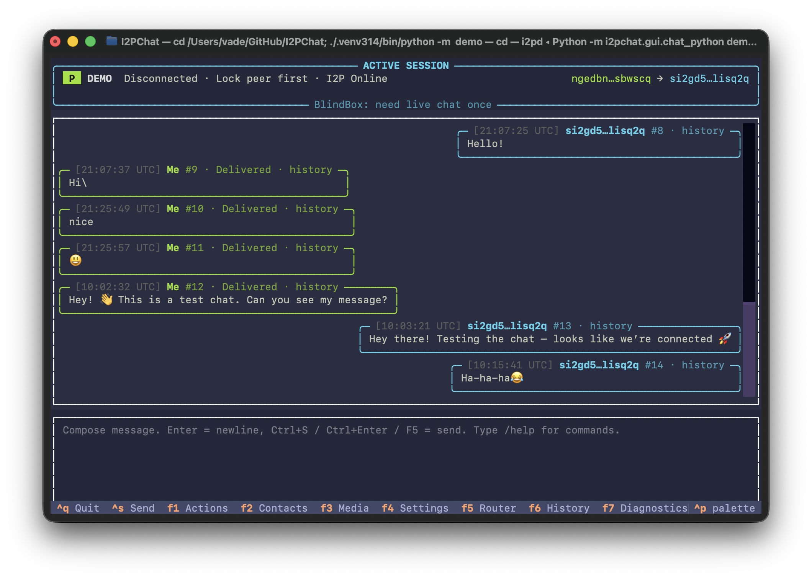

<p align="center">
  
</p>

<h1 align="center">I2PChat</h1>

<p align="center">
  <a href="https://github.com/MetanoicArmor/I2PChat/releases/latest"></a>
  <a href="LICENSE"></a>
  <a href="requirements.txt"></a>
  <a href="https://i2pd.website"></a>
</p>

**I2PChat** is an **experimental** desktop chat client for the [I2P](https://i2pd.website) network: encrypted, peer-to-peer style sessions over **SAM**. You get a **PyQt6 GUI** (normal windows) **and** a separate **terminal / text-mode client** — the same chat **in a console**, without the Qt interface. In docs and packages that build is often labeled **TUI** (*terminal user interface*). Prebuilt releases usually include a **bundled `i2pd`**; you can switch to a system router in the app.

**Goal:** install a build, create or pick a **profile**, connect to a peer’s `.b32.i2p` destination. Behaviour, menus, troubleshooting → [**docs/MANUAL_EN.md**](docs/MANUAL_EN.md) / [**docs/MANUAL_RU.md**](docs/MANUAL_RU.md).

---

## Quick start

1. Open **[Latest release](https://github.com/MetanoicArmor/I2PChat/releases/latest)** and download from **Assets** (version matches [`VERSION`](VERSION) in this repo).
2. Per-OS steps, paths inside zips, **winget**, and edge cases → [**docs/INSTALL.md**](docs/INSTALL.md).

**What to grab on Releases** (names always include the version, e.g. `v1.2.3`):

| What | Typical asset names |
|------|---------------------|
| **Windows** GUI | `I2PChat-windows-x64-vX.Y.Z.zip` |
| **Windows** terminal only | `I2PChat-windows-tui-x64-vX.Y.Z.zip` |
| **macOS** GUI (Apple Silicon) | `I2PChat-macOS-arm64-vX.Y.Z.zip` |
| **macOS** terminal only | `I2PChat-macOS-arm64-tui-vX.Y.Z.zip` |
| **Linux** GUI (AppImage in zip) | `I2PChat-linux-x86_64-vX.Y.Z.zip`, `I2PChat-linux-aarch64-vX.Y.Z.zip` |
| **Linux** terminal only | `I2PChat-linux-*-tui-vX.Y.Z.zip` |
| **Debian/Ubuntu** | `i2pchat_X.Y.Z_amd64.deb` / `_arm64.deb`, `i2pchat-tui_X.Y.Z_*.deb` |

**Windows (winget):** installers point at **`I2PChat-windows-*-winget-v*.zip`** (no embedded i2pd, for store validation). The ordinary **`I2PChat-windows-*.zip`** assets still bundle the router — details in **INSTALL.md**.

No Python on the target machine for these bundles.

### Package managers

**macOS (arm64) — [Homebrew](https://brew.sh) ([tap](https://github.com/MetanoicArmor/homebrew-i2pchat))**

```bash
brew install --cask metanoicarmor/i2pchat/i2pchat      # GUI — I2PChat.app
brew install --cask metanoicarmor/i2pchat/i2pchat-tui   # terminal (TUI) only
```

(`brew tap MetanoicArmor/i2pchat` then `brew install --cask i2pchat` works too.)

**Arch Linux — [AUR](https://aur.archlinux.org/)** (x86_64 and aarch64; example [yay](https://github.com/Jguer/yay))

```bash
yay -S i2pchat-bin       # GUI — AppImage from release (arch matches your CPU)
yay -S i2pchat-tui-bin   # TUI only
```

**Debian / Ubuntu — signed apt mirror** ([`packaging/apt/README.md`](packaging/apt/README.md); **amd64** on the mirror, **arm64** `.deb` only from Releases)

```bash
sudo mkdir -p /etc/apt/keyrings
curl -fsSL "https://metanoicarmor.github.io/I2PChat/KEY.gpg" | sudo gpg --dearmor -o /etc/apt/keyrings/i2pchat.gpg
echo "deb [signed-by=/etc/apt/keyrings/i2pchat.gpg] https://metanoicarmor.github.io/I2PChat stable main" | sudo tee /etc/apt/sources.list.d/i2pchat.list
sudo apt update
sudo apt install i2pchat       # GUI
sudo apt install i2pchat-tui   # terminal (TUI)
```

**Canonical binaries** for every platform live on **GitHub Releases** above. Maintainer-facing recipes (winget, AUR templates, `.deb` build scripts, etc.) → [**packaging/**](packaging/README.md).

> **Router:** New profiles often start with the **bundled** `i2pd`. Use **More actions → I2P router…** (**Cmd/Ctrl+R**) to point at a system **i2pd** (SAM, e.g. `127.0.0.1:7656`).

**Contents:** [Features](#features) · [Screenshots](#screenshots) · [Technical docs](#technical-docs) · [For developers](#for-developers) · [License](#license) · [Buy me a coffee](#buy-me-a-coffee)

---

### Language / manuals / planning

[](docs/MANUAL_EN.md)
[](docs/MANUAL_RU.md)
[](docs/ROADMAP.md)
[](docs/ROADMAP_RU.md)
[](docs/ISSUE_BACKLOG.md)
[](docs/ISSUE_BACKLOG_RU.md)
[](docs/AUDIT_EN.md)
[](docs/AUDIT_RU.md)

---

## Features

- Chat over **I2P SAM** with **E2E encryption**, **TOFU** peer pinning, optional **lock to one peer**
- **PyQt6** GUI (light/dark), **file and image** transfer, notifications (tray + sound)
- **Profiles** (`.dat`) and **saved peers** / contact list; optional **encrypted local chat history**
- **BlindBox** — offline text delivery when the peer is away (see manuals)
- **Terminal client (TUI):** full chat **in the shell** — no Qt windows, keyboard-driven UI (Textual). Shipped as slim **`*-tui-*`** zips / `i2pchat-tui` packages, embedded next to the GUI in some bundles, or run from source: `python -m i2pchat.tui`

Full shortcuts, BlindBox setup, data paths → **MANUAL_EN** / **MANUAL_RU** above.

---

## Screenshots

<p align="center">
  <br>
  <br>
  
</p>

More UI shots → [**MANUAL_EN.md**](docs/MANUAL_EN.md) / [**MANUAL_RU.md**](docs/MANUAL_RU.md).

---

## Technical docs

| Doc | Purpose |
|-----|---------|
| [**INSTALL.md**](docs/INSTALL.md) | Install from releases by platform |
| [**PROTOCOL.md**](docs/PROTOCOL.md) | Framing, handshake, ACK, BlindBox (developers) |
| [**ARCHITECTURE.md**](docs/ARCHITECTURE.md) | Runtime layout and wire-format summary |
| [**BUILD.md**](docs/BUILD.md) | Release scripts, GPG/checksums, padding env, NixOS, BlindBox daemon notes |

---

## For developers

**Requirements:** Python **3.14+**; [i2pd](https://i2pd.website) with **SAM** (e.g. port `7656`) or a **bundled** router from your build.

From repo root (Linux/macOS example):

```bash
python3.14 -m venv .venv314
./.venv314/bin/pip install -r requirements.txt
./.venv314/bin/python -m i2pchat.gui    # GUI; optional profile name as first arg
./.venv314/bin/python -m i2pchat.tui   # terminal (TUI)
```

**Windows:** `py -3.14 -m venv .venv314`, then `.\.venv314\Scripts\pip` / `python -m i2pchat.gui` / `i2pchat.tui`.

On **Debian/Ubuntu** you may need `libxcb-cursor0` for PyQt6 on X11. See [**MANUAL_EN**](docs/MANUAL_EN.md).

**Release builds, signing, padding, NixOS, BlindBox service layout** → [**docs/BUILD.md**](docs/BUILD.md). **Padding profile:** `I2PCHAT_PADDING_PROFILE=off` (details in BUILD.md).

---

## License

I2PChat is licensed under the **GNU Affero General Public License v3.0** (or later — see section 14 of the license). Full text: [`LICENSE`](LICENSE).

Vendored [`vendor/i2plib/`](vendor/i2plib/) and [`vendor/i2pd/`](vendor/i2pd/) remain under **MIT** (see [`vendor/i2plib/__version__.py`](vendor/i2plib/__version__.py)).

---

## Buy me a coffee

If you want to support development, you can donate **Bitcoin**:

- **BTC address:** `bc1q3sq35ym2a90ndpqe35ujuzktjrjnr9mz55j8hd`

<p align="center">
  
</p>

---

<p align="center">
  Created with ❤️ by <b>Vade</b> for the privacy and anonymity community
  <br><br>
  © 2026 Vade
</p>
