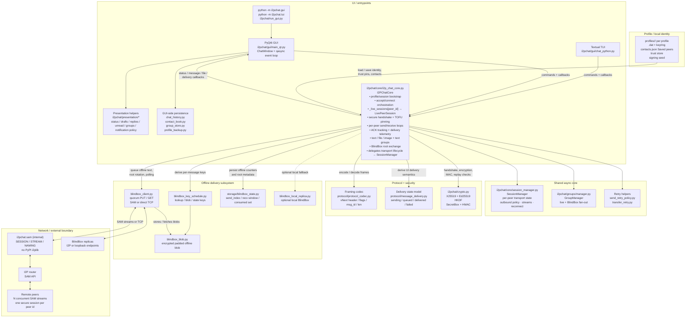

<p align="center">
  
</p>

<h1 align="center">I2PChat</h1>

<p align="center">
  <a href="https://github.com/MetanoicArmor/I2PChat/releases/latest"></a>
  <a href="LICENSE"></a>
  <a href="pyproject.toml"></a>
  <a href="https://i2pd.website"></a>
</p>

<p align="center">
  <b>Experimental peer‑to‑peer chat client for the <a href="https://i2pd.website">I2P</a> anonymity network.</b><br>
  Cross‑platform <b>PyQt6 GUI</b> and a separate <b>terminal client</b> (often labeled <b>TUI</b> — <i>terminal user interface</i>: the same chat in a console via Textual, no Qt windows) on one shared asynchronous core.<br>
  Prebuilt releases usually ship a <b>bundled <code>i2pd</code></b>; you can switch to a system router in the app (see manuals).
</p>

---

### Language / Язык

[](docs/MANUAL_EN.md)
[](docs/MANUAL_RU.md)
[](docs/ROADMAP.md)
[](docs/ROADMAP_RU.md)
[](docs/ISSUE_BACKLOG.md)
[](docs/ISSUE_BACKLOG_RU.md)

---

### 📑 Table of contents

- [✨ Features](#-features)
- [🧠 Core architecture](#-core-architecture)
- [🔌 Protocol overview](#-protocol-overview)
- [📬 BlindBox in short](#-blindbox-in-short)
- [📸 Screenshots](#-screenshots)
- [🛠 Running from source](#-running-from-source)
- [🔧 Cross‑platform builds](#-crossplatform-builds)
- [📄 License](#-license)
- [☕ Buy me a coffee](#-buy-me-a-coffee)
- [🚀 Quick Start](#-quick-start) — downloads, package managers, **INSTALL.md**

### ✨ Features

- **End‑to‑end communication over I2P SAM** (internal `i2pchat.sam` layer)
- **E2E encryption** — handshake, key signing and verification
- **TOFU** — peer key pinning on first contact
- **Multi-peer profiles** — switch between **Saved peers** freely; incoming connections are accepted only from addresses present in the contact book (empty book ⇒ no inbound whitelist matches)
- **PyQt6 GUI** with light and dark themes (macOS-style, consistent and predictable on all platforms)
- **File transfer** and **image sending** (Send picture: PNG, JPEG, WebP) between peers
- **Profiles (.dat)** — multiple profiles, load and import; each profile’s data lives under **`profiles/<name>/`** in the app data directory (if older **flat** `*.dat` files still sit in the data root, they are **migrated on startup** into that layout — see **§ profile paths** in [MANUAL_EN](docs/MANUAL_EN.md) / [MANUAL_RU](docs/MANUAL_RU.md))
- **System notifications** — tray toasts for new messages
- **Sound notifications** for incoming messages
- **BlindBox (default-on for named profiles)** — offline message delivery
- **Optional encrypted chat history** — per-peer local history (toggle **Chat history: ON/OFF** in the **⋯** menu); encrypted at rest with keys derived from your profile identity (see **§4.11** in [MANUAL_EN](docs/MANUAL_EN.md) / [MANUAL_RU](docs/MANUAL_RU.md))
- **Contact book (Saved peers)** — left sidebar list backed by **`profiles/<name>/<name>.contacts.json`**: quick switch between saved `.b32.i2p` peers, optional display name/note, unread hints, resize/collapse, and a context menu (edit, trust details, remove). See **§3.1** in [MANUAL_EN](docs/MANUAL_EN.md) / [MANUAL_RU](docs/MANUAL_RU.md).
- **Text groups** — multi-member conversations over the same vNext stream as 1:1 chat; offline delivery fans out per member via **pairwise** BlindBox (see the manuals for prerequisites and **§** on group BlindBox behavior)
- **Terminal client (TUI)** — *terminal user interface*: full chat in a text shell (Textual, `i2pchat/gui/chat_python.py`); shipped as **`*-tui-*`** release zips and **`i2pchat-tui`** packages (Homebrew, apt, AUR), or **`python -m i2pchat.tui`** from source
- Cross‑platform build scripts (Linux, macOS, Windows)

#### 📖 Manuals

- **English manual**: [**docs/MANUAL_EN.md**](docs/MANUAL_EN.md)
- **Русский мануал**: [**docs/MANUAL_RU.md**](docs/MANUAL_RU.md)

### 🧠 Core architecture

The runtime is built around one shared async engine — `I2PChatCore` — plus **`SessionManager`** (per-peer transport lifecycle and outbound policy since v1.2.6) and **parallel live streams** (`LivePeerSession` rows in **`_live_sessions[peer_id]`**), with **`GroupManager`** for text groups. Thin UI adapters sit on top; protocol / crypto / BlindBox below.

**Toolchain:** Python dependencies are managed with **[uv](https://docs.astral.sh/uv/)** ([`pyproject.toml`](pyproject.toml), [`uv.lock`](uv.lock)). **I2P SAM** (router control connection, sessions, streams, naming lookups) is implemented in-tree as **`i2pchat.sam`** — not the PyPI **`i2plib`** package; the old vendored `i2plib` tree was removed.



Runtime in practice:

1. **Startup**: `main_qt.py` runs **profile directory migration** when needed (flat `*.dat` in the data root → `profiles/<name>/`) before the profile picker, then creates `ChatWindow`; `start_core()` calls `I2PChatCore.init_session()`, which loads or creates the profile identity, opens the long-lived SAM session, warms up tunnels, and starts `accept_loop()` / `tunnel_watcher()`.
2. **Transport lifecycle (`SessionManager`, since v1.2.6)**: per-peer transport state (connecting / handshaking / secure / stale / failed), outbound send policy (`LIVE_ONLY`, `PREFER_LIVE_FALLBACK_BLINDBOX`, `QUEUE_THEN_RETRY_LIVE`, `BLINDBOX_ONLY`), stream registry, reconnect metadata, and inflight ACK hooks live in **`SessionManager`**. Parallel **live** traffic is keyed by **`peer_id`** in **`_live_sessions`** (`LivePeerSession`: `conn`, crypto, ACK tables, receive loop). Legacy `self.conn` may still reflect the active UI peer; **routing and ACKs are peer-scoped**, not “single global connection”. Delivery telemetry and UI read this so **Send** vs **Send offline** stay correct after handshake.
3. **Live chat path**: `connect_to_peer()` / `accept_loop()` opens or updates **one** I2P stream per **peer**; `I2PChatCore` runs the handshake, TOFU pinning, and subkeys, then encrypted vNext frames via `ProtocolCodec` + `crypto`. Multiple peers can be **connected at once** (bounded by `max_concurrent_live_sessions`); the UI **selection** (`current_peer_addr`) does not define which peer receives a send — the **target peer** for that operation does.
4. **Text groups**: **`GroupManager`** sends group envelopes over the same vNext stream as 1:1 chat; offline text fans out **per member** via pairwise BlindBox. State: `i2pchat/storage/group_store.py` (see [MANUAL_EN](docs/MANUAL_EN.md) / [PROTOCOL](docs/PROTOCOL.md)).
5. **Delivery tracking**: each outgoing text / file / image gets a `MSG_ID` and ACK context; `message_delivery.py` turns low-level outcomes into UI states (`sending`, `queued`, `delivered`, `failed`).
6. **Offline path (BlindBox)**: when no live secure session is available, `send_text()` can route through BlindBox — derive deterministic lookup/blob keys, encrypt a padded blob, PUT it to one or more BlindBox replicas, and later poll / decrypt GET results back into the chat stream.
7. **UI responsibility split**: `I2PChatCore` stays UI-agnostic and emits callbacks only; the Qt layer renders chat, status and notifications, while GUI-side storage modules persist chat history, contacts, group state, drafts and backup/export data.

### 🔌 Protocol overview

Traffic is a **byte stream** over **I2P SAM** (one TCP session to the router). Application data is split into **vNext binary frames**:

```
┌─────────── vNext frame ────────────────────────────────────────┐
│ MAGIC (4) │ VER (1) │ TYPE (1) │ FLAGS (1) │ MSG_ID (8) │ LEN (4) │ PAYLOAD (LEN bytes) │
└──────────────────────────────────────────────────────────────────┘
```

- **Handshake** uses **plain** frame bodies (UTF‑8 text: identities, `INIT` / replies, signatures).
- After the secure handshake, payloads are **encrypted** (`FLAGS` marks it): each body is **sequence (8 B) + ciphertext + MAC** (NaCl SecretBox + HMAC over metadata).
- **Message IDs** and **sequence numbers** tie frames to ordering and replay protection; see also [padding](#protocol-metadata-and-padding-profile) below.

For a developer-oriented specification with framing, handshake, ACK, transfer,
BlindBox, and code-map sections, see [**docs/PROTOCOL.md**](docs/PROTOCOL.md).

Runtime layout summary: [**docs/ARCHITECTURE.md**](docs/ARCHITECTURE.md). Release scripts, signing, checksums, NixOS, BlindBox daemon notes: [**docs/BUILD.md**](docs/BUILD.md).

### 📬 BlindBox

BlindBox is your “send now, deliver later” mode for text messages.

Why users like it:

- You can message people even when they are temporarily offline.
- Delivery happens automatically when they come back online.
- The chat stays clean and readable: only real messages, no technical noise.
- Works naturally with normal live chat — no extra routine in daily use.

Simple flow:

1. If the peer is online, the message is delivered live.
2. If the peer is offline, the app keeps it in the offline queue.
3. When the peer returns, the message appears automatically.

Practical notes:

- For named profiles BlindBox is enabled by default.
- For the transient profile `random_address` (CLI alias `default`) BlindBox is off.
- Disable explicitly with `I2PCHAT_BLINDBOX_ENABLED=0`.
- Deployments can set Blind Box endpoints via env (`I2PCHAT_BLINDBOX_REPLICAS`, `I2PCHAT_BLINDBOX_DEFAULT_REPLICAS`, or `I2PCHAT_BLINDBOX_DEFAULT_REPLICAS_FILE`). Built-in release defaults and further options → manuals / release notes above.

### 📸 Screenshots

<p align="center">
  <br>
  <br>
  
</p>

The gallery above is a short subset. **`screenshots/2.png`** (⋯ menu), **`3.png`** (profile picker), **`5.png`** (emoji picker), **`6.png`** (BlindBox diagnostics), **`8.png`** (I2P router dialog), **`9.png`** (Blind Box setup examples — `install.sh` / **Copy curl** for a custom replica), and **`10.png`** (TUI) are documented inline in [**MANUAL_EN.md**](docs/MANUAL_EN.md) / [**MANUAL_RU.md**](docs/MANUAL_RU.md).

### 🛠 Running from source

Requirements:

- **[uv](https://docs.astral.sh/uv/getting-started/installation/)** — install once (e.g. `brew install uv`, or the `curl` / PowerShell one-liner from the uv docs).
- Python **3.12+** (matches CI); **3.14+** is recommended for parity with release build images.
- one of:
  - a **system** [i2pd](https://i2pd.website) router with **SAM** enabled (default port `7656`), or
  - a **bundled** `i2pd` binary shipped with your build/package

Dependencies and versions are locked in **`uv.lock`**; declared in **`pyproject.toml`**. After changing dependencies, run **`uv lock`** and commit the updated lockfile.

Quick run commands (from repo root). **uv** keeps the project environment in **`.venv`** (default); the commands below are enough.

**Linux (Debian/Ubuntu)** — system packages you may need:

```bash
# Python 3.14 (if missing)
sudo apt install python3.14 python3.14-venv

# PyQt6 6.5+ on X11: without this, Qt may fail to load the "xcb" platform plugin
# (error: xcb-cursor0 / libxcb-cursor0 is needed)
sudo apt install libxcb-cursor0
```

**macOS / Linux**

```bash
uv sync --python 3.14
uv run python -m i2pchat.gui.main_qt   # GUI; optional profile name as first arg
uv run python -m i2pchat.tui            # terminal (TUI)
```

**Windows (PowerShell)**

```powershell
uv sync --python 3.14
uv run python -m i2pchat.gui.main_qt
uv run python -m i2pchat.tui
```

If the environment is already synced, you can run only the **`uv run python -m …`** lines you need.

**SAM stack:** live and BlindBox I2P traffic goes through **`i2pchat.sam`** (async client + protocol builders). You do not install **`i2plib`** from PyPI for this project.

The same GUI path is available as `python -m i2pchat.run_gui` (matches [`i2pchat/run_gui.py`](i2pchat/run_gui.py), the PyInstaller analyzed script) or `python -m i2pchat.gui`. Prefer `-m` from the repo root; running the `.py` file directly can break package imports.

PyInstaller builds use [`i2pchat/run_gui.py`](i2pchat/run_gui.py) as the GUI entry script (equivalent to `python -m i2pchat.gui` / `python -m i2pchat.gui.main_qt`). Release zips can also ship **`I2PChat-tui`** / **`i2pchat-tui`** from a separate slim spec. All modules live under `i2pchat/`.

**Developer note (BlindBox):** [`i2pchat/blindbox/blindbox_server_example.py`](i2pchat/blindbox/blindbox_server_example.py) is the hardened service implementation, while the **production-oriented package entrypoint** is `python -m i2pchat.blindbox.daemon`. The repo now also ships package-local `systemd`, env, install/bundle helper scripts, a one-shot `install.sh`, and fail2ban assets under [`i2pchat/blindbox/daemon/`](i2pchat/blindbox/daemon/) and [`i2pchat/blindbox/fail2ban/`](i2pchat/blindbox/fail2ban/). Public replicas behind an I2P tunnel may keep replica auth empty; raw TCP / loopback exposure should still keep a token. See **§4.9** in [MANUAL_EN](docs/MANUAL_EN.md) / [MANUAL_RU](docs/MANUAL_RU.md).

### 🔧 Cross‑platform builds

The project is intentionally **cross‑platform** and ships with helper scripts for the main targets.  
Everywhere, the recommended/runtime version is **Python 3.14+**. SAM transport is implemented in **`i2pchat.sam`** (PyPI **`i2plib`** is not a runtime dependency).

#### 🐧 Linux (GUI AppImage)

```bash
./build-linux.sh
```

This script:

- Requires **uv**; uses `python3.14` (or `python3`) and **`uv sync`** into **`.venv`** (runtime + `build` group).
- Builds a self‑contained GUI binary via PyInstaller.
- Packs it into `I2PChat.AppImage` using `appimagetool`.
- Creates release archive `I2PChat-linux-<arch>-v<version>.zip` (contains `I2PChat.AppImage`); **`arch`** is **`x86_64`** or **`aarch64`** depending on the host. CI publishes matching **`I2PChat-linux-aarch64-v*.zip`** and may attach **`SHA256SUMS.linux-aarch64`** separately from the amd64 checksum file.
- **Bundled `i2pd`:** before PyInstaller, [`scripts/ensure_bundled_i2pd.sh`](scripts/ensure_bundled_i2pd.sh) stages binaries under `vendor/i2pd/`. If that tree is empty, it **clones by default** [github.com/MetanoicArmor/i2pchat-bundled-i2pd](https://github.com/MetanoicArmor/i2pchat-bundled-i2pd) into `.cache/bundled-i2pd-source/` (override with **`I2PCHAT_BUNDLED_I2PD_GIT_URL`**, disable git fetch with **`I2PCHAT_SKIP_BUNDLED_I2PD_GIT=1`** or **`I2PCHAT_BUNDLED_I2PD_GIT_URL=`**). See [`docs/BUILD.md`](docs/BUILD.md).

#### 🍎 macOS (GUI .app bundle)

```bash
./build-macos.sh
```

- Uses Python 3.14+ (from PATH or Homebrew).
- Builds `dist/I2PChat.app` via PyInstaller.

### 🪟 Windows build (GUI)

For reproducible Windows builds there is a PowerShell script:

```powershell
powershell -ExecutionPolicy Bypass -File .\build-windows.ps1
```

For a safer one-off session, prefer:

```powershell
powershell -NoProfile -Command "Set-ExecutionPolicy -Scope Process RemoteSigned; .\build-windows.ps1"
```

This limits policy relaxation to the current process and does not change machine/user policy permanently.

It will:

1. Require **uv** on `PATH` (install from the uv docs if needed).
2. Run **`uv sync --frozen --group build --no-dev`** so **`uv.lock`** pins runtime + PyInstaller tooling.
3. Build a GUI‑only PyQt6 binary:
   - Output folder: `dist\I2PChat\`
   - Main executable: `dist\I2PChat\I2PChat.exe`

The resulting `I2PChat.exe` is self‑contained and can be distributed to machines without Python installed.

### Verify release artifacts

Release build scripts generate:

- `SHA256SUMS` file for produced release archive(s) (Linux aarch64 builds may use a separate **`SHA256SUMS.linux-aarch64`** on GitHub Releases so amd64 sums are not overwritten);
- detached armored GPG signature `SHA256SUMS.asc` (best-effort by default).

These files are **not** tracked in git (they differ per OS/build); upload them **with the release assets** on GitHub.

Build-time controls:

- `I2PCHAT_SKIP_GPG_SIGN=1` — always skip detached signature creation;
- `I2PCHAT_REQUIRE_GPG=1` — fail build if GPG signing is unavailable or fails;
- `I2PCHAT_GPG_KEY_ID=<keyid>` — select a specific key for detached signature (avoids “no default secret key” when you have several keys or no `default-key` in `gpg.conf`);
- `I2PCHAT_GPG_BATCH=0|1` — override auto mode: by default the Linux/macOS scripts use **`gpg --batch`** only when **neither** stdin nor stdout is a TTY (typical CI). If either is a TTY (including `build.sh | tee log`), they omit `--batch` so **pinentry** can ask for your passphrase. Force batch with `I2PCHAT_GPG_BATCH=1` (needs **gpg-agent** with a cached passphrase if the key is protected).

**Official release builds** should set `I2PCHAT_REQUIRE_GPG=1` so unsigned archives are not produced silently; publish `SHA256SUMS` and `SHA256SUMS.asc` next to each asset.

Verification example:

```bash
gpg --verify SHA256SUMS.asc SHA256SUMS
sha256sum -c SHA256SUMS
```

### Protocol metadata and padding profile

The transport is encrypted after handshake, but some protocol metadata remains
observable on the wire:

- frame type (`TYPE`);
- frame length (`LEN`);
- pre-handshake peer identity preface exchange.

To reduce traffic-shape leakage, encrypted payloads use a padding profile:

- default: `balanced` (pads encrypted plaintext to 128-byte buckets);
- optional: `off` (disable padding).

You can override the profile with:

```bash
I2PCHAT_PADDING_PROFILE=off python -m i2pchat.gui
```

Trade-off: stronger padding reduces length correlation but increases bandwidth.

#### ❄️ NixOS

```bash
# Run directly
nix run github:MetanoicArmor/I2PChat

# Development shell
nix develop github:MetanoicArmor/I2PChat
```

### 📄 License

I2PChat is licensed under the **GNU Affero General Public License v3.0** (or any later version — see section 14 of the license). The full text is in [`LICENSE`](LICENSE).

Bundled `i2pd` binaries, when injected for portable release builds, follow their upstream licenses. The application **SAM** stack is **`i2pchat.sam`** (no PyPI or vendored **i2plib**).

### ☕ Buy me a coffee

If you like this project and want to support development, you can send a small donation in Bitcoin:

- **BTC address**: `bc1q3sq35ym2a90ndpqe35ujuzktjrjnr9mz55j8hd`

<p align="center">
  
</p>

---

## 🚀 Quick Start

### 📥 Prebuilt Downloads

**[Latest release](https://github.com/MetanoicArmor/I2PChat/releases/latest)** — bundles match **`v` + [`VERSION`](VERSION)** in this repo (**v1.3.0** in the table below; **update these rows when you tag a new release** so `latest/download/…` filenames stay valid). No Python on the target machine for these zips.

Full zip layouts, **winget**, **`.deb`**, **Flatpak** notes → [**docs/INSTALL.md**](docs/INSTALL.md).

| Variant | Download | Launch |
|---------|----------|--------|
| **Windows — GUI** | [I2PChat-windows-x64-v1.3.0.zip](https://github.com/MetanoicArmor/I2PChat/releases/latest/download/I2PChat-windows-x64-v1.3.0.zip) | Unzip → run `I2PChat.exe` |
| **Windows — TUI only** | [I2PChat-windows-tui-x64-v1.3.0.zip](https://github.com/MetanoicArmor/I2PChat/releases/latest/download/I2PChat-windows-tui-x64-v1.3.0.zip) | `I2PChat-tui.exe` in the extracted tree |
| **macOS — GUI (arm64)** | [I2PChat-macOS-arm64-v1.3.0.zip](https://github.com/MetanoicArmor/I2PChat/releases/latest/download/I2PChat-macOS-arm64-v1.3.0.zip) | Unzip → open **`I2PChat-macOS-arm64-bundle/I2PChat.app`** (see **INSTALL.md**) |
| **macOS — TUI only** | [I2PChat-macOS-arm64-tui-v1.3.0.zip](https://github.com/MetanoicArmor/I2PChat/releases/latest/download/I2PChat-macOS-arm64-tui-v1.3.0.zip) | Run **`./i2pchat-tui`** from the extracted folder |
| **Linux — GUI (x86_64)** | [I2PChat-linux-x86_64-v1.3.0.zip](https://github.com/MetanoicArmor/I2PChat/releases/latest/download/I2PChat-linux-x86_64-v1.3.0.zip) | Unzip → `chmod +x I2PChat.AppImage` → run |
| **Linux — GUI (aarch64)** | [I2PChat-linux-aarch64-v1.3.0.zip](https://github.com/MetanoicArmor/I2PChat/releases/latest/download/I2PChat-linux-aarch64-v1.3.0.zip) | Same — AppImage inside the zip |
| **Linux — TUI** | [x86_64 TUI](https://github.com/MetanoicArmor/I2PChat/releases/latest/download/I2PChat-linux-x86_64-tui-v1.3.0.zip) · [aarch64 TUI](https://github.com/MetanoicArmor/I2PChat/releases/latest/download/I2PChat-linux-aarch64-tui-v1.3.0.zip) | After unzip: **`./i2pchat-tui`** |

> **Router backend:** On a **fresh install** (no `router_prefs.json` yet), I2PChat defaults to a **system** `i2pd` **SAM** endpoint (typically `127.0.0.1:7656`). Switch to the **bundled** sidecar when your build includes it via **More actions → I2P router…** (shortcut **Cmd/Ctrl+R**); the choice is persisted. The same dialog opens the router data/log paths and can restart the bundled router.

### 📦 Package managers

**macOS (arm64) — [Homebrew](https://brew.sh)** ([tap](https://github.com/MetanoicArmor/homebrew-i2pchat))

```bash
brew install --cask metanoicarmor/i2pchat/i2pchat       # GUI — I2PChat.app
brew install --cask metanoicarmor/i2pchat/i2pchat-tui   # TUI only
```

(`brew tap MetanoicArmor/i2pchat` then `brew install --cask i2pchat` works too.)

**Arch Linux — [AUR](https://aur.archlinux.org/)** (x86_64 and aarch64; example [yay](https://github.com/Jguer/yay))

```bash
yay -S i2pchat-bin       # GUI — AppImage from release
yay -S i2pchat-tui-bin   # TUI only
```

> **Not this repo:** [**`i2pchat-git`**](https://aur.archlinux.org/packages/i2pchat-git) (`yay -S i2pchat-git`) builds [**vituperative/i2pchat**](https://github.com/vituperative/i2pchat) — another I2P chat client (**Qt5**). It may still install and run as *that* app, but it is **not** **MetanoicArmor/I2PChat** (Python / PyQt6 / Textual TUI). For this project use **`i2pchat-bin`** / **`i2pchat-tui-bin`**, or clone this repo and run **`python -m i2pchat.gui`** / **`python -m i2pchat.tui`**.

**Debian / Ubuntu — `.deb` from [Releases](https://github.com/MetanoicArmor/I2PChat/releases)** (works without any mirror):

```bash
# after downloading e.g. i2pchat_1.3.0_amd64.deb
sudo apt install ./i2pchat_*_amd64.deb
# optional TUI-only: sudo apt install ./i2pchat-tui_*_amd64.deb
```

**Optional apt mirror** (GitHub Pages, **amd64** only): exists **only after** someone sets **`APT_REPO_GPG_PRIVATE_KEY`** and runs the publish workflow — see [`packaging/apt/README.md`](packaging/apt/README.md). **Until then,** `curl …/KEY.gpg` will **404**; use the `.deb` commands above.

If a mirror **is** live, add it with **deb822** (`.sources`):

```bash
sudo mkdir -p /etc/apt/keyrings
curl -fsSL "https://metanoicarmor.github.io/I2PChat/KEY.gpg" | sudo gpg --dearmor -o /etc/apt/keyrings/i2pchat.gpg
sudo tee /etc/apt/sources.list.d/i2pchat.sources >/dev/null <<'EOF'
Types: deb
URIs: https://metanoicarmor.github.io/I2PChat
Suites: stable
Components: main
Signed-By: /etc/apt/keyrings/i2pchat.gpg
Architectures: amd64
EOF
sudo apt update
sudo apt install i2pchat i2pchat-tui   # pick one or both
```

Legacy one-line:  
`echo 'deb [signed-by=/etc/apt/keyrings/i2pchat.gpg] https://metanoicarmor.github.io/I2PChat stable main' | sudo tee /etc/apt/sources.list.d/i2pchat.list`

### ℹ️ About

I2PChat is a cross‑platform chat client for the [I2P](https://i2pd.website) anonymity network over **SAM** — **PyQt6 GUI** with light/dark themes **and** an optional **terminal (TUI)** build on the same core.

Originally derived from [`termchat-i2p-python`](http://git.community.i2p/stan/termchat-i2p-python) by Stanley (I2P community), substantially rewritten.

### Audit / Аудит

[](docs/AUDIT_EN.md)
[](docs/AUDIT_RU.md)

---

<details>
<summary>📜 <i>Sur le secret</i> — Pierre Janet</summary>

<br>

> *Chez l'homme naïf la croyance est liée à son expression. Avoir une croyance, c'est l'exprimer, l'affirmer; beaucoup de personnes disent: «Si je ne peux pas parler tout haut, je ne peux pas penser. Si je ne parle pas de ce en quoi je crois, je ne peux pas y croire. Et, au contraire, quand je crois quelque chose, il faut que je l'affirme; quand je pense quelque chose, il faut que je le dise.» Si l'on empêche ces personnes de parler, elles penseront à autre chose. Le secret n'est donc pas une fonction psychologique primitive, c'est un phénomène tardif. Il apparaît à l'époque de la réflexion.*
>
> *Il vaut mieux ne pas communiquer ses projets: en les racontant on se met immédiatement dans une position défavorable. Même si l'idée n'est pas prise, elle sera critiquée d'avance. Il ne faut pas montrer les brouillons. Que se passera-t-il si vous commencez à exprimer toutes vos rêveries, toutes ces pensées «pour vous-même» qui vous soutiennent? Les autres se moqueront de vous, diront que c'est ridicule, absurde, et détruiront vos rêves. «Peu importe», direz-vous, «puisque je sais bien moi-même que ce ne sont que des rêves». Mais en détruisant vos rêves, ils emporteront aussi votre courage et l'enthousiasme que vous y puisiez.*
>
> *Il vient une époque où il n'est plus toujours bon d'exprimer au dehors les phénomènes psychologiques, de les rendre publics. Dans la société, dans le groupe auquel nous appartenons, il faut savoir garder certaines choses secrètes et en dire d'autres; avoir quelque chose pour soi et quelque chose pour les autres. C'est une opération difficile qui se rapproche de l'évaluation, car pour produire une impression favorable il vaut mieux ne pas tout dire. Tout le monde devrait savoir faire cela. Mais c'est difficile et les timides y réussissent mal; aussi l'une de leurs difficultés dans la société est-elle un trouble de la fonction du secret.*
>
> *Il existe toute une catégorie de personnes — les primitifs, les enfants, les malades — chez qui la fonction du secret n'existe pas; ils ne savent pas ce que c'est. Le petit enfant n'a pas de secret. Le malade en état de désagrégation mentale parle tout haut et dit toutes sortes de sottises: il ne comprend absolument pas qu'il y ait des choses qu'il faut garder secrètes.*

</details>

---

<p align="center">
  Created with ❤️ by <b>Vade</b> for the privacy and anonymity community
  <br><br>
  © 2026 Vade
</p>
