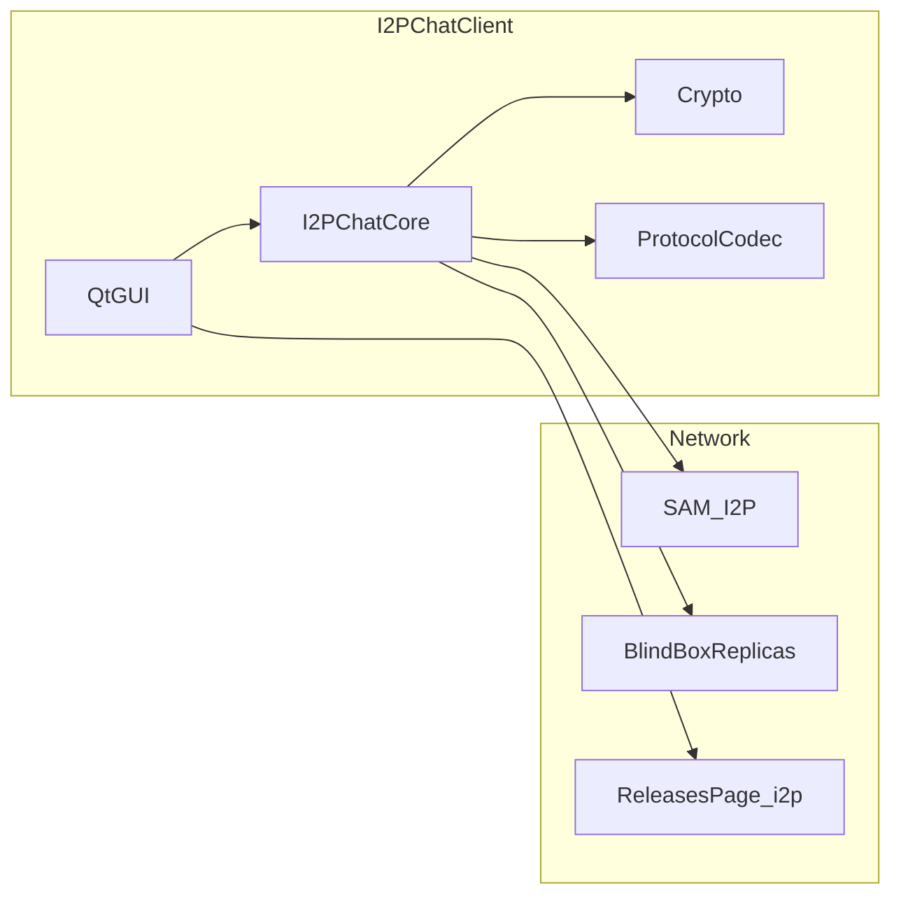

# I2PChat Security Audit Report (re-run after remediations)

| Field | Value |
|-------|-------|
| Report date | 2026-04-01 |
| Revision | Re-audit after remediations: `contact_book` (no `assert`), GUI warning for `I2PCHAT_UPDATE_HTTP_PROXY`, `load_profile_blindbox_replicas_bundle` contract `([], {})` |
| Scope | I2PChat repository (Python/Qt source + vendored `i2plib`) |
| Out of scope | Pentest of shipped binaries, PyInstaller reverse engineering, I2P router firmware audit |

## Executive summary

This repeat review uses the same check classes as the prior report, plus **verification after fixes**: a repo scan for the **`assert`** statement under `i2pchat/` and `i2plib/` found **no** production matches on the report date; `atomic_write_json` for `*.blindbox_replicas.json` still defaults to **mode 0o600** on Unix.

**pip-audit** on `requirements.txt`, `requirements-build.txt`, and `requirements.in` reported **no known vulnerabilities** (local run dated this report).

**Bandit 1.9.4** (`bandit -r i2pchat i2plib`) reported **0** High/Medium issues and **41** Low issues (mostly B110/B112; some B404/B603), scanning **20,819** lines of code in scope.

No **Critical** or **High** issues were identified from tooling plus targeted manual review. The main **residual risk** remains **update metadata trust** (FIND-001) and **operational discipline** for Blind Box samples and local replicas (FIND-003, FIND-004).

---

## 1. Methodology

1. Local **pip-audit** aligned with [`.github/workflows/security-audit.yml`](../.github/workflows/security-audit.yml) for `requirements.txt`, `requirements-build.txt`, and `requirements.in` (no CVE ignores).
2. Local **Bandit 1.9.4** (Python 3.14.x): `bandit -r i2pchat i2plib`.
3. Manual review after remediations: `contact_book.py`, `profile_blindbox_replicas.py`, the update-check dialog in `main_qt.py` (`load_releases_custom_*_warn_ack`), plus related areas: `blindbox_client.py`, `i2p_chat_core.py`, `blindbox_server_example.py`, `release_index.py`, CI workflows.
4. **`assert`** search across `i2pchat/**/*.py` and `i2plib/**/*.py` — **no** matches on the report date.
5. Cross-check with regression tests including [`tests/test_audit_remediation.py`](../tests/test_audit_remediation.py), [`tests/test_profile_blindbox_replicas.py`](../tests/test_profile_blindbox_replicas.py), [`tests/test_blindbox_client.py`](../tests/test_blindbox_client.py), [`tests/test_contact_book.py`](../tests/test_contact_book.py), and the full suite (**467** tests collected under `tests/`).

---

## 2. Already automated in CI

| Control | Location / notes |
|---------|------------------|
| Secret scanning | [`.github/workflows/secret-scan.yml`](../.github/workflows/secret-scan.yml) — Gitleaks |
| Dependency audit | [`.github/workflows/security-audit.yml`](../.github/workflows/security-audit.yml) — `pip-audit` |
| Release signing policy | Build scripts must reference SHA256/GPG |
| Vendored provenance | `i2plib/VENDORED_UPSTREAM.json`, `flake.lock` |
| HKDF / padding / GUI path tests | `tests/test_audit_remediation.py` |

---

## 3. Threat model (brief)

**Primary surfaces:** remote peers, path to I2P/proxies, local OS user malware, untrusted update metadata, misconfigured BlindBox, **profile file disclosure** (including `replica_auth` if disks or backups leak).

---

## 4. Findings (FIND-xxx)

### FIND-001 — Update check without cryptographic artifact binding

| Field | Value |
|-------|-------|
| **Severity** | Medium |
| **Component** | `i2pchat/updates/release_index.py`, GUI caller |
| **Description** | HTML fetch + ZIP name parsing + version compare; **no** in-client download or SHA256/GPG verification. |
| **Scenario** | Tampered page/proxy → misleading update prompt; **social/operational** impact if users install unverified artifacts. |
| **Status** | Accepted risk / design limitation |
| **Recommendations** | In **MANUAL**, spell out: download ZIP only from the official releases page; verify **`SHA256SUMS`**; verify **`SHA256SUMS.asc`** with the release-signing GPG workflow; do not rely on the in-app “update available” prompt alone. Longer term: consider a **signed manifest** (or an embedded release-signing key) if requirements tighten. |

---

### FIND-002 — Environment overrides for update URL and HTTP proxy

| Field | Value |
|-------|-------|
| **Severity** | Low |
| **Component** | `I2PCHAT_RELEASES_PAGE_URL`, `I2PCHAT_UPDATE_HTTP_PROXY` |
| **Description** | User- or malware-controlled redirection of update checks. |
| **Status** | Expected for advanced setups; **partially mitigated in GUI** |
| **Mitigation (code)** | On “Check for updates”, a single **Update check overrides** warning if not previously acknowledged: custom URL → `releases_custom_url_warn_ack` in UI prefs; custom proxy → `releases_custom_proxy_warn_ack`. Copy reminds users to trust both URL and proxy and points to MANUAL §4.12. |
| **Recommendations** | Document both variables and impersonation risk in the user manual. Do not bake overrides into shared scripts/repos; keep them in the user’s trusted environment only. Clearing prefs will show the warning again. |

---

### FIND-003 — `blindbox_server_example.py` (no-token mode)

| Field | Value |
|-------|-------|
| **Severity** | Medium (if **no** token and the service is reachable beyond loopback) |
| **Component** | [`i2pchat/blindbox/blindbox_server_example.py`](../i2pchat/blindbox/blindbox_server_example.py) |
| **Description** | Optional **`BLINDBOX_AUTH_TOKEN`** is supported; verification uses `hmac.compare_digest`. If the variable is **empty**, behavior matches the old example (**no** line-protocol authentication). Optional `.env` loading from the script directory and `~/.i2pchat-blindbox/.env` does **not** override variables already present in the environment. |
| **Scenario** | Exposing the server off `127.0.0.1` without a token re-opens the blob store to the network path. |
| **Status** | Documented sample; with a shared token configured, risk drops for “single shared secret per replica” setups. |
| **Recommendations** | Always set **`BLINDBOX_AUTH_TOKEN`** (long random secret) for any replica reachable beyond localhost. Do not change bind from `127.0.0.1` to `0.0.0.0` without a dedicated threat model, host firewall, and usually an additional isolation layer (e.g. I2P-only exposure). Keep **`.env`** user-readable only; never commit it. |

---

### FIND-004 — Local BlindBox replica with empty auth token

| Field | Value |
|-------|-------|
| **Severity** | Low |
| **Component** | [`BlindBoxLocalReplicaServer`](../i2pchat/blindbox/blindbox_local_replica.py) |
| **Description** | Without a token, any local process that can open the TCP port may PUT/GET blobs. |
| **Status** | Partially mitigated in core for loopback + direct replicas ([`i2p_chat_core.py`](../i2pchat/core/i2p_chat_core.py)). |
| **Recommendations** | Outside development, set **`I2PCHAT_BLINDBOX_LOCAL_TOKEN`**. Do not expose the replica port through the host firewall to untrusted networks. On multi-user hosts, treat any local process that can open the port as a potential client. |

---

### FIND-005 — Pygments / CVE handling in CI

| Field | Value |
|-------|-------|
| **Severity** | Low (historical ReDoS class; dependency upgraded) |
| **Component** | `requirements.txt`, workflows |
| **Description** | After **Pygments 2.20.0**, pip-audit CVE ignores were removed; current audit run is clean. |
| **Status** | Mitigated by upgrade |
| **Recommendations** | On every meaningful dependency change, run **`pip-audit`** against all three requirements files (as in CI). Keep **`requirements-ci-audit.txt`** current; when new CVEs appear, upgrade the package or document a deliberate ignore with rationale. |

---

### FIND-006 — Bandit static analysis summary

| Field | Value |
|-------|-------|
| **Severity** | Informational |
| **Component** | `i2pchat/`, `i2plib/` |
| **Description** | **41** **Low** findings (mostly B110/B112; some B404/B603), **0** High/Medium; **20,819** LOC. |
| **Status** | Optional style / hardening |
| **Recommendations** | Triage Bandit output: narrow **`except`**, log and re-raise meaningful errors; do not introduce **`assert`** for security-relevant invariants; optionally add **pre-commit** Bandit on touched paths. |

---

### FIND-007 — `assert` in production code (historically contacts / BlindBox)

| Field | Value |
|-------|-------|
| **Severity** | Low → **mitigated in current tree** |
| **Component** | Previously: [`contact_book.py`](../i2pchat/storage/contact_book.py) (`set_peer_profile`, `touch_peer_message_meta`); **`blindbox_client.py`** / **`i2p_chat_core.py`** contain **no** **`assert`** on the report date. |
| **Description** | With `python -O`, assertions are stripped; a missing invariant after `remember_peer` could fail silently. |
| **Status** | **Mitigated:** `contact_book` returns **`False`** if the record is still missing after `remember_peer`; scanning `i2pchat/` + `i2plib/` finds **no** **`assert`**. |
| **Recommendations** | Avoid **`assert`** for data-integrity paths in new code; periodically re-run an **`assert`** search under `i2pchat/` and `i2plib/`. |

---

### FIND-008 — On-disk `replica_auth` secrets

| Field | Value |
|-------|-------|
| **Severity** | Low (confidentiality / abuse if profile files leak) |
| **Component** | [`profile_blindbox_replicas.py`](../i2pchat/storage/profile_blindbox_replicas.py), profile JSON (`replica_auth`) |
| **Description** | Line-protocol shared secrets are stored alongside profile data. Writes use **`atomic_write_json`** with default **0o600** on Unix. This does **not** replace trust in the I2P destination; copying the profile copies these tokens. Failed/missing loads return **`([], {})`** (second value is always a dict). |
| **Scenario** | Host compromise or unsafe backups expose replica tokens. |
| **Status** | Expected “secret as part of profile” model |
| **Recommendations** | **Backups:** for profile portability use the **built-in encrypted export** (passphrase, scrypt, SecretBox); do not copy raw `profiles/` trees to USB/cloud without full-disk or archive encryption. **OS:** Unix data dirs already use **0700**—do not loosen ACLs manually; on Windows restrict account access and use volume encryption (BitLocker, etc.) where physical access is a risk. **SCM / sharing:** never commit live profiles or paste **`*.blindbox_replicas.json`** / `replica_auth` snippets into tickets, chats, or screenshots. **Incident response:** if a file leaks, treat replica tokens as compromised—rotate secrets on servers and update I2PChat. **Blast radius:** prefer distinct tokens per endpoint where practical (already supported). |

---

## 5. Positive controls (including new work)

- **Contacts:** after remediations, no **`assert`** on peer profile update paths; missing record yields **`False`**.
- **Updates:** combined warning for custom URL and/or **`I2PCHAT_UPDATE_HTTP_PROXY`** with separate acknowledgement flags in prefs.
- **BlindBox replicas JSON:** atomic writes with **0o600**; load contract **`([], {})`** on empty/error paths.
- **Per-replica auth:** client attaches tokens only to matching endpoints; example server uses **`hmac.compare_digest`** for the configured token.
- Prior controls remain in force: **HKDF**, **HMAC**, padding profile, encrypted backups, `chmod 0o700` data dir on Unix, safe image paths, `compare_digest` on the local replica token path, etc.
- **GUI:** pixmap tinting respects **devicePixelRatio**; scaling via ARGB **QImage** preserves alpha.
- **Input / UX:** ⋯ menu actions honor the same keyboard shortcuts while the popup is focused; **Esc** dismisses the menu.

---

## 6. pip-audit results (local run for this report revision)

| Requirements file | Result |
|-------------------|--------|
| `requirements.txt` | No vulnerabilities found |
| `requirements-build.txt` | No vulnerabilities found |
| `requirements.in` | No vulnerabilities found |

---

## 7. Top five follow-ups (aligned with FIND recommendations)

1. **Updates (FIND-001):** document step-by-step GPG + `SHA256SUMS` in MANUAL; do not rely on the in-app prompt alone.
2. **Dependencies (FIND-005):** run `pip-audit` when lockfiles change; watch the **Security Dependency Audit** CI job.
3. **Sample replica (FIND-003):** require `BLINDBOX_AUTH_TOKEN` off localhost; no wider bind without a threat model.
4. **FIND-007 regression guard:** do not reintroduce **`assert`** in `i2pchat/` / `i2plib/` for data invariants; use `grep`/Bandit when unsure.
5. **Profile / `replica_auth` (FIND-008):** encrypted profile exports only, strict OS permissions / disk encryption, no secrets in SCM; token rotation plan after any leak.

---

## 8. Conclusion

The re-audit confirms a **strong security posture** for the desktop client after Blind Box **`replica_auth`**, the token-aware example server, and **recent remediations** (FIND-002, FIND-007, FIND-008 clarification). **No new Critical or High** issues were found. Residual themes: **update metadata trust** (FIND-001), **example / local replica exposure** (FIND-003, FIND-004), and **on-disk secret handling** (FIND-008).

*This report is a source-code security review; it does not replace formal penetration testing of binary releases.*
