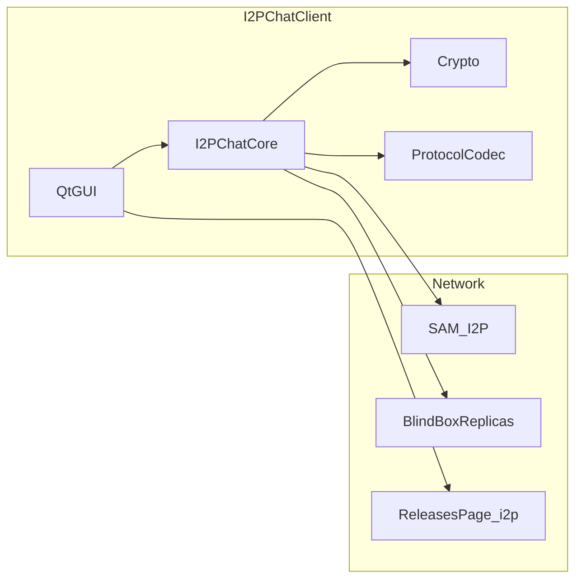

# I2PChat Security Audit Report

| Field | Value |
|-------|-------|
| Date | 2026-04-01 |
| Scope | I2PChat repository (Python/Qt source + vendored `i2plib`) |
| Out of scope | Pentest of shipped binaries, PyInstaller reverse engineering, I2P router firmware audit |

## Executive summary

This review covered the desktop client’s security posture: cryptography and protocol, BlindBox, updates, profile backups, GUI (paths and external processes), CI, and supply chain. Dependency scanning (`pip-audit` in the same configuration as CI, with a Pygments CVE ignored) reported **no known vulnerabilities** in the pinned graphs for `requirements.txt`, `requirements-build.txt`, and `requirements.in`. **Bandit** static analysis on `i2pchat/` and `i2plib/` reported **0** High/Medium issues and **47** Low findings (mostly broad `try/except` and `assert` usage).

The most notable **residual risk** is the **update check** design: it fetches an HTML release page over HTTP (typically via the local I2P HTTP proxy for `*.i2p`), parses ZIP filenames, and **compares version numbers only**. The client **does not download** the ZIP or **verify** cryptographic integrity. This is consistent with a “notify the user” model; a compromised page or proxy could misrepresent availability and filenames (**social / operational** risk if the user installs artifacts without following the project’s release signing policy).

---

## 1. Methodology

1. Local **pip-audit** (per [`.github/workflows/security-audit.yml`](../.github/workflows/security-audit.yml)) against `requirements.txt`, `requirements-build.txt`, and `requirements.in`, with no CVE ignores (Pygments bumped to 2.20.0).
2. Local **Bandit 1.9.4** (Python 3.14.3): `bandit -r i2pchat i2plib` (~20,400 LOC scanned per metrics).
3. Manual checklist review: `i2pchat/crypto.py`, `i2pchat/protocol/`, BlindBox, `i2p_chat_core.py`, `profile_backup.py`, `release_index.py`, GUI (`main_qt.py`), `notifications.py`, `drag_drop.py`, scripts, GitHub Actions.
4. Cross-check with policy regression tests in [`tests/test_audit_remediation.py`](../tests/test_audit_remediation.py).

---

## 2. Already automated in CI (not re-reported as new critical findings)

| Control | Location / notes |
|---------|------------------|
| Secret scanning | [`.github/workflows/secret-scan.yml`](../.github/workflows/secret-scan.yml) — Gitleaks |
| Dependency audit | [`.github/workflows/security-audit.yml`](../.github/workflows/security-audit.yml) — `pip-audit` |
| Release signing policy | Workflow enforces SHA256/GPG references in build scripts |
| Vendored provenance | `i2plib/VENDORED_UPSTREAM.json`, `flake.lock` |
| HKDF / padding / GUI path policy tests | `tests/test_audit_remediation.py` |

---

## 3. Threat model (brief)

**Primary surfaces:** remote peers (chat protocol and file transfer), network path to I2P/proxies, local OS user or malware, untrusted update metadata source, misconfigured BlindBox (direct TCP, relaxed local mode).

---

## 4. Findings (FIND-xxx)

### FIND-001 — Update check without cryptographic artifact binding

| Field | Value |
|-------|-------|
| **Severity** | Medium |
| **Component** | `i2pchat/updates/release_index.py`, GUI caller |
| **Description** | The app fetches the releases HTML, extracts ZIP names with regexes, and compares semantic versions. It **does not** download the distribution or verify SHA256/GPG **inside the client**. Transport for `*.i2p` defaults to HTTP through the local I2P proxy ([`release_index.py`](../i2pchat/updates/release_index.py)). |
| **Scenario** | An actor who can tamper with the page or proxy (or a user pointing at an untrusted URL) can show a fake “update available” message and filename. Impact is mainly **social/operational**: harm depends on the user installing an unverified package. |
| **Status** | Accepted risk / design limitation |
| **Recommendations** | Document mandatory `SHA256SUMS` + GPG verification for downloaded ZIPs in user-facing docs; consider embedding signed manifests or pinned release keys if requirements tighten. |

---

### FIND-002 — Environment overrides for update URL and HTTP proxy

| Field | Value |
|-------|-------|
| **Severity** | Low |
| **Component** | `I2PCHAT_RELEASES_PAGE_URL`, `I2PCHAT_UPDATE_HTTP_PROXY` |
| **Description** | The user (or malware with user privileges) can redirect update checks to arbitrary hosts or proxies. |
| **Scenario** | Same trust issues as FIND-001. |
| **Status** | Expected for advanced setups |
| **Recommendations** | Optional UI warning when the releases URL is customized. |

---

### FIND-003 — `blindbox_server_example.py` has no authentication

| Field | Value |
|-------|-------|
| **Severity** | Medium (if used outside its documented scenario) |
| **Component** | [`i2pchat/blindbox/blindbox_server_example.py`](../i2pchat/blindbox/blindbox_server_example.py) |
| **Description** | Minimal dev server bound to `127.0.0.1` with **no** token or cryptographic client authentication. |
| **Scenario** | Binding beyond loopback or port forwarding could expose the blob store. |
| **Status** | Documented in-file (“not for untrusted networks”) |
| **Recommendations** | Do not widen bind addresses without a full security design; keep developer docs explicit about `127.0.0.1` only. |

---

### FIND-004 — Local BlindBox replica with empty auth token

| Field | Value |
|-------|-------|
| **Severity** | Low |
| **Component** | [`BlindBoxLocalReplicaServer`](../i2pchat/blindbox/blindbox_local_replica.py) (`_is_authorized` allows operations when `auth_token` is empty) |
| **Description** | Any local process that can open TCP to `host:port` may PUT/GET blobs if no token is configured. |
| **Scenario** | Multi-user host or compromised local process. |
| **Status** | Partially mitigated in core: loopback direct replicas without a token are rejected unless `I2PCHAT_BLINDBOX_ALLOW_INSECURE_LOCAL` is set ([`_blindbox_direct_replicas_security_issue`](../i2pchat/core/i2p_chat_core.py)). |
| **Recommendations** | Always set `I2PCHAT_BLINDBOX_LOCAL_TOKEN` for non-development use. |

---

### FIND-005 — CVE-2026-4539 (Pygments) in CI

| Field | Value |
|-------|-------|
| **Severity** | Low (ReDoS, usage-dependent) |
| **Component** | [`.github/workflows/security-audit.yml`](../.github/workflows/security-audit.yml), `requirements.txt` |
| **Description** | Previously `pip-audit` used `--ignore-vuln CVE-2026-4539` while no fixed PyPI release existed. After **Pygments 2.20.0** shipped, the dependency was upgraded and the workflow ignore was removed. |
| **Status** | Mitigated (upgrade + plain `pip-audit`) |
| **Recommendations** | When pip-audit flags Pygments again, refresh the lockfile and re-run audits. |

---

### FIND-006 — Bandit static analysis summary

| Field | Value |
|-------|-------|
| **Severity** | Informational |
| **Component** | `i2pchat/`, `i2plib/` |
| **Description** | **47** hits, all **Low**: B110 (`try/except: pass`), B112 (`try/except: continue`), B101 (`assert`). No injection-class or hardcoded-secret issues flagged. |
| **Status** | Optional hardening / style |
| **Recommendations** | Narrow broad `except` blocks with logging; avoid security-relevant invariants that rely solely on `assert` (or always run tests without `-O`). |

---

### FIND-007 — `assert` in BlindBox networking paths

| Field | Value |
|-------|-------|
| **Severity** | Low |
| **Component** | [`blindbox_client.py`](../i2pchat/blindbox/blindbox_client.py), [`i2p_chat_core.py`](../i2pchat/core/i2p_chat_core.py) |
| **Description** | With `python -O`, assertions are stripped, changing behavior on rare post-retry error paths. |
| **Status** | Common Python caveat; PyInstaller bundles typically do not use `-O` |
| **Recommendations** | Replace critical `assert` statements with explicit `if ...: raise`. |

---

## 5. Positive controls (implemented / tested)

- **HKDF** session subkey separation ([`crypto.derive_handshake_subkeys`](../i2pchat/crypto.py)); regression in `test_audit_remediation`.
- **HMAC** and vNext header fields in [`compute_mac`](../i2pchat/crypto.py); framing hardening tests in [`test_protocol_hardening.py`](../tests/test_protocol_hardening.py).
- **Padding profile** (`I2PCHAT_PADDING_PROFILE`) for traffic metadata; documented and policy-tested.
- **Backups**: scrypt + NaCl SecretBox, per-file SHA256 in manifest, `_safe_member_name` against tar path traversal ([`profile_backup.py`](../i2pchat/storage/profile_backup.py)).
- **Data directory** `chmod 0o700` on Unix ([`get_profiles_dir`](../i2pchat/core/i2p_chat_core.py)).
- **Image open path**: `_is_path_within_directory` + `realpath` (see `test_audit_remediation`).
- **subprocess** on Linux: argv lists, binaries from `shutil.which`, sound path as a separate argument, no `shell=True`.
- **BlindBox**: `hmac.compare_digest` for tokens on the local replica; strict SAM mode (`I2PCHAT_BLINDBOX_REQUIRE_SAM`).
- **Secrets in SCM**: broad [`.gitignore`](../.gitignore) for keys and `.env`.
- **GitHub script**: token from environment only, documented in [`sync_github_backlog.py`](../scripts/sync_github_backlog.py).
- **No** `pickle` or unsafe `yaml.load` in application `.py` tree (repo search).

---

## 6. pip-audit results (local run 2026-04-01)

| Requirements file | Result |
|-------------------|--------|
| `requirements.txt` | No vulnerabilities (after Pygments 2.20.0 upgrade) |
| `requirements-build.txt` | No vulnerabilities |
| `requirements.in` | No vulnerabilities |

---

## 7. Top five follow-ups

1. Document the end-user trust chain for updates (GPG/SHA256 on releases), aligned with FIND-001.
2. Keep dependencies current per `pip-audit` (FIND-005 addressed by the Pygments upgrade).
3. Do not promote `blindbox_server_example` to production without a full threat model (FIND-003).
4. Consider replacing critical `assert` statements on network paths with explicit exceptions (FIND-007).
5. Keep current CI discipline (Gitleaks + pip-audit + release artifact signing policy).

---

## 8. Conclusion

The codebase shows **mature practices** for a desktop messenger: cryptographic key separation, strict protocol framing, encrypted backups, GUI path confinement, and automated dependency review. The main **residual risk** is **trust in update metadata** (FIND-001) and **operational discipline** around BlindBox examples and environment variables. This audit did **not** identify Critical or High severity vulnerabilities in source review and tooling output.

*This report reflects a source-code security review; it is not a substitute for formal certification or full-scope penetration testing.*
