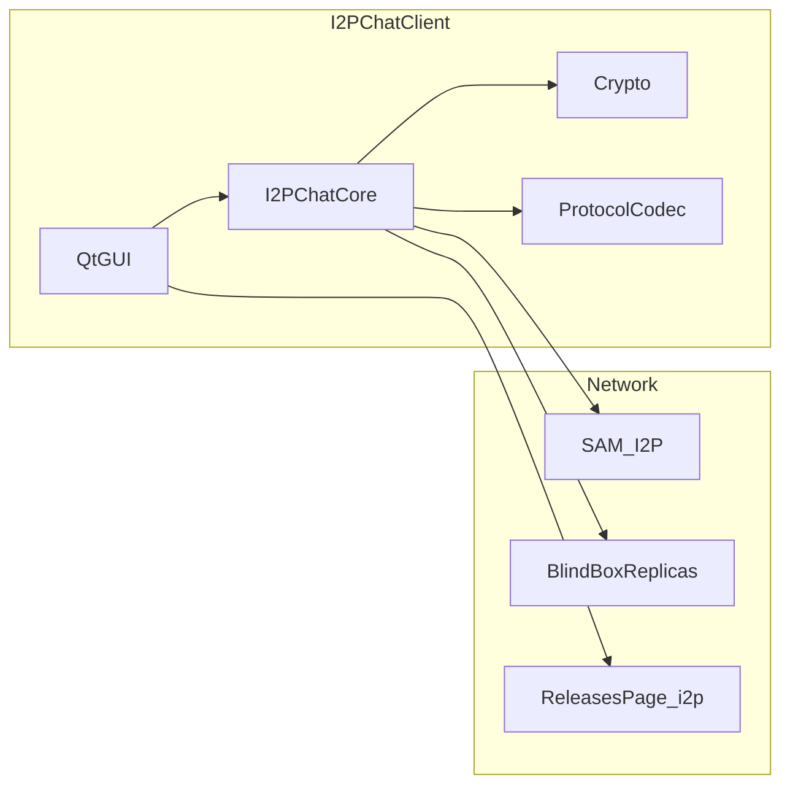

# Отчёт об аудите безопасности I2PChat

| Поле | Значение |
|------|----------|
| Дата | 2026-04-01 |
| Объект | Репозиторий I2PChat (исходный код Python/Qt + вендорный `i2plib`) |
| Вне области | Пентест развёрнутых бинарей, реверс PyInstaller, аудит прошивок I2P-маршрутизаторов |

## Краткое резюме

Проведён обзор безопасности десктопного клиента: криптография и протокол, BlindBox, обновления, бэкапы профиля, GUI (пути и внешние процессы), CI и цепочка поставок. Автоматизированная проверка зависимостей (`pip-audit` в конфигурации CI, с игнором CVE для Pygments) **не выявила известных уязвимостей** в закреплённых графах `requirements.txt`, `requirements-build.txt` и `requirements.in`. Статический анализ **Bandit** по каталогам `i2pchat/` и `i2plib/` показал **0** находок уровня High/Medium и **47** низкого приорителя (в основном широкие `try/except` и использование `assert`).

Наиболее значимый **остаточный риск**: механизм «проверки обновлений» опирается на разбор HTML-страницы релизов по HTTP (в типичной конфигурации — через I2P HTTP-прокси); приложение **не загружает** ZIP и **не проверяет** криптографически целостность артефакта — только сравнивает номера версий. Это осознанная модель «уведомить пользователя»; при компрометации страницы или прокси возможна **социальная** подмена сведений о версии (пользователь всё равно должен скачать и проверить билд вручную по политике релизов).

---

## 1. Методология

1. Локальный запуск **pip-audit** (как в [`.github/workflows/security-audit.yml`](../.github/workflows/security-audit.yml)) для файлов `requirements.txt`, `requirements-build.txt`, `requirements.in` — без игноров CVE (Pygments обновлён до 2.20.0).
2. Локальный запуск **Bandit 1.9.4** (Python 3.14.3): `bandit -r i2pchat i2plib` (JSON-метрики: ~20400 строк кода в области сканирования).
3. Ручной обзор по чеклисту: `i2pchat/crypto.py`, `i2pchat/protocol/`, BlindBox, `i2p_chat_core.py`, `profile_backup.py`, `release_index.py`, GUI (`main_qt.py`), `notifications.py`, `drag_drop.py`, скрипты, GitHub Actions.
4. Сопоставление с регрессионными тестами политик: [`tests/test_audit_remediation.py`](../tests/test_audit_remediation.py).

---

## 2. Что уже автоматизировано в CI (не дублируется как «новые» критические находки)

| Механизм | Файл / описание |
|----------|-----------------|
| Сканирование секретов | [`.github/workflows/secret-scan.yml`](../.github/workflows/secret-scan.yml) — Gitleaks |
| Аудит зависимостей | [`.github/workflows/security-audit.yml`](../.github/workflows/security-audit.yml) — `pip-audit` |
| Политика подписи релизов | Проверка наличия SHA256/GPG в build-скриптах |
| Provenance вендорного кода | `i2plib/VENDORED_UPSTREAM.json`, `flake.lock` |
| Регрессии HKDF / padding / путей GUI | `tests/test_audit_remediation.py` |

---

## 3. Модель угроз (кратко)

**Основные поверхности атаки:** удалённый собеседник (протокол чата и передачи файлов), сеть до I2P/прокси, локальный пользователь/вредонос на той же ОС, подмена источника обновлений, неправильная конфигурация BlindBox (прямой TCP, ослабленный локальный режим).

---

## 4. Находки (сквозная нумерация FIND-xxx)

### FIND-001 — Проверка обновлений без криптографической привязки к артефакту

| Поле | Значение |
|------|----------|
| **Уровень** | Medium |
| **Компонент** | `i2pchat/updates/release_index.py`, вызов из GUI |
| **Описание** | Приложение загружает HTML страницы релизов, извлекает имена ZIP по регулярным выражениям и сравнивает семантику версии с локальной. Загрузка дистрибутива и проверка SHA256/GPG **в коде клиента не выполняются**. Транспорт для `*.i2p` по умолчанию — HTTP через локальный прокси I2P ([`release_index.py`](../i2pchat/updates/release_index.py)). |
| **Сценарий** | Актёр, способный подменить ответ страницы или прокси (или пользователь, задавший недоверенный URL), может показать ложное «доступно обновление» и имя файла. Риск в основном **социальный/операционный**: пользователь может перейти по ссылке и установить поддельный пакет, если не следует внешней политике проверки релизов. |
| **Статус** | Принятый риск / ограничение дизайна |
| **Рекомендации** | Документировать в руководстве пользователя обязательную проверку `SHA256SUMS` и подписи GPG для скачанных ZIP; при появлении требований — рассмотреть встраивание проверки по известному публичному ключу или отдельный signed manifest. |

---

### FIND-002 — Переопределение URL и HTTP-прокси для проверки обновлений

| Поле | Значение |
|------|----------|
| **Уровень** | Low |
| **Компонент** | `I2PCHAT_RELEASES_PAGE_URL`, `I2PCHAT_UPDATE_HTTP_PROXY` |
| **Описание** | Пользователь (или вредонос с правами того же пользователя) может перенаправить проверку обновлений на произвольный хост или прокси. |
| **Сценарий** | Утечка или подмена переменных окружения → та же логика, что в FIND-001. |
| **Статус** | Ожидаемое поведение для продвинутых сценариев |
| **Рекомендации** | В UI при первом изменении URL показывать предупреждение о доверии к источнику (опционально). |

---

### FIND-003 — Пример `blindbox_server_example.py` без аутентификации

| Поле | Значение |
|------|----------|
| **Уровень** | Medium (при использовании вне задокументированного сценария) |
| **Компонент** | [`i2pchat/blindbox/blindbox_server_example.py`](../i2pchat/blindbox/blindbox_server_example.py) |
| **Описание** | Минимальный сервер для разработки слушает `127.0.0.1`, **без** токена и без криптографической авторизации клиентов. |
| **Сценарий** | Запуск на интерфейсе, отличном от loopback, или проброс порта наружу откроет хранилище блобов локальным/удалённым клиентам. |
| **Статус** | Документировано в файле («not for untrusted networks») |
| **Рекомендации** | Не менять bind на `0.0.0.0` без отдельного дизайна безопасности; в README для разработчиков явно указывать только `127.0.0.1`. |

---

### FIND-004 — Локальная реплика BlindBox с пустым токеном

| Поле | Значение |
|------|----------|
| **Уровень** | Low |
| **Компонент** | [`BlindBoxLocalReplicaServer`](../i2pchat/blindbox/blindbox_local_replica.py) (`_is_authorized`: при пустом `auth_token` разрешаются операции) |
| **Описание** | Если сервер поднят без токена, любой процесс на той же машине, способный открыть TCP к `host:port`, может PUT/GET блобы. |
| **Сценарий** | Многопользовательская ОС или скомпрометированный локальный процесс. |
| **Статус** | Частично смягчено в ядре: для loopback + direct replicas без токена выдаётся ошибка, если не задан `I2PCHAT_BLINDBOX_ALLOW_INSECURE_LOCAL` ([`_blindbox_direct_replicas_security_issue`](../i2pchat/core/i2p_chat_core.py)). |
| **Рекомендации** | Всегда задавать `I2PCHAT_BLINDBOX_LOCAL_TOKEN` для не-dev сценариев. |

---

### FIND-005 — CVE-2026-4539 (Pygments) в CI

| Поле | Значение |
|------|----------|
| **Уровень** | Low (ReDoS в зависимости от использования Pygments) |
| **Компонент** | [`.github/workflows/security-audit.yml`](../.github/workflows/security-audit.yml), `requirements.txt` |
| **Описание** | Ранее `pip-audit` вызывался с `--ignore-vuln CVE-2026-4539` из-за отсутствия исправленного релиза на PyPI. После выхода **Pygments 2.20.0** зависимость обновлена, игнор в workflow снят. |
| **Статус** | Смягчено в коде (обновление + чистый `pip-audit`) |
| **Рекомендации** | При появлении новых предупреждений по Pygments снова запускать `pip-audit` и обновлять lockfile. |

---

### FIND-006 — Результаты Bandit (статический анализ)

| Поле | Значение |
|------|----------|
| **Уровень** | Informational |
| **Компонент** | `i2pchat/`, `i2plib/` |
| **Описание** | **47** срабатываний, все **Low**: B110 (`try/except: pass`), B112 (`try/except: continue`), B101 (`assert`). Уязвимостей класса инъекции или hardcoded secret не выявлено. |
| **Статус** | Для рассмотрения при ужесточении стиля кода |
| **Рекомендации** | Точечно заменять широкие `except` на логирование; критичные инварианты не опирать только на `assert` в путях, важных для безопасности (или запускать тесты без `-O`). |

---

### FIND-007 — Использование `assert` в сетевом коде BlindBox

| Поле | Значение |
|------|----------|
| **Уровень** | Low |
| **Компонент** | [`blindbox_client.py`](../i2pchat/blindbox/blindbox_client.py), [`i2p_chat_core.py`](../i2pchat/core/i2p_chat_core.py) |
| **Описание** | При запуске интерпретатора с оптимизацией (`python -O`) утверждения удаляются; теоретически меняется поведение редких веток ошибок после циклов повторов. |
| **Статус** | Типичная для Python оговорка; PyInstaller/рантайм обычно без `-O` |
| **Рекомендации** | Заменить критичные `assert` на явный `if ...: raise`. |

---

## 5. Положительные меры (уже в коде / тестах)

- **HKDF** для разделения ключей сессии после handshake ([`crypto.derive_handshake_subkeys`](../i2pchat/crypto.py)); регрессия в `test_audit_remediation`.
- **HMAC** и параметры vNext-заголовка в [`compute_mac`](../i2pchat/crypto.py); тесты hardening фрейминга в [`test_protocol_hardening.py`](../tests/test_protocol_hardening.py).
- **Профиль padding** (`I2PCHAT_PADDING_PROFILE`) для метаданных трафика; задокументировано и покрыто тестами политик.
- **Бэкапы**: scrypt + NaCl SecretBox, manifest с SHA256 по файлам, `_safe_member_name` против path traversal в tar ([`profile_backup.py`](../i2pchat/storage/profile_backup.py)).
- **Каталог данных** `chmod 0o700` на Unix ([`get_profiles_dir`](../i2pchat/core/i2p_chat_core.py)).
- **Открытие изображений**: проверка `_is_path_within_directory` + `realpath` (тесты в `test_audit_remediation`).
- **subprocess** на Linux: списки аргументов, бинарии из `shutil.which`, путь к звуку как отдельный аргумент без `shell=True`.
- **BlindBox**: сравнение токена через `hmac.compare_digest` в локальной реплике; строгий режим SAM (`I2PCHAT_BLINDBOX_REQUIRE_SAM`).
- **Секреты в SCM**: расширенный [`.gitignore`](../.gitignore) для ключей и `.env`.
- **Скрипт GitHub**: токен только из окружения, предупреждение в docstring ([`sync_github_backlog.py`](../scripts/sync_github_backlog.py)).
- **Нет** `pickle` / небезопасного `yaml.load` в дереве приложения (поиск по `.py`).

---

## 6. Результаты pip-audit (локальный прогон 2026-04-01)

| Файл требований | Результат |
|-----------------|-----------|
| `requirements.txt` | Уязвимостей не найдено (после обновления Pygments 2.20.0) |
| `requirements-build.txt` | Уязвимостей не найдено |
| `requirements.in` | Уязвимостей не найдено |

---

## 7. Топ-5 приоритетных действий

1. Явно описать в пользовательской документации цепочку доверия для обновлений (GPG/SHA256 на стороне релиза), согласованно с FIND-001.
2. Поддерживать актуальный Pygments / зависимости по результатам `pip-audit` (FIND-005 закрыт обновлением).
3. Не расширять `blindbox_server_example` до production-сервера без полноценной модели угроз (FIND-003).
4. Рассмотреть замену критичных `assert` в сетевых путях на явные исключения (FIND-007).
5. Сохранять текущую дисциплину CI (gitleaks + pip-audit + политика подписи артефактов).

---

## 8. Заключение

Кодовая база демонстрирует **зрелый набор практик** для десктопного мессенджера: разделение криптоключей, жёсткий фрейминг протокола, защищённые бэкапы, ограничение путей в GUI и автоматизированный аудит зависимостей. Основной **остаточный риск** связан с **моделью доверия к странице обновлений** (FIND-001) и с **операционной дисциплиной** при использовании примеров и переменных окружения BlindBox. Критических или высоких уязвимостей в результате данного аудита **не зафиксировано**.

*Отчёт подготовлен в рамках внутреннего аудита исходного кода; не заменяет формальный сертификационный пентест.*
