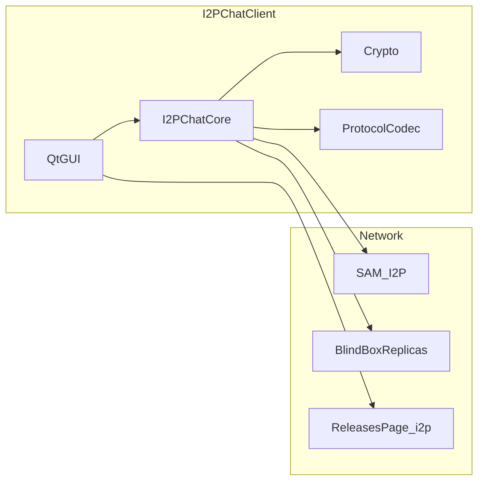

# Отчёт об аудите безопасности I2PChat (повторный прогон после мер)

| Поле | Значение |
|------|----------|
| Дата отчёта | 2026-04-01 |
| Ревизия | Повторный аудит после мер: `contact_book` (без `assert`), предупреждение GUI для `I2PCHAT_UPDATE_HTTP_PROXY`, контракт `load_profile_blindbox_replicas_bundle` → `([], {})` |
| Объект | Репозиторий I2PChat (исходный код Python/Qt + вендорный `i2plib`) |
| Вне области | Пентест развёрнутых бинарей, реверс PyInstaller, аудит прошивок I2P-маршрутизаторов |

## Краткое резюме

Выполнены те же классы проверок, что в предыдущем отчёте, плюс **точечная верификация** после исправлений: поиск оператора **`assert`** только в каталогах `i2pchat/` и `i2plib/` (в продакшен-коде **не обнаружено**), сверка `atomic_write_json` / прав на `*.blindbox_replicas.json` (режим записи по умолчанию **0o600**).

**pip-audit** по `requirements.txt`, `requirements-build.txt` и `requirements.in` — **уязвимостей не найдено** (локальный прогон на дату отчёта).

**Bandit 1.9.4** (`bandit -r i2pchat i2plib`): **0** High/Medium, **41** Low (в основном B110/B112 — широкие `try/except` и `try_except_continue`; также отдельные B404/B603); охват **20 819** строк кода в зоне сканирования.

Критических или высоких уязвимостей по итогам инструментов и ручного обзора **не зафиксировано**. Основной **остаточный риск** по-прежнему связан с **моделью проверки обновлений** (FIND-001) и с **дисциплиной эксплуатации** примеров Blind Box и локальных реплик (FIND-003, FIND-004).

---

## 1. Методология

1. Локальный **pip-audit** по [`.github/workflows/security-audit.yml`](../.github/workflows/security-audit.yml) для `requirements.txt`, `requirements-build.txt`, `requirements.in` — без игноров CVE.
2. Локальный **Bandit 1.9.4** (Python 3.14.x): `bandit -r i2pchat i2plib`.
3. Ручной обзор и верификация после мер: `contact_book.py`, `profile_blindbox_replicas.py`, диалог проверки обновлений в `main_qt.py` (`load_releases_custom_*_warn_ack`), плюс связанные участки: `blindbox_client.py`, `i2p_chat_core.py`, `blindbox_server_example.py`, `release_index.py`, CI workflows.
4. Поиск **`assert`** в `i2pchat/**/*.py` и `i2plib/**/*.py` (совпадений **нет** на дату отчёта).
5. Сверка с регрессионными тестами: [`tests/test_audit_remediation.py`](../tests/test_audit_remediation.py), [`tests/test_profile_blindbox_replicas.py`](../tests/test_profile_blindbox_replicas.py), [`tests/test_blindbox_client.py`](../tests/test_blindbox_client.py), [`tests/test_contact_book.py`](../tests/test_contact_book.py) и остальной набор (**467** собранных тестов в `tests/`).

---

## 2. Что уже автоматизировано в CI

| Механизм | Файл / описание |
|----------|-----------------|
| Сканирование секретов | [`.github/workflows/secret-scan.yml`](../.github/workflows/secret-scan.yml) — Gitleaks |
| Аудит зависимостей | [`.github/workflows/security-audit.yml`](../.github/workflows/security-audit.yml) — `pip-audit` |
| Политика подписи релизов | Проверка наличия SHA256/GPG в build-скриптах |
| Provenance вендорного кода | `i2plib/VENDORED_UPSTREAM.json`, `flake.lock` |
| Регрессии HKDF / padding / путей GUI | `tests/test_audit_remediation.py` |

---

## 3. Модель угроз (кратко)

**Поверхности атаки:** удалённый пир (протокол и файлы), путь до I2P/прокси, локальный пользователь ОС, подмена метаданных обновлений, неверная конфигурация BlindBox (прямой TCP, ослабленный локальный режим), **утечка файлов профиля** (в т.ч. карта `replica_auth` при компрометации диска или бэкапа).

---

## 4. Находки (сквозная нумерация FIND-xxx)

### FIND-001 — Проверка обновлений без криптографической привязки к артефакту

| Поле | Значение |
|------|----------|
| **Уровень** | Medium |
| **Компонент** | `i2pchat/updates/release_index.py`, вызов из GUI |
| **Описание** | Загрузка HTML страницы релизов, разбор имён ZIP, сравнение версий. Загрузка дистрибутива и проверка SHA256/GPG в клиенте **не выполняются**. |
| **Сценарий** | Подмена страницы/прокси → ложное уведомление об обновлении; **операционный/социальный** риск при установке непроверенного пакета. |
| **Статус** | Принятый риск / ограничение дизайна |
| **Рекомендации** | В **MANUAL** явно описать: скачивание ZIP только с официальной страницы релизов; сверка **`SHA256SUMS`**; проверка **`SHA256SUMS.asc`** отпечатком GPG из политики релиза; не доверять только всплывающему «доступно обновление» в приложении. Долгосрочно: рассмотреть **подписанный manifest** (или закреплённый публичный ключ в клиенте) при ужесточении требований. |

---

### FIND-002 — Переопределение URL и HTTP-прокси для проверки обновлений

| Поле | Значение |
|------|----------|
| **Уровень** | Low |
| **Компонент** | `I2PCHAT_RELEASES_PAGE_URL`, `I2PCHAT_UPDATE_HTTP_PROXY` |
| **Описание** | Пользователь или ПО с правами пользователя может перенаправить проверку обновлений. |
| **Статус** | Ожидаемое поведение; **частично смягчено в GUI** |
| **Смягчение (код)** | При «Проверить обновления» одно предупреждение **Update check overrides**, если не подтверждено ранее: для кастомного URL — флаг `releases_custom_url_warn_ack` в UI prefs; для кастомного прокси — `releases_custom_proxy_warn_ack`. Текст напоминает о доверии к URL и прокси и отсылает к §4.12 MANUAL. |
| **Рекомендации** | Документировать в руководстве смысл переменных и риск подмены. Не задавать их в общих скриптах/репозиториях; хранить только в доверенном окружении пользователя. При сбросе prefs предупреждение покажется снова. |

---

### FIND-003 — Пример `blindbox_server_example.py` (режим без токена)

| Поле | Значение |
|------|----------|
| **Уровень** | Medium (если токен **не** задан и сервер доступен шире loopback) |
| **Компонент** | [`i2pchat/blindbox/blindbox_server_example.py`](../i2pchat/blindbox/blindbox_server_example.py) |
| **Описание** | Поддерживается опциональный **`BLINDBOX_AUTH_TOKEN`**: проверка через `hmac.compare_digest`. Если переменная **пуста**, линия протокола ведёт себя как раньше (**без** линейной аутентификации). Загрузка `.env` из каталога скрипта и `~/.i2pchat-blindbox/.env` не перезаписывает уже заданные переменные окружения. |
| **Сценарий** | Публикация сервера вне `127.0.0.1` без токена снова открывает хранилище блобов. |
| **Статус** | Документированный пример; при наличии токена — снижение риска для сценария «один общий секрет на реплику». |
| **Рекомендации** | Всегда задавать **`BLINDBOX_AUTH_TOKEN`** (достаточно длинный случайный секрет) для любой реплики, доступной не только с localhost. Не менять bind с `127.0.0.1` на `0.0.0.0` без отдельной модели угроз, файрвола и, при необходимости, отдельного слоя (например, только через I2P/tunnel). Файл **`.env`** держать с правами только для владельца; не коммитить. |

---

### FIND-004 — Локальная реплика BlindBox с пустым токеном

| Поле | Значение |
|------|----------|
| **Уровень** | Low |
| **Компонент** | [`BlindBoxLocalReplicaServer`](../i2pchat/blindbox/blindbox_local_replica.py) |
| **Описание** | Без токена локальный TCP принимает PUT/GET от процессов, имеющих доступ к порту. |
| **Статус** | Частично смягчено в ядре для loopback + direct replicas ([`i2p_chat_core.py`](../i2pchat/core/i2p_chat_core.py)). |
| **Рекомендации** | Вне разработки задавать **`I2PCHAT_BLINDBOX_LOCAL_TOKEN`**. Не открывать порт реплики в файрволе для внешних сетей. На многопользовательской машине считать «любой локальный процесс с доступом к порту» потенциальным клиентом. |

---

### FIND-005 — Pygments / CVE в CI

| Поле | Значение |
|------|----------|
| **Уровень** | Low (исторически ReDoS; сейчас зависимость обновлена) |
| **Компонент** | `requirements.txt`, workflow |
| **Описание** | После **Pygments 2.20.0** игнор CVE в `pip-audit` снят; текущий прогон — без находок. |
| **Статус** | Смягчено обновлением |
| **Рекомендации** | На каждом значимом изменении зависимостей: **`pip-audit`** по трем файлам требований (как в CI). Поддерживать **`requirements-ci-audit.txt`** в актуальном состоянии; при новых CVE — обновлять пакет или документировать осознанный игнор с обоснованием. |

---

### FIND-006 — Результаты Bandit (статический анализ)

| Поле | Значение |
|------|----------|
| **Уровень** | Informational |
| **Компонент** | `i2pchat/`, `i2plib/` |
| **Описание** | **41** срабатывание **Low** (преимущественно B110/B112; встречаются B404, B603), **0** High/Medium; **20 819** LOC. |
| **Статус** | Для точечного ужесточения стиля |
| **Рекомендации** | Точечно проходить отчёт Bandit: сужать **`except`**, логировать и пробрасывать осмысленные исключения; не вводить **`assert`** для инвариантов, влияющих на безопасность; при желании — **pre-commit** с Bandit на изменённых файлах. |

---

### FIND-007 — Оператор `assert` в продакшен-коде (исторически контакты / BlindBox)

| Поле | Значение |
|------|----------|
| **Уровень** | Low → **смягчено в текущем дереве** |
| **Компонент** | Ранее: [`contact_book.py`](../i2pchat/storage/contact_book.py) (`set_peer_profile`, `touch_peer_message_meta`); в **`blindbox_client.py`** / **`i2p_chat_core.py`** на дату отчёта операторов **`assert`** **нет**. |
| **Описание** | При `python -O` утверждения отбрасываются; пустой инвариант после `remember_peer` мог привести к некорректному состоянию без явной ошибки. |
| **Статус** | **Смягчено:** в `contact_book` после `remember_peer` при отсутствии записи возвращается **`False`**; сканирование `i2pchat/` + `i2plib/` не находит **`assert`**. |
| **Рекомендации** | При новых изменениях не использовать **`assert`** для логики, влияющей на целостность данных; периодически повторять поиск **`assert`** в `i2pchat/` и `i2plib/`. |

---

### FIND-008 — Секреты `replica_auth` в файле профиля

| Поле | Значение |
|------|----------|
| **Уровень** | Low (конфиденциальность / эксплуатация при утечке файла) |
| **Компонент** | [`profile_blindbox_replicas.py`](../i2pchat/storage/profile_blindbox_replicas.py), JSON профиля (`replica_auth`) |
| **Описание** | Общие секреты линии протокола Blind Box хранятся на диске рядом с данными профиля. Запись через **`atomic_write_json`** задаёт режим **0o600** на Unix. Это **не** замена доверию к I2P destination; при копировании профиля/бэкапа секреты копируются вместе с ним. Загрузка пустого бандла возвращает **`([], {})`** (второй элемент всегда словарь). |
| **Сценарий** | Компрометация каталога профиля или незащищённый бэкап раскрывает токены реплик. |
| **Статус** | Ожидаемая модель «секрет как часть профиля» |
| **Рекомендации** | **Бэкапы:** для переноса профиля использовать **встроенный зашифрованный экспорт** (пароль, scrypt, SecretBox); не копировать сырой каталог `profiles/` на USB/облако без шифрования тома или архива. **Права ОС:** на Unix каталог данных уже **0700** — не ослаблять вручную; на Windows ограничивать доступ учётной записи, включать шифрование диска (BitLocker и т.п.) при риске физического доступа. **SCM и обмен:** не коммитить живые профили и не публиковать **`*.blindbox_replicas.json`** / фрагменты с `replica_auth` в тикетах, чатах, скриншотах. **Инцидент:** при утечке файла считать токены реплик скомпрометированными — сменить секрет на сервере и обновить записи в I2PChat. **Blast radius:** по возможности разные токены на разные endpoint’ы (модель уже поддерживается). |

---

## 5. Положительные меры (в т.ч. новые)

- **Контакты:** после мер нет **`assert`** на пути обновления профиля пира; безопасный отказ **`False`**, если запись не появилась.
- **Проверка обновлений:** комбинированное предупреждение для кастомного URL и/или **`I2PCHAT_UPDATE_HTTP_PROXY`** с отдельными флагами подтверждения в prefs.
- **BlindBox replicas JSON:** атомарная запись и **0o600**; контракт типов **`([], {})`** при отсутствии/ошибке загрузки.
- **Per-replica auth:** клиент подставляет токен только для совпадающего endpoint; сервер-пример использует **`hmac.compare_digest`** для строки токена.
- **HKDF**, **HMAC**, padding, бэкапы профиля, `chmod 0o700` каталога данных, проверки путей к изображениям, **BlindBox** `compare_digest` на локальной реплике — без изменения смысла предыдущего отчёта.
- **GUI:** тинт растровых иконок с корректной обработкой `devicePixelRatio`; масштабирование через ARGB **QImage** для сохранения альфы.
- **UX безопасности ввода:** хоткеи действий меню «⋯» обрабатываются при открытом popup; **Esc** закрывает меню.

---

## 6. Результаты pip-audit (локальный прогон, ревизия отчёта)

| Файл требований | Результат |
|-----------------|-----------|
| `requirements.txt` | Уязвимостей не найдено |
| `requirements-build.txt` | Уязвимостей не найдено |
| `requirements.in` | Уязвимостей не найдено |

---

## 7. Топ-5 приоритетных действий (согласовано с рекомендациями FIND)

1. **Обновления (FIND-001):** в MANUAL зафиксировать пошагово GPG + `SHA256SUMS`; не полагаться только на диалог в приложении.
2. **Зависимости (FIND-005):** прогон `pip-audit` при изменении lockfile; следить за CI **Security Dependency Audit**.
3. **Пример реплики (FIND-003):** обязательный `BLINDBOX_AUTH_TOKEN` вне localhost; без расширения bind без модели угроз.
4. **Регресс FIND-007:** при ревью не возвращать **`assert`** в `i2pchat/` / `i2plib/` для инвариантов данных; при сомнениях — `grep`/Bandit.
5. **Профиль и `replica_auth` (FIND-008):** только шифрованные бэкапы профиля, жёсткие права/шифрование диска, ноль секретов в SCM; план ротации токенов при утечке.

---

## 8. Заключение

Повторный аудит подтверждает **устойчивый профиль безопасности** десктопного клиента с учётом расширения Blind Box и **внесённых мер** (FIND-002, FIND-007, уточнение FIND-008). Новых критических или высоких проблем **не выявлено**. Главные остаточные темы: **доверие к метаданным обновлений** (FIND-001), **эксплуатация примеров и локальных реплик** (FIND-003, FIND-004), **защита секретов на диске** (FIND-008).

*Отчёт не заменяет формальный пентест бинарных сборок.*
