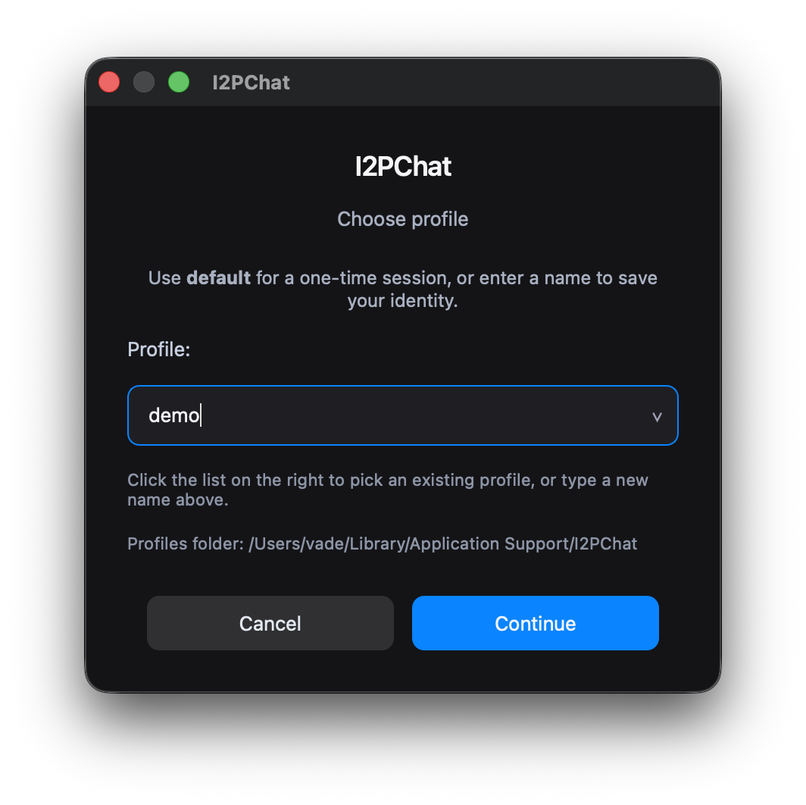
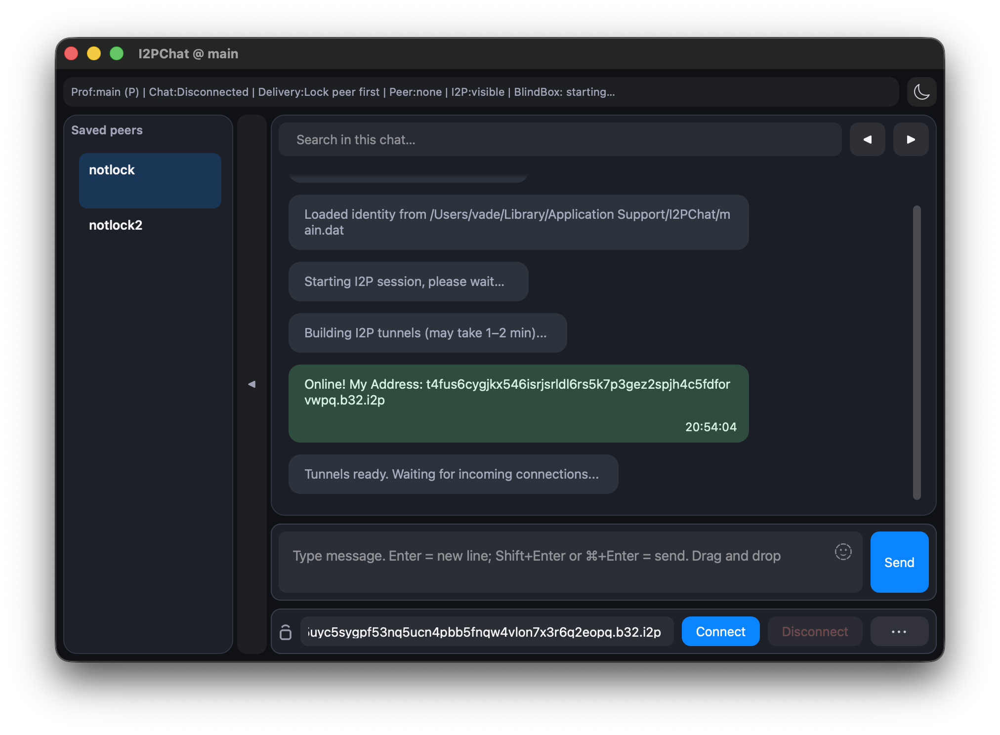
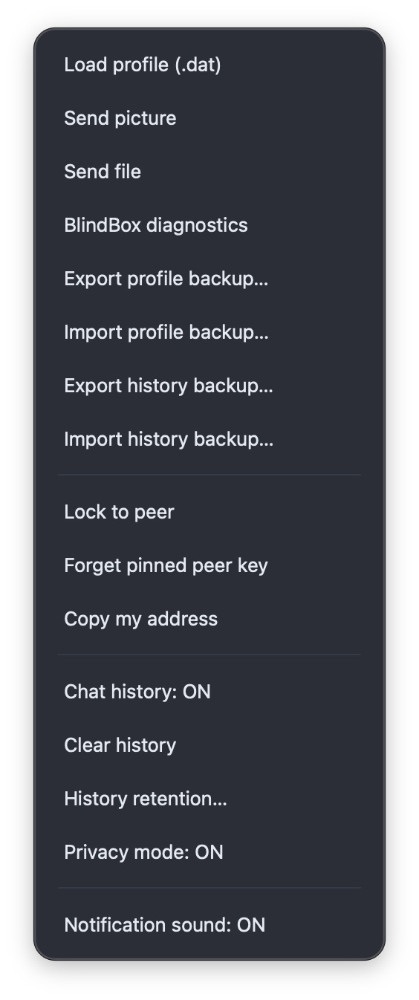

## Руководство по кнопкам GUI I2PChat

### Окно выбора профиля

При запуске GUI без указания профиля появляется диалог выбора профиля:



- заголовок окна: **I2PChat**;
- подзаголовок: **Choose profile**;
- подсказка: `Use default for a one-time session, or enter a name to save your identity.`
- поле **Profile:** с комбобоксом (список + ввод), текущее значение `default`;
- подсказка под полем: `Click the list on the right to pick an existing profile, or type a new name above.`
- строка **Profiles folder: <path>** (кликабельная, открывает папку профилей);
- внизу — две кнопки: **Cancel** и **OK**.

Как использовать:

- **`default`**:
  - оставьте, если нужен одноразовый (TRANSIENT) профиль без привязки к одному пиру;
- **выбор из списка**:
  - откройте список справа от поля и выберите уже существующий профиль (ранее созданный `.dat`‑файл из директории профилей);
- **ввод нового имени**:
  - напечатайте своё имя профиля (например, `alice`);
  - допустимы только символы `a-z`, `A-Z`, `0-9`, `.`, `_`, `-` (длина 1..64);
  - профильный `.dat` создаётся сразу: ключи сохраняются в `<имя>.dat` (или в keyring), а `Lock to peer` дописывает туда адрес пира и делает профиль одно‑к‑одному.

**Директория профилей** зависит от ОС: на **macOS** — `~/Library/Application Support/I2PChat`, в **Windows** — `%APPDATA%\I2PChat`, в **Linux** и др. — `~/.i2pchat`. Права доступа к папке на Unix ограничиваются владельцем (0700).

#### Где лежит папка с профилями (.dat)

Все файлы профилей (например, `alice.dat`) хранятся в одной папке, которую приложение создаёт автоматически:

| ОС       | Путь (папка с файлами .dat) |
|----------|-----------------------------|
| Windows  | `%APPDATA%\I2PChat` — обычно **`C:\Users\<ваше_имя>\AppData\Roaming\I2PChat`** |
| macOS    | `~/Library/Application Support/I2PChat` |
| Linux    | `~/.i2pchat` |

Папку можно открыть напрямую из диалога выбора профиля — строка **Profiles folder:** кликабельна на всех ОС.

Формат профиля `.dat` в актуальной версии:

- строка 1 — приватный ключ профиля (если он не хранится в keyring);
- строка 2 — закреплённый peer (`stored peer`) при использовании `Lock to peer`.

Если identity хранится в keyring, файл `.dat` может содержать только адрес закреплённого пира.

После выбора или ввода имени нажмите **OK**, чтобы продолжить, или **Cancel**, чтобы закрыть окно и не запускать чат.

### 3. Основной интерфейс (главное окно чата)

После выбора профиля открывается главное окно чата:



- **Заголовок окна** — `I2PChat @ <имя_профиля>` (например, `I2PChat @ alice`).
- **Строка статуса** — вверху, над чатом: `Net`, `Profile`, `Link`, `Peer`, `Stored`, `Secure`, `ACKdrop`.  
  В узком окне строка сокращается до `Net`, `Link`, `Peer`, `Secure`, `ACKdrop`; полный текст доступен по наведению.
- **Переключатель темы** — справа от статуса (иконка солнца/луны). Меняет темы `ligth` и `night`.
- **Область чата** — отображаются сообщения (ваши и собеседника), системные уведомления, статус передачи файлов. Сообщения можно выделять и копировать (правый клик или контекстное меню).
- **Поле ввода** — под областью чата: введите текст и нажмите **Enter** (или кнопку отправки), чтобы отправить сообщение подключённому пиру.
- **Панель действий** — в самом низу окна: адрес пира, кнопки подключения и меню **`⋯`** (см. раздел 4).

Сначала имеет смысл подключиться к собеседнику (адрес в панели действий → **Connect**), затем писать сообщения в поле ввода.

### 4. Панель действий (управление подключением и профилями)

Панель действий располагается **внизу окна**, под областью ввода, и содержит:

- поле ввода **адреса пира**;
- кнопки **`Connect`** и **`Disconnect`**;
- кнопку **`⋯` (Ещё действия)**, открывающую меню:
  - **Load profile (.dat)**;
  - **Send picture**;
  - **Send file**;
  - **Lock to peer**;
  - **Copy my address**.

Все элементы панели имеют одинаковую высоту и выстроены в строку.

#### 4.1. Меню `⋯` (Ещё действия)

По нажатию кнопки **`⋯`** открывается всплывающее меню с действиями по профилю и подключению:



- **Load profile (.dat)** — выбор файла для загрузки профиля из `.dat`.
- **Send picture** — отправить изображение подключённому пиру.
- **Send file** — отправить любой файл подключённому пиру.
- **Lock to peer** — привязать текущий профиль к подключённому пиру (см. раздел 4.7).
- **Copy my address** — скопировать ваш I2P-адрес в буфер.

#### 4.2. Поле адреса пира

Поле `Peer .b32.i2p address` предназначено для полного адреса собеседника в виде:

```text
<base32>.b32.i2p
```

- Можно вводить/вставлять адрес вручную.
- Если профиль «залочен» на пира и поле пустое, адрес автоматически заполняется из сохранённого значения.

#### 4.3. Кнопка `Connect`

Кнопка **`Connect`** инициирует подключение к текущему адресу в поле.

Логика:

1. Если поле **не пустое**:
   - запускается попытка подключения через ядро (`connect_to_peer`).
2. Если поле **пустое**:
   - если есть сохранённый пир (`stored_peer`), он подставляется в поле и используется;
   - иначе показывается предупреждение:

   ```text
   Please enter peer address
   ```

После успешного подключения:

- обновляется строка статуса;
- приходящие сообщения отображаются в области чата;
- по сети могут пойти файловые/системные и другие события.

При первом контакте с новым ключом пира появится диалог **Trust on First Use (TOFU)**:

- в окне показываются адрес пира, короткий fingerprint и префикс публичного ключа;
- в диалоге есть предупреждение, что TOFU без OOB-сверки не подтверждает личность;
- выберите **Yes**, чтобы доверить и закрепить ключ, либо **No**, чтобы прервать соединение;
- для повышенной безопасности сверяйте fingerprint с собеседником по независимому каналу.

#### 4.4. Кнопка `Disconnect`

Кнопка **`Disconnect`** разрывает текущее соединение с пиром.

После нажатия:

- ядро инициирует отключение;
- в чате может появиться системное сообщение о разрыве соединения;
- строка статуса обновляется.

#### 4.5. Действие `Copy my address` (меню `⋯`)

Пункт **`Copy my address`** в меню **`⋯`** копирует ваш собственный I2P‑адрес в буфер обмена.


Логика:

1. Если локальный адрес ещё не инициализирован:
   - показывается окно (заголовок **Copy My Addr**):

   ```text
   Local destination is not initialized yet.
   ```

2. Если адрес уже есть:
   - в буфер обмена копируется строка вида `<base32>.b32.i2p`;
   - в чате появляется системное сообщение:

   ```text
   My address copied to clipboard.
   ```

Это удобно для быстрой передачи вашего адреса собеседнику через любой другой канал.

#### 4.6. Действие `Send file` (меню `⋯`)

Пункт **`Send file`** в меню **`⋯`** отправляет файл текущему подключённому пиру.

После выбора:

1. Открывается диалог выбора файла (`Select file to send`).
2. Если путь не выбран — отправка отменяется.
3. Если файл выбран:
   - ядро начинает передачу (`send_file(path)`).

Прогресс передачи отображается в области чата сообщениями вида:

```text
<имя_файла>: <получено>/<размер> bytes
```

На принимающей стороне:

- при входящем файле сначала показывается диалог **`Incoming file`**:
  - с вопросом `Accept incoming file?`;
  - с информацией о имени и размере;
- если пользователь выбирает **`No`**:
  - временный файл удаляется;
  - в чате появляется сообщение об отклонении:

  ```text
  Incoming file rejected: <имя_файла>
  ```
- при совпадении имени с уже существующим файлом в `downloads` новый файл сохраняется как `<имя> (1).<ext>`, `<имя> (2).<ext>` и т.д. без перезаписи.

Пункт **`Send picture`** работает аналогично, но предназначен для отправки изображений (PNG/JPEG) и отображается в чате как встроенное изображение.

#### 4.7. Кнопка `Lock to peer`

Кнопка **`Lock to peer`** **не обязательна** к использованию — чат отлично работает и без неё.  
По умолчанию, если вы никогда не жали `Lock to peer`, профиль ведёт себя как **почтовый ящик**:

- **любой** узел, который знает ваш адрес, может написать этому профилю;
- вы сами можете подключаться к разным пирам со временем.

Если же нажать **`Lock to peer`**, профиль становится **жёстко привязан к одному собеседнику**:

- в профильный `.dat`‑файл сохраняется адрес собеседника в каноничном формате (строка 1 — ключ, строка 2 — peer; при keyring может быть только peer);
- при следующих запусках этого профиля адрес будет подставляться автоматически как `stored_peer`;
- входящие соединения от других адресов ядро может отклонять как «неавторизованные».

Ограничения и поведение:

1. Если текущий профиль — `default` (режим `TRANSIENT`):
   - появится предупреждение:

   ```text
   Cannot lock in TRANSIENT mode. Restart with a profile name.
   ```

2. Если профиль уже «залочен» (`stored_peer` не пустой):
   - показывается информационное окно с уже сохранённым адресом.

3. Если нет подтверждённого адреса пира (`current_peer_addr` пустой):
   - показывается предупреждение:

   ```text
   Peer address not yet verified.
   Establish a connection first.
   ```

4. В остальных случаях:
   - `Lock to peer` доступен только после криптографической верификации binding адреса пира;
   - создаётся/обновляется файл `<имя_профиля>.dat` в директории профилей (каноничный формат без дублей строк);
   - в чате появляется системное сообщение:

   ```text
   Identity <profile> is now locked to this peer.
   ```

#### 4.8. Кнопка `Load .dat`

Кнопка **`Load .dat`** позволяет переключиться на другой профиль, выбрав существующий `.dat`‑файл.

После нажатия:

1. Открывается диалог `Select profile (.dat)`:
   - по умолчанию указывает на директорию профилей (в Windows — `%APPDATA%\I2PChat`, в Linux — `~/.i2pchat`, на macOS — `~/Library/Application Support/I2PChat`);
   - фильтрует файлы по маске `*.dat`.
2. Если файл не выбран — операция отменяется.
3. Если файл выбран:
   - из пути берётся имя файла без расширения (`<base>`);
   - `.dat` копируется в директорию профилей как `<base>.dat` (если ещё не там);
   - происходит асинхронное переключение профиля:
     - текущее ядро корректно останавливается (`shutdown`);
     - окно обновляет заголовок на `I2PChat @ <имя_профиля>`;
     - создаётся новое ядро для этого профиля;
     - повторно инициируется сессия I2P.

Таким образом, через GUI можно:

- быстро импортировать готовый профиль;
- переключаться между несколькими профилями без перезапуска приложения.

### 5. Системные уведомления и звук

GUI‑клиент использует системный трей (`QSystemTrayIcon`) и при поддерживаемых платформах —
звуковые уведомления (`QSoundEffect`) для входящих сообщений.

#### 5.1. Системные уведомления

- При получении входящего сообщения от пира (тип `peer`) вызывается обработчик `handle_notify`.
- Если окно/приложение **не активно** (свернуто или в фоне):
  - создаётся короткий заголовок:
    - базовый текст — `New message`;
    - при наличии адреса пира добавляется обрезанный адрес: `New message from <peer>`.
  - через `QSystemTrayIcon` показывается системное уведомление (тост) на 5 секунд.
- Если окно активно, GUI полагается на визуальное обновление чата без всплывающих уведомлений.
- Для входящего подключения показывается уведомление **Incoming connection** с адресом пира (если он известен).

#### 5.2. Звуковые уведомления

- Если модуль `QtMultimedia` доступен:
  - создаётся `QSoundEffect`;
  - при заданной переменной окружения `I2PCHAT_NOTIFY_SOUND` используется указанный локальный аудиофайл;
  - громкость по умолчанию — около 70%.
- При входящем сообщении, когда окно не активно:
  - проигрывается кастомный звук (если задан и доступен);
  - если проигрывание не удалось — используется резервный `QApplication.beep()`.

### 6. Типичные сценарии использования

#### 6.1. Первый запуск и отправка сообщения

1. Убедитесь, что запущен I2P‑роутер с SAM (`127.0.0.1:7656`).
2. Запустите I2PChat в зависимости от платформы:

   - **Windows**: распакуйте релизный архив и запустите `I2PChat.exe`.
   - **Linux**: сделайте AppImage исполняемым (`chmod +x I2PChat-x86_64.AppImage`) и запустите `./I2PChat-x86_64.AppImage`.
   - **macOS**: перенесите `I2PChat.app` в `/Applications` (или удобное место) и откройте обычным способом.

3. В диалоге `Choose profile`:
   - оставьте `default` или введите своё имя профиля (например, `alice`).
4. В главном окне:
   - дождитесь, пока строка статуса отобразит рабочее состояние;
   - при необходимости скопируйте свой адрес через меню `⋯` → `Copy my address` и передайте его собеседнику другим каналом.
5. Когда у вас есть адрес пира:
   - вставьте его в поле `Peer .b32.i2p address`;
   - нажмите `Connect`.
6. После установления соединения:
   - в нижнем поле ввода напишите сообщение;
   - нажмите `Enter` или кнопку `Send`.
7. Новое сообщение появится в правой части чата (как отправленное вами).

#### 6.2. Отправка файла собеседнику

1. Убедитесь, что соединение с пиром установлено (подключились через `Connect`).
2. Откройте меню **`⋯`** и выберите **`Send file`**.
3. Выберите нужный файл в открывшемся диалоге.
4. Наблюдайте прогресс в области чата по сообщениям:

   ```text
   <имя_файла>: <получено>/<размер> bytes
   ```

На стороне получателя при входящем файле:

- появится диалог подтверждения приёма;
- при отказе файл будет удалён, а в чате появится сообщение об отклонении.

#### 6.3. Переключение на постоянный профиль и «локация» пира

1. Запустите I2PChat с именем профиля (опционально, через аргумент командной строки):

   - **Windows**: `I2PChat.exe myprofile`.
   - **Linux**: `./I2PChat-x86_64.AppImage myprofile`.
   - **macOS**: `open -a I2PChat --args myprofile`.

2. Подключитесь к нужному пиру через поле адреса и кнопку `Connect`.
3. Убедитесь, что соединение установлено и вы можете обмениваться сообщениями.
4. Если вы хотите, чтобы профиль работал как **жёсткий канал один‑к‑одному** (написать может только этот пир), нажмите кнопку **`Lock to peer`**:
   - убедитесь, что профиль не `default`;
   - при успешной записи появится сообщение:

   ```text
   Identity myprofile is now locked to this peer.
   ```

5. В дальнейшем при запуске профиля `myprofile`:
   - в строке статуса появится `Stored: <адрес>`;
   - при пустом поле ввода адреса этот адрес будет подставлен автоматически;
   - входящие соединения от других адресов для этого профиля больше не принимаются.

#### 6.4. Импорт готового профиля из `.dat`

1. Убедитесь, что у вас есть файл профиля, например `friend.dat`.
2. Запустите GUI (с любым профилем или через `default`).
3. Нажмите **`Load .dat`**.
4. В открывшемся диалоге выберите `friend.dat`:
   - файл будет скопирован в директорию профилей как `friend.dat` (если ещё не там);
   - профиль автоматически переключится на `friend`;
   - состояние ядра будет перезапущено под новым профилем.

### 7. Типичные проблемы на уровне GUI

#### 7.1. В чате не появляются сообщения

Проверьте:

- строку статуса:
  - нет ли там ошибок подключения к SAM/I2P;
  - есть ли нормальное состояние (не `initializing` бесконечно долго);
- корректность адреса пира в поле:
  - адрес должен заканчиваться на `.b32.i2p`;
  - без лишних пробелов и символов;
- факт нажатия `Connect` и отсутствия ошибок в чате (`ERROR`, `disconnect`).

Если всё выглядит корректно, но трафика нет — проблема, скорее всего, **на стороне сети/I2P**, а не GUI.

#### 7.2. Не удаётся подключиться к пиру

Убедитесь, что:

- запущен I2P‑роутер, SAM‑порт доступен;
- адрес пира введён полностью (включая `.b32.i2p`);
- пир в онлайне и использует совместимый клиент (legacy‑клиенты до `0.3.x`/`0.4.x` не поддерживаются).

GUI в этом случае отобразит соответствующие системные/ошибочные сообщения в области чата.

#### 7.3. Не видно запросов на приём файла

При входящем файле GUI должен показать диалог `Incoming file` с вопросом `Accept incoming file?`.

Если диалог не появляется:

- проверьте, не блокирует ли его другая модальная форма (диалоги могут быть «за» главным окном);
- убедитесь, что приложение не находится в «подвисшем» состоянии из‑за сетевых проблем.

#### 7.4. Не работает копирование текста сообщений

Проверьте:

- выбрано ли сообщение (клик по нужному «баблу»);
- используете ли вы стандартную комбинацию копирования:
  - `Ctrl+C` на Windows/Linux;
  - `Cmd+C` на macOS;
- можно также воспользоваться контекстным меню (`Copy text` / `Copy with timestamp`).

### 8. Метаданные протокола и padding

Несмотря на шифрование после handshake, на транспортном уровне остаются
наблюдаемыми:

- тип кадра (`TYPE`);
- длина кадра (`LEN`);
- pre-handshake обмен identity preface.

Для снижения утечек по длине в зашифрованном режиме используется профиль
padding:

- по умолчанию: `balanced` (выравнивание до блоков 128 байт);
- опционально: `off` (без padding).

Переопределение профиля через переменную окружения:

```bash
I2PCHAT_PADDING_PROFILE=off python main_qt.py
```

Компромисс: больше padding -> меньше сигналов для traffic analysis, но выше
сетевые накладные расходы.

### 9. Резюме

GUI‑клиент I2PChat предоставляет:

- наглядный чат с цветными «баблами»;
- переключение тем `ligth`/`night` и единый кроссплатформенный стиль;
- информативную строку статуса (Net/Link/Peer/Secure/ACKdrop);
- удобную панель для управления профилями и подключением;
- отправку файлов и изображений;
- системные уведомления и мягкий звук при входящих сообщениях.

Для повседневного использования достаточно:

1. Запустить приложение I2PChat (exe / AppImage / `.app`) с нужным профилем.
2. Вставить адрес пира и нажать `Connect`.
3. Общаться через поле ввода и кнопку `Send`.
4. При необходимости отправлять файлы/изображения и использовать «лок» профиля на постоянного собеседника.
