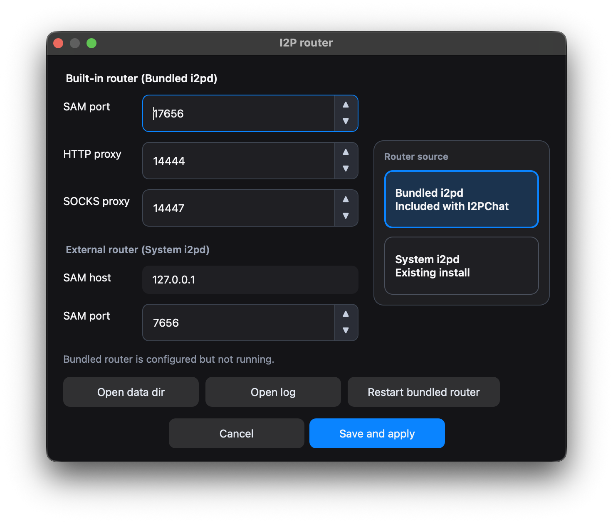
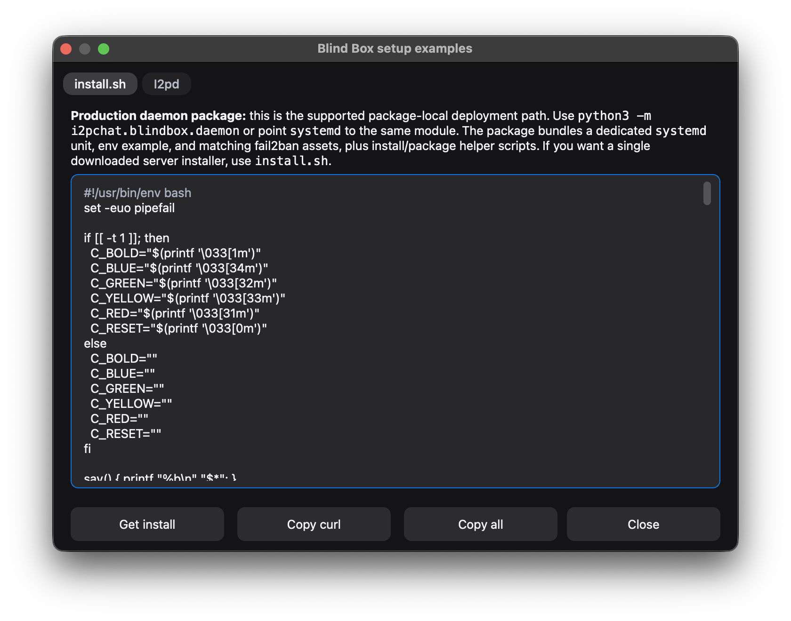

## Руководство по кнопкам GUI I2PChat

Документ актуален для **I2PChat 1.0.1** (номер версии в корне репозитория: [`VERSION`](../VERSION)).

### Окно выбора профиля

При запуске GUI без указания профиля появляется диалог выбора профиля:


- заголовок окна: **I2PChat**;
- подзаголовок: **Choose profile**;
- подсказка: `Use random_address for a one-time session, or enter a name to save your identity.`
- поле **Profile:** с комбобоксом (список + ввод), текущее значение `random_address` (встроенный TRANSIENT-профиль);
- подсказка под полем: `Click the list on the right to pick an existing profile, or type a new name above.`
- строка **Profiles folder: <path>** (кликабельная, открывает папку профилей);
- внизу — две кнопки: **Cancel** и **OK**.

Как использовать:

- **`random_address`** (TRANSIENT):
  - оставьте, если нужен одноразовый профиль без привязки к одному пиру;
  - важный момент безопасности: TOFU‑пины доверия не сохраняются между перезапусками;
  - имя **`default`** в аргументах командной строки по-прежнему принимается как синоним того же профиля и каталога данных;
- **выбор из списка**:
  - откройте список справа от поля и выберите уже существующий профиль (каждый хранится в `profiles/<имя>/` как `<имя>.dat`);
- **ввод нового имени**:
  - напечатайте своё имя профиля (например, `alice`);
  - допустимы только символы `a-z`, `A-Z`, `0-9`, `.`, `_`, `-` (длина 1..64);
  - профильный `.dat` создаётся сразу: ключи сохраняются в `profiles/<имя>/<имя>.dat` (или в keyring), а `Lock to peer` дописывает туда адрес пира и делает профиль одно‑к‑одному.

**Каталог данных приложения** зависит от ОС: на **macOS** — `~/Library/Application Support/I2PChat`, в **Windows** — `%APPDATA%\I2PChat`, в **Linux** и др. — `~/.i2pchat`. Права доступа к папке на Unix ограничиваются владельцем (0700).

#### Где лежат файлы профиля (.dat и остальное)

Для каждого сохранённого профиля (например, `alice`) приложение использует подпапку **`profiles/<имя>/`**: там лежат `alice.dat`, `alice.trust.json`, история чатов, контакты и другие файлы с префиксом имени. В **корне** каталога данных остаются общие вещи: папки `downloads/`, `images/`, файл `ui_prefs.json` и т.п.

Старые установки могли хранить всё плоско в корне; при первом запуске с таким профилем файлы **переносятся** в `profiles/<имя>/` автоматически.

| ОС       | Корень данных I2PChat | Пример пути к `.dat` профиля `alice` |
|----------|-------------------------|--------------------------------------|
| Windows  | `%APPDATA%\I2PChat` — обычно **`C:\Users\<ваше_имя>\AppData\Roaming\I2PChat`** | `...\I2PChat\profiles\alice\alice.dat` |
| macOS    | `~/Library/Application Support/I2PChat` | `.../I2PChat/profiles/alice/alice.dat` |
| Linux    | `~/.i2pchat` | `~/.i2pchat/profiles/alice/alice.dat` |

Папку данных можно открыть из диалога выбора профиля — строка с путём кликабельна на всех ОС.

Формат профиля `.dat` в актуальной версии:

- строка 1 — приватный ключ профиля (если он не хранится в keyring);
- строка 2 — закреплённый peer (`stored peer`) при использовании `Lock to peer`.

Если identity хранится в keyring, файл `.dat` может содержать только адрес закреплённого пира.

После выбора или ввода имени нажмите **OK**, чтобы продолжить, или **Cancel**, чтобы закрыть окно и не запускать чат.

### 3. Основной интерфейс (главное окно чата)

После выбора профиля открывается главное окно чата:


- **Заголовок окна** — `I2PChat @ <имя_профиля>` (например, `I2PChat @ alice`).
- **Строка статуса** — вверху, над чатом: в полном виде есть `Net`, профиль (`Prof`), `Link`, `Peer`, `Stored`, `Secure`, текущий маршрут отправки (`Send:*`), состояние **BlindBox** (короткая подпись) и `ACKdrop`.  
  При **сужении окна** показывается укороченный вариант (в том числе `Tx:<state>` и `BB:<state>`). **Наведите курсор** на строку статуса — откроется подсказка с полной диагностикой, маршрутом отправки и пояснением BlindBox.
  При важных изменениях сети/безопасности и ошибках строка статуса временно раскрывается для читаемости, затем возвращается в компактный режим.
- **Переключатель темы** — справа от статуса (иконка солнца/луны). Меняет темы `ligth` и `night`.
- **Saved peers** — опциональная **левая** боковая панель с книгой контактов профиля; подробнее в **§3.1**.
- **Область чата** — отображаются сообщения (ваши и собеседника), системные уведомления, статус передачи файлов. Сообщения можно выделять и копировать (правый клик или контекстное меню).
- **Поле ввода** — под областью чата: введите текст. **По умолчанию** **Enter** — новая строка, отправка — **Shift+Enter** (также **Ctrl+Enter**, на macOS **⌘+Enter**) или кнопка отправки. В меню **`⋯`** можно включить **Enter sends message: ON** — тогда **Enter** отправляет сообщение, а **Shift+Enter** вставляет перевод строки (**Ctrl/⌘+Enter** в обоих режимах тоже отправляет). Подсказка-плейсхолдер в поле соответствует режиму. Настройка сохраняется в **`ui_prefs.json`**. **Растровое изображение** из буфера можно вставить (**Ctrl+V** / **⌘V** или **Paste** в меню поля) — отправка как у пункта **Send picture** (PNG, JPEG, WebP). Текст в поле ввода хранится **отдельно для каждого пира** (по нормализованному адресу): при смене адреса в панели действий или при смене текущего пира восстанавливается черновик для выбранного контакта; после успешной отправки черновик для этого пира очищается. Черновики сохраняются на диск в файл `profiles/<профиль>/<профиль>.compose_drafts.json` (с ограничением числа записей; при старой плоской раскладке читается и переносится в эту папку).
- **Панель действий** — в самом низу окна: адрес пира, кнопки подключения и меню **`⋯`** (см. раздел 4).

`Connect` нужен для живого чата и первичной инициализации офлайн-доставки. Если BlindBox уже готов, отправка текста может сразу уйти в офлайн-очередь даже без активного live-соединения.

#### 3.1. Боковая панель Saved peers (книга контактов)

Слева от чата — список **Saved peers**: локальная **книга контактов** текущего профиля. Данные хранятся в `profiles/<профиль>/<профиль>.contacts.json` (рядом с `<профиль>.dat`).

- **Строки** — отображаемое имя (или сокращённый `.b32.i2p`), подпись (превью последнего сообщения или ваша заметка), подсветка непрочитанного, если это не активный чат.
- **Клик** по строке — подставляет адрес пира в поле (как ручной ввод) и синхронизирует черновик; если профиль **залочен** на другого пира, переключение может быть недоступно (см. сообщения в интерфейсе).
- **◀ / ▶** — свернуть или развернуть панель; при **Lock to peer** панель может открываться **свёрнутой**, чтобы отдать место чату.
- **Перетаскивание** узкой полоски между списком и чатом — изменение ширины панели (в пределах ограничений).
- **ПКМ** по контакту — **Edit name & note…** (только локальные подписи), **Contact details…** (адрес, TOFU, при необходимости снятие pin), **Remove from saved peers…** (с опциями также удалить шифрованную историю, TOFU pin, lock профиля и локальный файл состояния BlindBox для этого пира, где применимо).

### 4. Панель действий (управление подключением и профилями)

Панель действий располагается **внизу окна**, под областью ввода, и содержит:

- поле ввода **адреса пира**;
- кнопки **`Connect`** и **`Disconnect`**;
- кнопку **`⋯` (Ещё действия)**, открывающую меню:
  - **Load profile (.dat)**;
  - **Send picture**;
  - **Send file**;
  - **BlindBox diagnostics**;
  - **Export profile backup…** / **Import profile backup…**;
  - **Export history backup…** / **Import history backup…**;
  - **Lock to peer**;
  - **Forget pinned peer key**;
  - **Copy my address**;
  - **Chat history: ON/OFF** (подпись отражает текущее состояние);
  - **Clear history**;
  - **History retention…**;
  - **Privacy mode: ON/OFF**;
  - **Enter sends message: ON/OFF**;
  - **Notification sound: ON/OFF**.

Все элементы панели имеют одинаковую высоту и выстроены в строку.

**Горячие клавиши** (Connect, Disconnect, `⋯`, тема, Saved peers, пункты меню и т.д.) привязаны к **физическим позициям US QWERTY** — тем же клавишам, что на стандартной английской (US) клавиатуре. **Русская и другие раскладки не отключают эти сочетания**; переключать язык не обязательно. На **Linux** используются типичные **evdev**-сканы и распространённое смещение **X11** keycode.

#### 4.1. Меню `⋯` (Ещё действия)

Кнопка **`⋯`** или **Ctrl+.** (Windows/Linux) / **⌘+.** (macOS) открывает или закрывает то же всплывающее меню; подсказка на кнопке содержит строку **Shortcut:**. В меню — действия по профилю и подключению:


- **Load profile (.dat)** — выбор файла для загрузки профиля из `.dat`.
- **Send picture** — отправить изображение подключённому пиру.
- **Send file** — отправить любой файл подключённому пиру.
- **BlindBox diagnostics** — текстовая сводка по BlindBox/офлайн-маршруту и репликам (дополняет строку статуса и раздел 4.9).
- **Export profile backup…** / **Import profile backup…** — парольно защищённые архивы текущего профиля (`.dat` и поддерживаемые sidecar); при импорте при конфликте имени выбирается свободное имя профиля.
- **Export history backup…** / **Import history backup…** — только зашифрованные per-peer файлы истории; при импорте запрашивается, перезаписывать совпадения или добавлять только отсутствующие.
- **Check for updates…** — сравнить текущую сборку с именами ZIP на странице релизов (см. раздел 4.12).
- **Open App dir** — открыть каталог данных приложения в файловом менеджере.
- **I2P router…** — открыть диалог backend’а роутера (**Ctrl/Cmd+R**): переключение между системным `i2pd` по SAM и встроенным роутером, настройка портов backend’а, открытие каталога/лога роутера и перезапуск bundled router.
- **Lock to peer** — привязать текущий профиль к подключённому пиру (см. раздел 4.7).
- **Forget pinned peer key** — удалить TOFU-pinning ключа подписи текущего пира (см. раздел 4.10).
- **Copy my address** — скопировать ваш I2P-адрес в буфер.
- **Chat history: ON/OFF** — включить/выключить сохранение локальной истории (см. раздел 4.11); подпись в меню показывает текущее состояние.
- **Clear history** — удалить локальный файл истории для текущего пира.
- **History retention…** — лимиты: максимум сообщений на peer и максимальный возраст в днях до записи зашифрованной истории.
- **Privacy mode: ON/OFF** — при ON: в трее скрывается текст сообщения (заголовок может содержать имя/адрес пира); пока это окно в фокусе — без тостов в трее и без звука уведомлений (в т.ч. для других чатов). При OFF эти эффекты отключены. Подпись показывает состояние.
- **Enter sends message: ON/OFF** — при **ON**: **Enter** отправляет сообщение, **Shift+Enter** — новая строка (**Ctrl/⌘+Enter** по-прежнему отправляет). При **OFF** (по умолчанию): **Enter** — новая строка; **Shift+Enter** или **Ctrl/⌘+Enter** — отправка. Текст-подсказка в поле ввода меняется вместе с режимом; выбор сохраняется (см. **`ui_prefs.json`**).
- **Notification sound: ON/OFF** — звук входящих, когда он должен проигрываться; при OFF путь к кастомному звуку сохраняется (при активном Privacy mode звук в фокусе всё равно подавляется).

Пример окна **I2P router** (**⋯ → I2P router…** / **Ctrl/Cmd+R**):



#### 4.2. Поле адреса пира

Поле `Peer .b32.i2p address` предназначено для полного адреса собеседника в виде:

```text
<base32>.b32.i2p
```

- Можно вводить/вставлять адрес вручную.
- Если профиль «залочен» на пира и поле пустое, адрес автоматически заполняется из сохранённого значения.

#### 4.3. Кнопка `Connect`

Кнопка **`Connect`** инициирует живое подключение к текущему адресу в поле.

**Горячая клавиша:** **Ctrl+1** в Windows/Linux, **⌘1** на macOS — то же, что нажатие **`Connect`**, когда кнопка активна (срабатывает и при фокусе в поле ввода сообщения).

Логика:

1. Если поле **не пустое**:
   - запускается попытка подключения через ядро (`connect_to_peer`).
2. Если поле **пустое**:
   - если есть сохранённый пир (`stored_peer`), он подставляется в поле и используется;
   - иначе показывается предупреждение:

   ```text
   Please enter peer address
   ```

После успешного подключения:

- обновляется строка статуса;
- приходящие сообщения отображаются в области чата;
- по сети могут пойти файловые/системные и другие события.

Зачем нужен `Connect`, если пир офлайн:

- для **live-чата** (онлайн-обмен в реальном времени);
- для **первой инициализации BlindBox root** (одна успешная защищённая сессия с этим пиром);
- для диагностики доступности пира.

При первом контакте с новым ключом пира появится диалог **Trust on First Use (TOFU)**:

- в окне показываются адрес пира, короткий fingerprint и префикс публичного ключа;
- в диалоге есть предупреждение, что TOFU без OOB-сверки не подтверждает личность;
- выберите **Yes**, чтобы доверить и закрепить ключ, либо **No**, чтобы прервать соединение;
- для повышенной безопасности сверяйте fingerprint с собеседником по независимому каналу.

**Состояние кнопки:** **`Connect`** **неактивна** (серая), пока в статусе сети не появятся **Pending** или **Visible** (сессия I2P готова), пока нет адреса пира или сохранённого закреплённого пира, либо пока уже есть соединение или идёт исходящая попытка подключения. Пока выполняется dial-out, **`Connect`** остаётся неактивной; повторное нажатие ядро игнорирует. **Подсказки** на кнопке объясняют причину (дождаться Pending/Visible, ввести адрес, уже подключены и т.д.) и содержат строку **Shortcut:** для **Ctrl+1** / **⌘1**.  
Если BlindBox уже готов к офлайн-очереди, tooltip у `Connect` явно помечает подключение как **optional**.

#### 4.4. Кнопка `Disconnect`

Кнопка **`Disconnect`** разрывает текущее соединение с пиром.

**Горячая клавиша:** **Ctrl+0** в Windows/Linux, **⌘0** на macOS — то же, что **`Disconnect`**, когда кнопка активна.

**Состояние кнопки:** **`Disconnect`** **неактивна**, пока нет активной сессии с пиром; при наведении — пояснение и строка **Shortcut:** **Ctrl+0** / **⌘0**.

После нажатия:

- ядро инициирует отключение;
- в чате может появиться системное сообщение о разрыве соединения;
- строка статуса обновляется.

#### 4.5. Действие `Copy my address` (меню `⋯`)

Пункт **`Copy my address`** в меню **`⋯`** копирует ваш собственный I2P‑адрес в буфер обмена.

Логика:

1. Если локальный адрес ещё не инициализирован:
   - показывается окно (заголовок **Copy My Addr**):

   ```text
   Local destination is not initialized yet.
   ```

2. Если адрес уже есть:
   - в буфер обмена копируется строка вида `<base32>.b32.i2p`;
   - в чате появляется системное сообщение:

   ```text
   My address copied to clipboard.
   ```

Это удобно для быстрой передачи вашего адреса собеседнику через любой другой канал.

#### 4.6. Действие `Send file` (меню `⋯`)

Пункт **`Send file`** в меню **`⋯`** отправляет файл текущему подключённому пиру.

После выбора:

1. Открывается диалог выбора файла (`Select file to send`).
2. Если путь не выбран — отправка отменяется.
3. Если файл выбран:
   - ядро начинает передачу (`send_file(path)`).

Прогресс передачи отображается в области чата сообщениями вида:

```text
<имя_файла>: <получено>/<размер> bytes
```


На принимающей стороне:

- при входящем файле сначала показывается диалог **`Incoming file`**:
  - с вопросом `Accept incoming file?`;
  - с информацией о имени и размере;
- если пользователь выбирает **`No`**:
  - временный файл удаляется;
  - в чате появляется сообщение об отклонении:

  ```text
  Incoming file rejected: <имя_файла>
  ```
- при совпадении имени с уже существующим файлом в `downloads` новый файл сохраняется как `<имя> (1).<ext>`, `<имя> (2).<ext>` и т.д. без перезаписи.

Пункт **`Send picture`** работает аналогично, но предназначен для отправки изображений (PNG, JPEG или WebP) и отображается в чате как встроенное изображение.


#### 4.7. Кнопка `Lock to peer`

Кнопка **`Lock to peer`** **не обязательна** к использованию — чат отлично работает и без неё.  
По умолчанию, если вы никогда не жали `Lock to peer`, профиль ведёт себя как **почтовый ящик**:

- **любой** узел, который знает ваш адрес, может написать этому профилю;
- вы сами можете подключаться к разным пирам со временем.

Если же нажать **`Lock to peer`**, профиль становится **жёстко привязан к одному собеседнику**:

- в профильный `.dat`‑файл сохраняется адрес собеседника в каноничном формате (строка 1 — ключ, строка 2 — peer; при keyring может быть только peer);
- при следующих запусках этого профиля адрес будет подставляться автоматически как `stored_peer`;
- входящие соединения от других адресов ядро может отклонять как «неавторизованные».

Ограничения и поведение:

1. Если текущий профиль — `random_address` (режим `TRANSIENT`; в CLI алиас `default`):
   - появится предупреждение:

   ```text
   Cannot lock in TRANSIENT mode. Restart with a profile name.
   ```

2. Если профиль уже «залочен» (`stored_peer` не пустой):
   - показывается информационное окно с уже сохранённым адресом.

3. Если нет подтверждённого адреса пира (`current_peer_addr` пустой):
   - показывается предупреждение:

   ```text
   Peer address not yet verified.
   Establish a connection first.
   ```

4. В остальных случаях:
   - `Lock to peer` доступен только после криптографической верификации binding адреса пира;
   - создаётся/обновляется файл `profiles/<имя_профиля>/<имя_профиля>.dat` (каноничный формат без дублей строк);
   - в чате появляется системное сообщение:

   ```text
   Identity <profile> is now locked to this peer.
   ```

#### 4.8. Кнопка `Load .dat`

Кнопка **`Load .dat`** позволяет переключиться на другой профиль, выбрав существующий `.dat`‑файл.

После нажатия:

1. Открывается диалог `Select profile (.dat)`:
   - по умолчанию указывает на **корень каталога данных приложения** (в Windows — `%APPDATA%\I2PChat`, в Linux — `~/.i2pchat`, на macOS — `~/Library/Application Support/I2PChat` — папку, внутри которой лежит `profiles/`);
   - фильтрует файлы по маске `*.dat`.
2. Если файл не выбран — операция отменяется.
3. Если файл выбран:
   - из пути берётся имя файла без расширения (`<base>`);
   - `.dat` копируется в `profiles/<base>/<base>.dat`, при необходимости создаётся `profiles/<base>/` (если такого пути ещё нет);
   - происходит асинхронное переключение профиля:
     - текущее ядро корректно останавливается (`shutdown`);
     - окно обновляет заголовок на `I2PChat @ <имя_профиля>`;
     - создаётся новое ядро для этого профиля;
     - повторно инициируется сессия I2P.

Таким образом, через GUI можно:

- быстро импортировать готовый профиль;
- переключаться между несколькими профилями без перезапуска приложения.

#### 4.9. Опционально: BlindBox (офлайн-текст)

**BlindBox** — функция офлайн-очереди текста для закреплённого пира, когда **нет живой защищённой сессии**. Для **именованных** профилей (`persistent`) включена по умолчанию; для эфемерного профиля `random_address` отключена.

- Нужен **постоянный профиль** и **Lock to peer**. Для межхостовой офлайн-доставки задайте общие **Blind Box**-серверы через `I2PCHAT_BLINDBOX_REPLICAS`. Для дефолта на весь деплой используйте `I2PCHAT_BLINDBOX_DEFAULT_REPLICAS`. Для централизованной прод-настройки — `I2PCHAT_BLINDBOX_DEFAULT_REPLICAS_FILE`. В **готовых сборках** дополнительно зашита **пара адресов** в `DEFAULT_RELEASE_BLINDBOX_ENDPOINTS` в `i2pchat/core/i2p_chat_core.py` (`tcglilyjadosrez5gu3kqvrdpu6ri622jwrzamtpburtnpge7wgq.b32.i2p:19444`, `dzyhukukogujr6r2vwfy667cwm7vg3oomhx2sryxhb6mn4i4wbjq.b32.i2p:19444`; перекрывается переменными выше; отключить: `I2PCHAT_BLINDBOX_NO_BUILTIN_DEFAULTS=1`). См. [**RELEASE_0.6.0.md**](releases/RELEASE_0.6.0.md) — без повторения криптодеталей).
  Опционально только для локальной/дев-сборки: `I2PCHAT_BLINDBOX_LOCAL_FALLBACK=1` поднимает локальный Blind Box (`127.0.0.1:19444`).
  **Локальный токен:** задайте **`I2PCHAT_BLINDBOX_LOCAL_TOKEN`** в окружении процесса **I2PChat** (и тем же значением — отдельный демон-реплику на том же `host:port`, если он у вас есть). В режиме **`local-auto`**, если переменная не задана, ядро генерирует одноразовый токен на запуск (удобно для простой разработки, но не для стыковки с внешним процессом). Для raw TCP / loopback-реплик токен стоит сохранять.
  **Секрет на реплику (именованные профили):** в окне **BlindBox diagnostics** можно задать опциональные токены для конкретных endpoint’ов (по одной строке: `endpoint<TAB>токен`). Они хранятся в `<profile>.blindbox_replicas.json` в поле **`replica_auth`** (формат файла **версия 2**; старые файлы **версии 1** читаются как только список реплик). Клиент подставляет токен в `PUT`/`GET` только для этого адреса. На своей Python-реплике задайте **`BLINDBOX_AUTH_TOKEN`** тем же значением (см. `i2pchat/blindbox/blindbox_server_example.py`). Токен в протоколе **не заменяет** доверие к I2P destination — он лишь ограничивает доступ к сырому TCP-протоколу. Для публичной реплики, доступной только через I2P tunnel, токен можно оставить пустым, но лимиты TTL / quota всё равно должны оставаться включёнными.
  Для package-style деплоя используйте **`python -m i2pchat.blindbox.daemon`**; вместе с репозиторием идут подходящие примеры `systemd`, env, install/bundle helper scripts, one-shot `install.sh` и fail2ban в `i2pchat/blindbox/daemon/`.
  Принудительно выключить BlindBox можно `I2PCHAT_BLINDBOX_ENABLED=0`.
  **Кворум PUT:** по умолчанию `I2PCHAT_BLINDBOX_PUT_QUORUM=1` (успех, если хотя бы один **Blind Box** принял blob). Значение `=2` — строгий режим: ответ должны дать все перечисленные Blind Box.
- `Send` в GUI работает как «умный маршрут»:
  - при живой защищённой сессии отправляет онлайн;
  - при `Send: offline queue` ставит текст в BlindBox-очередь (без обязательного ручного Connect);
  - при `Send: need Connect once` сохраняет текст в поле ввода и подсказывает сделать один live Connect для инициализации root.
- В режиме готовой офлайн-очереди подпись кнопки меняется на `Send offline` (в две строки на кнопке).
- Отладочные строки BlindBox про queued/received в ленте чата не показываются; детали остаются в статусе и tooltip.
- Состояние видно в **строке статуса** (поля `Send:*` и BlindBox); при наведении — подсказки, если что-то не настроено.
- **Совместимость:** у пиров на старых сборках BlindBox может не поддерживаться; обычный чат, файлы и картинки работают как раньше.

Пример окна **BlindBox diagnostics** (**⋯ → BlindBox diagnostics**): сводка телеметрии, список endpoint’ов реплик (если можно править), опциональная **replica auth**, кнопки **Example server…** и **Save and restart**.


Окно **Blind Box setup examples** (**BlindBox diagnostics → Example server…**): вкладки с текстами (в т.ч. **`install.sh`** и **I2pd**), кнопки **Get install** (сохранить скрипт) и **Copy curl** (однострочник для сервера) для своей реплики.



#### 4.10. Действие `Forget pinned peer key` (меню `⋯`)

Пункт **`Forget pinned peer key`** удаляет сохранённый TOFU pin публичного signing-key для текущего пира.

Когда это нужно:

- если у собеседника легитимно сменился ключ;
- если вы хотите вручную сбросить доверие и выполнить TOFU заново.

Что происходит:

1. GUI запрашивает подтверждение.
2. Запись для текущего peer удаляется из trust store (`<profile>.trust.json`).
3. При следующем защищённом подключении к этому peer появится TOFU-подтверждение заново.

#### 4.11. История чата (зашифрована локально)

История чата хранится **локально по каждому peer** в отдельном зашифрованном файле.

- Файлы истории создаются в `profiles/<profile>/`, формат имени:
  - `<profile>.history.<peer_hash>.enc`
- Шифрование:
  - полезная нагрузка шифруется `NaCl SecretBox`;
  - ключ истории выводится через HKDF из identity-ключа профиля;
  - для каждого peer используется отдельный file-key (через salt + peer context).
- Запись атомарная (через temp-файл + `fsync` + `replace`), чтобы снизить риск порчи при аварийном завершении.

Управление из меню `⋯`:

- **Chat history: ON/OFF**:
  - `ON` — новые сообщения текущей защищённой сессии добавляются в локальную историю;
  - `OFF` — новые сообщения в историю не пишутся и не сохраняются.
- **Clear history**:
  - удаляет файл истории для текущего peer.
- **History retention…**:
  - диалог лимитов: сколько сообщений на peer хранить и максимальный возраст в днях; `0` дней — ограничение только по числу сообщений.

Поведение в работе:

- история загружается после установления защищённого канала;
- при отключении/закрытии окна история сохраняется;
- также используется периодический flush (если есть несохранённые изменения).

Ограничение размера:

- по умолчанию сохраняются последние `1000` сообщений на peer;
- лимит можно переопределить в `ui_prefs.json` через `history_max_messages`.

#### 4.12. Проверка обновлений и доверие к загрузкам

Пункт меню **⋯ → Check for updates…** (**Ctrl/Cmd+U**) загружает **HTML** страницы релизов, находит имена ZIP по шаблону и **сравнивает номер версии** с локальной (файл **`VERSION`** в корне при запуске из исходников). Для адресов `*.i2p` запрос по умолчанию идёт через **HTTP-прокси активного backend’а роутера** (или через `I2PCHAT_UPDATE_HTTP_PROXY`, если он задан). Приложение **не скачивает** архив и **не проверяет** хеш или подпись.

**Цепочка доверия при установке вручную:**

1. Скачайте ZIP с официальной страницы релизов (или зеркала, которому доверяете).
2. Сверьте SHA256 с файлом **`SHA256SUMS`** из того же релиза.
3. Проверьте отсоединённую подпись GPG для `SHA256SUMS` (**`SHA256SUMS.asc`**) ключом проекта.

Если задана переменная **`I2PCHAT_RELEASES_PAGE_URL`**, источник страницы релизов меняется — относитесь к нему как к произвольному HTTP-источнику. При первой проверке обновлений GUI покажет предупреждение; его можно принять только если вы осознанно доверяете этому URL.

### 5. Системные уведомления и звук

GUI‑клиент использует системный трей (`QSystemTrayIcon`) и при поддерживаемых платформах —
звуковые уведомления (`QSoundEffect`) для входящих сообщений.

#### 5.1. Системные уведомления

- При получении входящего сообщения от пира (тип `peer`) вызывается обработчик `handle_notify`.
- Если окно/приложение **не активно** (свернуто или в фоне):
  - создаётся короткий заголовок:
    - базовый текст — `New message`;
    - при наличии адреса пира добавляется обрезанный адрес: `New message from <peer>`.
  - через `QSystemTrayIcon` показывается системное уведомление (тост) на 5 секунд.
- Если окно активно, GUI полагается на визуальное обновление чата без всплывающих уведомлений.
- Для входящего подключения показывается уведомление **Incoming connection** с адресом пира (если он известен).

#### 5.2. Звуковые уведомления

- В меню **`⋯`** доступны переключатели **Privacy mode** и **Notification sound** наряду с описанным ниже поведением.

- Если модуль `QtMultimedia` доступен:
  - создаётся `QSoundEffect`;
  - при заданной переменной окружения `I2PCHAT_NOTIFY_SOUND` используется указанный локальный аудиофайл;
  - громкость по умолчанию — около 70%.
- При входящем сообщении, когда окно не активно:
  - проигрывается кастомный звук (если задан и доступен);
  - если проигрывание не удалось — используется резервный `QApplication.beep()`.

### 6. Типичные сценарии использования

#### 6.1. Первый запуск и отправка сообщения

1. Выберите backend I2P‑роутера:
   - либо убедитесь, что системный I2P‑роутер с SAM (`127.0.0.1:7656`) запущен;
   - либо переключите I2PChat на встроенный роутер в **More actions → I2P router…**.
2. Запустите I2PChat в зависимости от платформы:

   - **Windows**: распакуйте релизный архив и запустите `I2PChat.exe`.
   - **Linux**: сделайте AppImage исполняемым (`chmod +x I2PChat-x86_64.AppImage`) и запустите `./I2PChat-x86_64.AppImage`.
   - **macOS**: перенесите `I2PChat.app` в `/Applications` (или удобное место) и откройте обычным способом.

3. В диалоге `Choose profile`:
   - оставьте `random_address` или введите своё имя профиля (например, `alice`).
4. В главном окне:
   - дождитесь в строке статуса **Pending** или **Visible** (тогда станет доступна **`Connect`**);
   - при необходимости скопируйте свой адрес через меню `⋯` → `Copy my address` и передайте его собеседнику другим каналом.
5. Когда у вас есть адрес пира:
   - вставьте его в поле `Peer .b32.i2p address`;
   - нажмите `Connect`.
6. После установления соединения:
   - в нижнем поле ввода напишите сообщение;
   - отправьте сообщение `Shift+Enter` (или `Ctrl+Enter` / `⌘+Enter` на macOS) либо нажмите кнопку `Send`.
7. Новое сообщение появится в правой части чата (как отправленное вами).

#### 6.2. Отправка файла собеседнику

1. Убедитесь, что соединение с пиром установлено (подключились через `Connect`).
2. Откройте меню **`⋯`** и выберите **`Send file`**.
3. Выберите нужный файл в открывшемся диалоге.
4. Наблюдайте прогресс в области чата по сообщениям:

   ```text
   <имя_файла>: <получено>/<размер> bytes
   ```

На стороне получателя при входящем файле:

- появится диалог подтверждения приёма;
- при отказе файл будет удалён, а в чате появится сообщение об отклонении.

#### 6.3. Переключение на постоянный профиль и «локация» пира

1. Запустите I2PChat с именем профиля (опционально, через аргумент командной строки):

   - **Windows**: `I2PChat.exe myprofile`.
   - **Linux**: `./I2PChat-x86_64.AppImage myprofile`.
   - **macOS**: `open -a I2PChat --args myprofile`.

2. Подключитесь к нужному пиру через поле адреса и кнопку `Connect`.
3. Убедитесь, что соединение установлено и вы можете обмениваться сообщениями.
4. Если вы хотите, чтобы профиль работал как **жёсткий канал один‑к‑одному** (написать может только этот пир), нажмите кнопку **`Lock to peer`**:
   - убедитесь, что профиль не эфемерный (`random_address` / алиас `default`);
   - при успешной записи появится сообщение:

   ```text
   Identity myprofile is now locked to this peer.
   ```

5. В дальнейшем при запуске профиля `myprofile`:
   - в строке статуса появится `Stored: <адрес>`;
   - при пустом поле ввода адреса этот адрес будет подставлен автоматически;
   - входящие соединения от других адресов для этого профиля больше не принимаются.

#### 6.4. Импорт готового профиля из `.dat`

1. Убедитесь, что у вас есть файл профиля, например `friend.dat`.
2. Запустите GUI (с любым профилем или через эфемерный `random_address` / `default`).
3. Нажмите **`Load .dat`**.
4. В открывшемся диалоге выберите `friend.dat`:
   - файл будет скопирован в `profiles/friend/friend.dat` (при необходимости создаётся `profiles/friend/`, если такого пути ещё нет);
   - профиль автоматически переключится на `friend`;
   - состояние ядра будет перезапущено под новым профилем.

### 7. Типичные проблемы на уровне GUI

#### 7.1. В чате не появляются сообщения

Проверьте:

- строку статуса:
  - нет ли там ошибок подключения к SAM/I2P;
  - есть ли нормальное состояние (не `initializing` бесконечно долго);
- корректность адреса пира в поле:
  - адрес должен заканчиваться на `.b32.i2p`;
  - без лишних пробелов и символов;
- факт нажатия `Connect` и отсутствия ошибок в чате (`ERROR`, `disconnect`).

Если всё выглядит корректно, но трафика нет — проблема, скорее всего, **на стороне сети/I2P**, а не GUI.

#### 7.2. Не удаётся подключиться к пиру

Убедитесь, что:

- запущен I2P‑роутер, SAM‑порт доступен;
- адрес пира введён полностью (включая `.b32.i2p`);
- пир в онлайне и использует совместимый клиент (legacy‑клиенты до `0.3.x`/`0.4.x` не поддерживаются).

GUI в этом случае отобразит соответствующие системные/ошибочные сообщения в области чата.

#### 7.3. Не видно запросов на приём файла

При входящем файле GUI должен показать диалог `Incoming file` с вопросом `Accept incoming file?`.

Если диалог не появляется:

- проверьте, не блокирует ли его другая модальная форма (диалоги могут быть «за» главным окном);
- убедитесь, что приложение не находится в «подвисшем» состоянии из‑за сетевых проблем.

#### 7.4. Не работает копирование текста сообщений

Проверьте:

- выбрано ли сообщение (клик по нужному «баблу»);
- используете ли вы стандартную комбинацию копирования:
  - `Ctrl+C` на Windows/Linux;
  - `Cmd+C` на macOS;
- можно также воспользоваться контекстным меню (`Copy text` / `Copy with timestamp`).

#### 7.5. Qt не загружает плагин **xcb** (Linux)

При запуске GUI **из исходников** на **Debian/Ubuntu** в сессии **X11** для **PyQt6 6.5+** нужен системный пакет **`libxcb-cursor0`**. Если в терминале появляются строки про `xcb-cursor0` / `libxcb-cursor0 is needed` или `Could not load the Qt platform plugin "xcb"`, установите:

```bash
sudo apt install libxcb-cursor0
```

Затем снова запустите приложение. (В **README** репозитория эта команда тоже указана в блоке про запуск из исходников.)

### 8. Метаданные протокола и padding

Несмотря на шифрование после handshake, на транспортном уровне остаются
наблюдаемыми:

- тип кадра (`TYPE`);
- длина кадра (`LEN`);
- pre-handshake обмен identity preface.

Для снижения утечек по длине в зашифрованном режиме используется профиль
padding:

- по умолчанию: `balanced` (выравнивание до блоков 128 байт);
- опционально: `off` (без padding).

Переопределение профиля через переменную окружения:

```bash
I2PCHAT_PADDING_PROFILE=off python3 -m i2pchat.gui
```

Точки входа при запуске из исходников (из корня репозитория): `python3 -m i2pchat.gui` или `python3 -m i2pchat.run_gui` (тот же код, что и скрипт [`i2pchat/run_gui.py`](../i2pchat/run_gui.py)). Прикладной код располагается только под `i2pchat/`; отдельных «плоских» шимов в корне нет.

Компромисс: больше padding -> меньше сигналов для traffic analysis, но выше
сетевые накладные расходы.

### 9. Резюме

GUI‑клиент I2PChat предоставляет:

- наглядный чат с цветными «баблами»;
- переключение тем `ligth`/`night` и единый кроссплатформенный стиль;
- информативную строку статуса (Net/Link/Peer/Secure/ACKdrop);
- удобную панель для управления профилями и подключением;
- отправку файлов и изображений;
- локальную зашифрованную историю чата с переключателем ON/OFF;
- системные уведомления и мягкий звук при входящих сообщениях.

Для повседневного использования достаточно:

1. Запустить приложение I2PChat (exe / AppImage / `.app`) с нужным профилем.
2. Вставить адрес пира и нажать `Connect`.
3. Общаться через поле ввода и кнопку `Send`.
4. При необходимости отправлять файлы/изображения и использовать «лок» профиля на постоянного собеседника.
